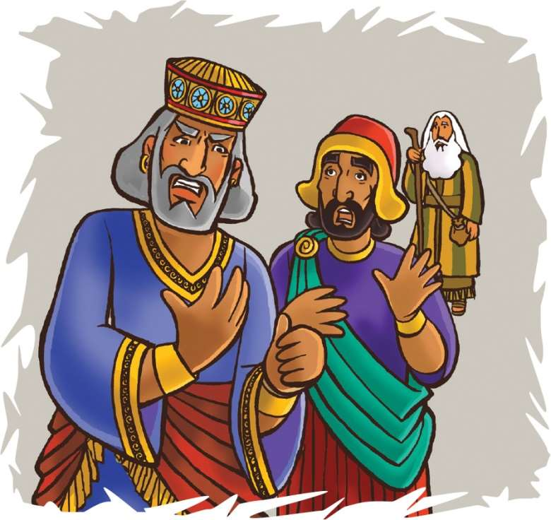
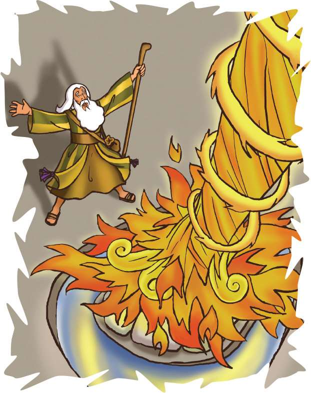

> 
Chângvawn

> “Lalpa chuan, ka koh apiangin a lo ngâithlâ ang” (Sam 4:3).

### Chhiar tûrte

1 Lalte 18:1–39; Zâwlneite leh Lalte (2nd Edition, 2014), pp. 119–136.

> 
Thuchah

> Pathianin ka tawngtâina a ngâithla thîn.

_Jack-a leh Mary-i te chuan camp-ah kâr khat hun an hmang a. In lam pawh an ngâi hle tawh a, an nu leh pate hnêna thil hrilh hlân an nghâkhlel a, chutiangah chuan hun nuam zâwk hmang thei tûrin an inngâi a. Camp office atang chuan in lam a phone a. A nuin phone a lo chhân chuan, an hlim ngei mai. Chutiang chu Pathianin a tawngtâina A chhânsak tuma Elija rilru awm dân chu a ni._

Obadia chu kawngah a tlân chhuk a. A hnung lamah chuan a kawrfual chu a phe hlawp hlawp a. Lal Ahaba hnênah chuan, “Hetah hian Elija a awm e,” tiin a au lâng lâng a.

Lal Ahaba chu thinrimin a hmêl a ling hlar mai a. Elija chu kha leh chen a lo zawn thin kha a ni si a! Israel ramah kum thum zet khua a khêng (ruah sûr lo) tawh a. Chaw eitûr pawh a awm meuh tawh lo va. Chu chu Elija vâng vekah a ngâi bawk a. Elija hmu tûr chuan rang takin a kal nghâl a. “Khatah i lo awm a ni maw—Israelte timangangtu pa!” tiin a va au khum a.

Elija chu tîm hauh lovin a lo ding ngar mai a. “Israelte ka timangang hlei nêm! Nang hi Israel hote timangangtu chu i ni a. Nang leh i chhûngte hian Lalpa âiah Baala milimte in biak zâwk vâng vek a lâwm!” tiin a chhâng lêt ve a.

Elija vek chuan Ahaba hnênah, “Israel mi zawng zawngte leh Baala puithiam zawng zawngte chu Karmel Tlângah rawn hruai khâwm vek rawh. Chutah chuan—Lalpa nge Baala chu, a tu chu nge Pathian dik zâwk chu tih kan fiah dâwn nia,” a ti a.

Tichuan, Lal Ahaba chuan mipui zawng zawng leh Baala puithiam zawng zawngte chu Karmel Tlângah chuan a ko khâwm ta vek a.

Elija chu an hmaah a ding a. “Baala puithiamte’n an pualin bâwngpa hlân rawh se. Mâichâm chungah thing chhep sela, mahse, mei chu chhêm suh se. Kei pawhin bawngpa chu ka hlân ve ang a, mei ka chhêm bîk lo vang. Baala puithiamte chuan an pathian hming chu an lam ang a. Kei pawhin Lalpa hming chu ka lam ang. Tu pawh meia rawn chhângtu zâwk zâwk chu Pathian dik ni rawh se,” a ti a.

Mipui zawng zawngte chuan rem an tiin, intihsiakna dik leh fel ni tûrin an pawm tlâng a.

Elija chuan Baala puithiam 450 lâite chu a’n en a. “Nangni hi che hmasa rawh u,” a ti a.

Puithiam hote chuan an pual bawngpa chu an talh a, an mâichâm chungah chuan an hlân a. An tawngtâi ta mup mup mai a. An pathian Baala hming chu an lam a, maksak tak takin an lâm chiam a. Baalan a ngaihsak beiseiin an taksâte chu chemtêin an zai thî zawih zawih a. Mahse, chhângtu tûr thâwm leh rîvâ rêng a awm sî lo!

Chawhnu lamah chuan Elija’n, “Tûnah chuan ka hun a thleng ve ta,” a ti a. A hmasain mâichâm chu a’n siam tha phawt a, a kiang vêl chu a lâi khuar a. Chutah amâ pual bawngpa chu talhin mâichâma thing chheh chungah chuan a hlân a. “Hêng mâichâm leh thil hlan te, thingte hi tui han leih rawh u,” tiin a hrilh a.

Mipuite chu a hrilh ang chuan an che sawk sawk a.

Ani chuan, “Han leih leh rawh u,” a ti a.

“A vawi thum nân han leih nawn leh rawh u,” a ti a.

Tûnah zet chuan mâichâm leh thil hlan chu a huh hneh hle a, a kiang lâih khuarah chuan tui chu a tling lî pung mai bawk a.

Tichuan, Elija chu lu kunin atawngtâi a. “Aw Lalpa, Nang ni Israelte Pathian chu i ni tih rawn inlantîr ang che!” tiin a dîl a.

Chu vêleh vân atangin mei a lo tla nghâl a. Bawngpa sâ chu a kâng ral vek a. Thing leh lung pawh chu a kâng fai vek a; maichâm kianga tui tling pawh a hîp kang ta vek mai a ni!

Israel mipuite chu hmaia lei sîin an bawkkhup a, “Lalpa hi Pathian a lo ni! Lalpa hi Pathian a lo ni!” tiin ring takin an au rual a.

### Tih Tûrte

#### Sabbath

- In chhûngte nên tlâng chungah lâwn ho ula, remchâng lâiah in Bible zirlâi hi in chhiar tlâng dâwn nia. Tlâng chunga mâichâm pahnih leh mipui tlim hmur tûr angin suangtuah ula. Elija tih dân anga mâichâm din tum ve chhin teh u. (1 Lalte 18:31.)
- Chhiar ho tûr: Sam 4:3. In chhûngte nên chângvawn zir ang che u.

#### Sunday

- Chhûngkaw worship-naa chhiar tûr 1 Lalte 18:1–39. An hnênah Elija, Ahaba leh Mipuite thil sawi theuh kha eng thu nge tih zâwt la. Khata thil thleng chungchâng sawina lâi kha tu ber emaw in chhiartîr dâwn nia.
- A remchân chuan meipui chhep ula. Mei alh zuai zuai thlîr pahin chu chu Pathianin vân atanga mei a rawn tlâktîr angah chan ang che u.
- Khawkhen (ruah sûr loh) chhûng kha engtia rei nge ni? Chu chu ni eng zât nge?
- In chângvawn hi a thluk phuah chawpin sa nghâl teh.

#### Thawhtanni

- Worship lâia chhûngte hnêna zawh tûr: Engtin nge kan tawngtâi tlângpui thin? (“Min tanpui rawh” “Min pe rawh” tih em ni?) Thu dang in chham thinte chungchâng sawi teh u:

1. Fakna (Pathian nihna târlanna thu—zahngâi thei, hmangaihnaa khat).
2. Inpuanna (Tih suala thupha châwina, ngaihdam dîlna.)
3. Lâwmthu sawina (Thil eng emaw vânga Pathian hnêna lâwmthu sawi.)
4. Ngenna (Thil eng emaw atâna Pathian tanpuina dîl.)

- Tawngtâina bu tê siam la. Chutiang bung hrang pali-te entîrna tûr inhmeh deuh magazine atanga chep thlâin, i bel dâwn nia. Chutiang thil pali-te hmang chuan tawngtâina hlân zêl thîn ang che. Chângvawn thu hmangin tawngtâina i khar dâwn nia. I tawngtâina a ngaihthlâk avângin Pathian hnênah lâwmthu sawi ang che.

#### Thawhlehni

- Chhûngkaw worship-naah Elija tawngtâina thu, 1 Lalte 18:36, 37 chhiar ula. Elija ngenna kha eng nge ni? Chângvawn thluk in siam kha sa teh. Chutah Pathian fak, sual puang, lâwmthu sawi leh a tâwpah ngenna hmangin tawngtâina in hlân dâwn nia.
- Tawngtâia dîlna i hlan chu a lem emaw, thuin emaw ziak ang che. “Tawngtâi Bâwm” siam a mâwi taka cheiin, i ngennate chu khung la, chutiang avâng chuan ni tinin lâwmthu sawi thîn ang che.

#### Nilaini

- In chhûngte nên 1 Lalte 18:38 chhiar ula. Pathianin kan tawngtâina chhân dân kawng thum a nei a: 1. Aw le. 2. Âih. 3. Nghâk rih rawh. Khawi ber hmangin nge Pathianin Elija tawngtâina a chhân?
- In chhûngte nên sawi ho teh u: Pathianin in dîlna chu “Aw le” “Âih” “Nghâk rih rawh” tia a chhân che u lâi hun kha.
- Hla sak tûr: “A Little Talk With Jesus” (Sing for Joy, no. 98).

#### Ningani

- I chhûngte nêna chhiar tûr: 1 Thesalonika 5:17. A tlângpuiin, eng hunah nge in tawngtâi thin? Tawngtai nâna hun tha chu engtik lâi nge ni? Khawi hmunah nge i tawngtâi thin? Hmun thum chu ziak chhuak teh: [_]()
- Lehkha chhahah sana hmai lem ziak la, ni tina i hmuh theihna tûr remchâng lâiah târ ang che. Chumi hmang chuan engtik lâi pawhin, khawi hmunah pawh i tawngtâi thei reng a ni tih hriattîr nân i hmang tangkâi thîn dâwn nia. Chutah he hlâ hi sa rual ula: “Whisper a Prayer” (No. 34).
- In chângvawn hlâ kha sa ho teh u.

#### Zirtawpni

- Chhûngkaw worship neih nân Karmel Tlânga Elija thiltih dân kha lemchanah hmang ho teh u. Pathianin Elija tawngtâina kha kawng hnihin a chhânsak a. Chhiar tûr: 1 Lalte 18:38, 45. Pakhatna, Vân atanga [_]() a tlâktîr bâkah, a hnu deuhah, vân atangin [_]() a sûrtîr bawk.
- In chângvawn thiam nâl takin sawi la. In chhûng zînga thut nân chair ruak pakhat hung ang che. Chutah chuan Isua lo thu angin ngaihruat la. Chutah Thawhlehnia “Tawngtâi Bâwm” i siam kha hawng la. In chhûngte chu Isua hnêna dîlna pakhat theuh hlân tûrin hrilh ula. Ani chu thian anga nêl chungin in be dâwn nia.
- Isua tawngtâina bîk hmangin khar ula. Lalpa Tawngtâina (Matthaia 6:9–13) in chham rual dâwn nia.