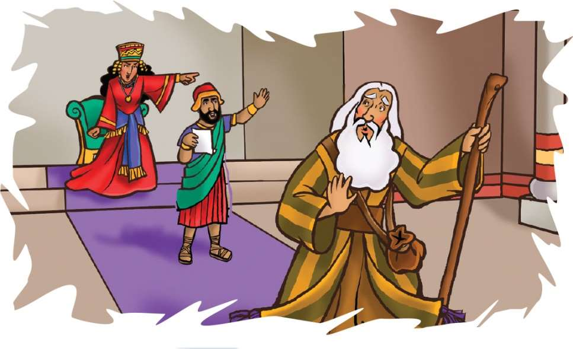
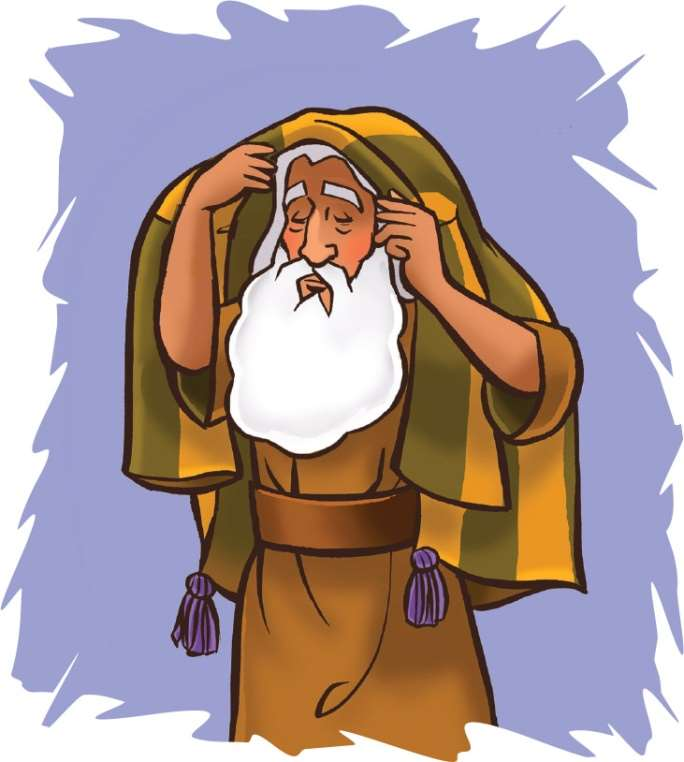

> 
Chângvawn

> “In bengin in hnung lama thu, ‘Hei hi kawng a nih hi, hetah hian kal rawh u,’ tiin a hre zêl ang,” (Isaia 30:21).

### Chhiar tûrte

1 Lalte 19:1–18; Zâwlneite leh Lalte (2nd Edition, 2014), pp. 147–155.

> 
Thuchah

> Pathian phunri ser ser pawh ka hre zêl ang.

_Zan khat chu Shanika-i chu a mutna pindanah mahni chauhin a mu a. Hlimthla tin rêng hi an che zut zut ni maiin a hria a. A tirilah a hlau tan deuh a. Chutah a nu chu a hnênah a lo kal a. Thlamuanna thu nêm tê a sawi chuan a tithlamuang ta huai mai a ni. Hmânlâi khân Pathian zâwlnei Elija pawhin thil hlauh a nei a. Pathianin aw nêm têa thil a hrilh zârah a lo thlamuang leh ta a ni._

Elija chu a nun humhim nân a tlânchhe dâwr dâwr a. Lal Ahaba nupui, lalnu sual tak mai Jezebelin thahah a vau va. Elija chuan a hlauh êm avângin Pathianin lalnu sual lakah pawh a humhim dâwn a ni tih pawh a theihnghilh ta hial mai a ni. Tichuan, mêl za tam taka hlâ, hmun him lam panin ni 40 lâi a tlânchhia a. Chutah chuan pûk chhûngah a va tawm bo ta a ni.

Pathianin a hnênah, “Hetah hian eng nge i tih?” tiin a zâwt a.

Elija’n Pathian a chhân dân atang hian mahni a inkhawngaihin, a inlâinat hle a ni tih chu i hrethiam thei mai ang. “Lalpa, i tân thahnemngâi leh rim takin ka thawk a. Israelte lah chuan i mâichâmte an tichim a, i zâwlneite pawh an that a. Keimah chauh hi a la bang awm chhun chu ka ni tawh a. Kei pawh hi min tihhlum an tum a ni,” tiin a sawi a.

Elija khân Pathian hnênah: “I tân rim takin ka thawk a. Tûnah hian ka va chau vin, ka va beidawng ta tehrêng êm!” a tihna ang a ni.

Tichuan, Pathianin, “Kal la, tlângah, Lalpa hmaah va ding rawh, chutah chuan Lalpan a rawn kal pêl dâwn che nia,” a ti a. Chu chu Pathianin, “Elija, hetah hian lo kal teh. I hnênah thu ka sawi duh e,” a tihna a ni ber.

Elija chuan Pathian sawi ang chuan a ti a. Chutah thlipui na zet mai a lo thawk a, tlângte chu chhêm balin, lungpuite chu a chhêm phel rem rum mai a. Mahse, Elija chu a tho chhuak chuang lo, a chhan chu thlipuiah chuan Pathian âw a hriat loh vâng a ni. Thlipuiah chuan Pathian chu a awm lo a ni.

A dawt lehah chuan lîr lo nghîngin, tlâng chu a sâwi nghîng dur dur mai a. Mahse, lîrnghîngah chuan Pathian âw a hriat loh vângin, Elija chu a tho chhuak chuang lo. Lîrnghîn hnu chuan meipui râpthlâk tak a lo alh leh zuai zuai a. Mahse, chutah pawh chuan Elija’n Pathian âw a hre chuang lo. Pathian chu thlipuiah te, lîrnghîngah leh meipuiah pawh chuan a awm chuang lo.

Chutianga râpthlâk taka thilsiamte an lo chet hnu chuan, aw nêm damdiai hi a lo ri ta sê sê mai a. Chu aw nêm damdiai chu Pathian âw a ni tih Elijan a hre ta a. A kawrfual chuan a hmai a hup a; tichuan, pûk luhna kawngkâ, Pathian hmaah chuan a va ding ta a ni.

Pathianin Elija chu zawhna ngâi bawk a zâwt nawn leh a, “Hetah hian eng nge i tih?” tiin. Chuta Elija chhânna chu ka chan a va chau tak êm tih a ni ber mai.

Khatianga beidawng leh hlau phelênga Elija a tlânchhiat avâng khân a chungah Pathian chu a thinrim mai chuang lo. Amah a rinchhan loh avângin Pathian chu Elija chungah a thinrim hek lo. Pathianin aw nêm damdiaia Elija hnêna thu a sawi hma a hmangaihzia târlanna a ni. Mahni a inkhawngaih êm êm lâi pawh khân, Pathianin Elija kha a hmangaih reng a. Zâwlnei chau tawh tak chu Pathianin a fuihphûr thar leh a. Hna thawk tûrin a tîr chhuak leh ta a ni. Elija chu a mal tan lo a ni tih a hriattîr a. Mahni chauh ni lovin, Israel ramah chuan Pathian chibai bûktu rinawm mi 7,000 lâi an la awm tih a hrilh ta a ni!

### Tih Tûrte

#### Sabbath

- Hmun fianrial remchâng zawngin ramhnuai lamah lêng chhuak ula. Chutah chuan in zirlâi Bible thawnthu hi in chhiar dâwn nia. Elija’n Pathian aw nêm damdiai a ngâithla tûr chu suangtuah chhin teh u.
- Chutah chhuk zâwngin kal ho ula. Hnung lama mi chu in chângvawn thu (Isaia 30:21) ring deuh taka chhiar lauh lauh tûrin in sâwm dâwn nia. Kawng bo deuh ta ulang, engtin nge Chângvawn hian a tanpui ang che u?
- Hla sak ho tûr: “Khawiah Pawh Lal Isua Nên Chuan Awm Ila” (Sing for Joy, no. 45).

#### Sunday

- Chhûngkaw worship-naa chhiar tûr: 1 Lalte 19:1–18. Engati nge Elija khân a hlauh a, mahni a inkhawngaih viau mai le? A rilru a nawm theih nâna tanpui tûrin Pathianin eng nge a tih? (châng 5–7)
- Hlauhna i neih leh mahni i inlâinat deuh riau lâi hun kha ngaihtuah lêt leh la. Engtin nge Pathianin a tanpui che? Lemchanah hmang la. Tûn hnâia aw ring tak hretu hmêl lan dân chu a lem han ziak teh.
- A remchân chuan, chângvawn hi record la, a nih loh leh phun ser serin sawi ang che. I chhûngte hnênah i zirtîr ve dâwn nia.

#### Thawhtanni

- Eng zawhna nge Pathianin tum hnih lâi Elija kha a zawh? In chhûngte nêna chhiar tûr: 1 Lalte 19:9 leh 13.
- Zawhna chhinchhiahna (?) lem lehkhâin chep la, chutah chuan Pathian zawhna thu kha i ziak dâwn nia. Lungngâi leh lungchhe taka Elija chhânna thu chhiar la (1 Lalte 19:10). Mahni tawngkauchhehin Elija lungngaih thu kha sawi zawm ang che (1 Lalte 19:11–14).
- Pathian aw nêm damdiai i hriat chhuah theih nân, chângvawn i record kha zâwi têa play-in ngâithla lang. Phun sê sêin sawi ve ang che.

#### Thawhlehni

- Chhûngte nêna chhiar nawn tûr: 1 Lalte 19:11–13. Pûk chhûnga Elija a tawm lâia thil namên lo tak thleng pali-te kha a lem ziak teh.
- Sawi ho tûr: Elija kha lo ni ta lang, eng chu nge i hriat zâwk ang? Aw ring tak nge, aw nêm damdiai zâwk chu? Engtin nge he thawnthua Pathian thil sawi dân hian a hmangaihna chungchâng min hrilh le?
- Chângvawn hi phun sê sêin han sawi teh.

#### Nilaini

- Vawiin worship-naah, zâwi têa Pathian phun ri ser ser chu ngaihtuah teh. Pathian âw i hriat theih dân tûr kawng thum sawi teh. Chhia leh tha hriatna chungchâng sawi ho ula. Eng nge a nih? Engtin nge a tanpui thin che? Tuin nge chhia leh tha hriatna hmangin be thîn che? Thil dik lo ti tûrin a hrilh ngâi che em? Chhia leh tha hriatna chungchâng Paula’n Tirhkohte 24:16-a a sawi hi chhiar teh.
- Beng lem ziak la, tah chuan chângvawn thu hi ziak ang che. Pathian âw i hriat theih avângin a hnênah lâwmthu sawi ang che.

#### Ningani

- Eng emaw châng chuan Pathianin ring takin thil a sawi thîn. I chhûngte nên chutiang lam sawina Exodus 19:16–19 chhiar ula. Sawi ho tûr: Pathianin i hnêna ring taka thu a sawi i ring em? Engati nge? Pathian âw i hriat hmaih loh theih dân tûr chu engtin nge ni? A âw hriat emaw, a chenchilh nih hriatna emaw te i lo chang tawh ngâi em? Engtikah leh khawi hmunah nge? Chhiar ho tûr: 1 Lalte 19:15–18.
- Vawiina i thil hriat emaw chet dân emaw chu a lem han ziak teh.
- I chhûngte chu phun sê sêa chângvawn sawi tûrin sâwm la. Nangma hnêna aw nêm damdiaia thu a sawi avângin lâwmthu sawi ang che.

#### Zirtawpni

- Bible thawnthu hi lemchana hmangin in chhûngkaw worship bultan ula. Pathian âw i hriatna dâl thei thilte sawi ula. Sam 46:10 chhiar ula, chutah rimâwi dam dap ngâithla teh u. Maimit chhîng chungin “Ngâwi ula, Pathian ka ni tih hi hre rawh u,” tih kha sawi rual teh u. Rilru ngaihtuahnaa Pathian thil rawn sawi chu ngaihvên ula. Eng emawti chinah, rimâwi chu titâwp ula. Kha thâwm reh dak atang khân eng nge in zir chhuah? Pathian âw ngaihthlâk chu a awlsam deuh em? Eng vâng nge?
- I chhûngte chu phun sê sê-a chângvawn sawi tûrin sâwm la.
- Tawngtâi hmaa hla sak tûr: “Teach Me, Lord” (Sing for Joy, no. 110).