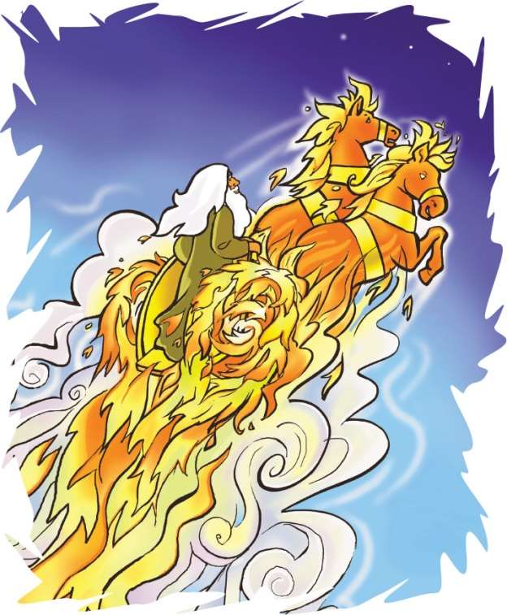
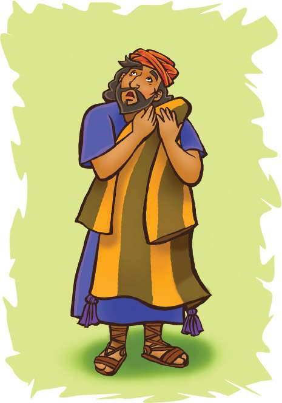

> 
Chângvawn

> “Sual man chu thihna a ni sI a, Pathian thilthlâwnpêk erawh chu, kan Lalpa Krista Isua zârah chuan chatuan nunna a ni,” (Rom 6:23).

### Chhiar tûrte

2 Lalte 2:1–15; Zâwlneite leh Lalte (2nd Edition, 2014), pp. 195–198.

> 
Thuchah

> Pathian khawngaihna chu chatuan nunna thilthlâwnpêk a ni.

_Burt-a chuan a u hmeichhe hnênah, “Hemi chungchâng hi tawngtâiin Pathian hnênah ka thlen tawh a, min pe tûrin ka dîl tawh,” a ti a._

_Martha-i chuan, “Kan duh apiang hi kan dawng kher lo tih chu in hria a. Pathianin in neih aduhsak che u a nih phawt chuan, in la nei êm êm ang,” tiin a lo sawi ve a._

_Burt-a chuan, “Engtin nge i hriat?” tiin a zâwt a._

_“Bible atangin Elija leh Elisha chanchin ka chhiar atangin ka hria a. Nangni pawhin in la hrethiam ve mai ang,” a ti a._

Pathianin Elija tân thil ruahman mak deuh mai a nei a. Pathian chuan ani hi thihna tem lo va vâna hruai a duh a. Chutianga duhsakna sâng bîk chu mihring zînga mi pakhat—Enoka hnênah chauh pêk a la ni.

Elisha chu Elija tanpuitu a ni a. Elisha chuan Elija rawngbâwlna chu a lo tâwp hnâi tawh a, ani chuan a chhunzawm a ngâi dâwn a ni tih a hria a. An thawhpui zâwlnei dangte pawhin Elijan a kalsan thuai tawh dâwn tih chu an hre ve bawk a. Pathian aw nêm damdiaiin a hriattîr hlawm a ni.

Ni khat chu Elija’n Elisha chu zin chhuahpuiin, zâwlnei sikulte a tlawhpui a. Chûng zâwlnei sikula zâwlnei hote chuan Elisha hnênah, “Vawiin hian Pathianin Elija a lâk bosak dâwn che tih i hria em?” tiin an zâwt a.

Elisha chuan, “Âw, hria e,” a ti a. Elija’n a kal bosan dâwn tih a hriatin, a rilru chu a lungngâi a. Elija thawh ang hna han thawh pawh chu tlêmin a hlauthâwng deuh a.

Elija pawhin Elisha chu a kalsan thuai tawh dâwn tih chu a hre tho bawk a. Chuvâng chuan amah tanpuitu chu a fiah ta a ni. Sikul an kalna apiangah chuan, Elija’n Elisha hnênah, “Hetah hian lo awm rawh. Kei chu ka kal zêl a ngâi,” tiin a hrilh zêl a. Mahse, Elisha chuan a zui zêl dâwn tih a hrilh zêl thung a.

Elisha khân Elija hmu phâk lo va awm a duh lo. A tâwp thlenga a hnêna awm zêl a duh a ni. A hnênah chuan, “I nunna leh Lalpa nunna chhâlin ka sawi e. Ka kalsan tawp lo vang che,” a ti a. Tichuan, an pahnih chuan an kal dun ta zêl a.

Kâr lohah Jordan Lui an thleng a. Elija chuan a kawrfual chu a tumtêl a, lui tui chu vuak nân a hmang a. Tui chu a lo inthen a, an pahnih chuan tui chhûng lei chârah an kal kâi dun ta mai a ni. A kam lehlam an thlen chuan an inthen hun a lo thleng dâwn ta. Elija chuan, “I hnên atanga lâk bo ka nih hmain eng nge ka tihsak ang che?” tiin a zâwt a.

Elisha khân thil chi hrang tam tak a dîl thei a ni. Tangka sum pawh a dîl thei a. Hmingthanna pawh a dîl thei tho. Mahse, chutiang zawng âi chuan malsâwmna bîk tak chu a dîl ta zâwk a. Chu chu, “I thlarau chan ang chan hnih min chantîr tawh,” tih a ni. Pathian hnên atanga tanpuina bîk tel lo chuan a la thawh tûr Pathian hna chu a thawk thei dâwn lo tih a inhria a ni.

“Lâk bo ka nih lâi tak min hmuh chuan, chu chu i chang ang, min hmuh loh erawh chuan i chang lo vang,” a ti a. Tichuan, an pahnih chuan an kal dun leh ta zêl a.

Chutah le, an pahniha inkârah chuan mei tawlâilîr leh sakawr chu a lo awm ta thut mai a. Elija chu thâwngaleivirin vânah a la chho ta daih mai a. Elisha chuan au zuiin, “Ka pa! Ka pa! Israelte tawlâilîr leh sakawr chungchuangte hentu,” a ti a. Mahse, Elija chu a bo da daih a. Elisha chuan a thian leh zirtîrtu a chân ta a lungngaihzia entîr nân a puan chu a pawtthlêr a.

Chutah Elisha chuan Elija kawrfual lo tla chu a hmu a. A chhar a, Jordan Lui lam a pan ta a ni. Kawrfual chu tumtêlin, Elija tih ang khân lui tui chu a han vua a, a lo inthen leh ta mai a, lei chârah chuan a kal kâi leh ta a. Pathianin Elisha hnênah a Thlarau chu a pe ta ngei a ni.

Pathian chuan keini pawh hi thilthlâwnpêk tha tak min pêk a duh a. Elija hnêna Pathian thilthlâwnpêk tha ber chu chatuan nunna a ni. Elisha ang khân, keini pawhin thilthlâwnpêk chu kan dîl ve a ngâi. Kan dîlna chu min chhânsak a ni tih ringin, rinnaa kan chet chhuah a ngâi bawk. Elishan ring chunga kawrfual hmanga tui a vaw ta ang khân, keini pawhin rinna kan nei ve tûr a ni.

### Tih Tûrte

#### Sabbath

- A remchân chuan, lui tui kiangah Bible thawnthu chhiar ang che u. Lemchan nân pawh in hmang dâwn nia. Elisha khân Elija kalna apiangah a zui zêl a. Nang tu nge vawiin hian i zui ve zêl ang le?
- Sak ho tûr: “I Have Decided to Follow Jesus” (No. 3). Chutah amah zui tûrin Isua tanpuina in dîl dâwn nia.
- Rom 6:23 chhiar hovin, i chhûngte hnênah i zirtîr dâwn nia.

#### Sunday

- Chhûngkaw worship-naah, Bible zirlâi chhiar ang che u (2 Lalte 2:1–15).
- Chângvawn thumal awm zât lehkha (cardboard) inbial sem ang che. Chûngah chuan thumal chu i ziahpui zêl dâwn nia. Bible châng pawh ziak bawk ang che. Tûnah chuan “Beanbag Toss” tih hmangin in infiam thei tawh ang. Chumi hmang chuan Chângvawn thu chu dik takin in rem thei tawh ang chu. I chhûngte chu mahni hun theuhah thawhtîr la, kâr tluana infiam nân in hmang dâwn nia.

#### Thawhtanni

- Chhûngkaw worship nân, lehkha mâwi hmangin thilthlâwnpêk bâwm têl thlap ang che. A chungah chuan “Chatuan Nunna” tih i ziak dâwn nia. Kâr tluana i hmuh theihna tûr remchâng lâiah hung la. Isua hmangaih leh zuitute hnêna Pathian thilthlâwnpêk chatuan nunna hriat chhuahtîrtu cheah i hmang dâwn nia.
- Bible keuvin, 1 Johana 5:11 chhiar ang che. A huhovin, Pathianin thilthlâwnpêk duhawm tak a hlui che u avângin lâwmthu sawi ang che u.
- In in chhûngah khân thil bial emaw, kual chhuak pap emaw eng zât nge in hmuh theih? Engtin nge chung chuan chatuan nunna an hriat chhuahtîr che u?
- “Beanbag Toss” tih hmangin infiam ang che u.

#### Thawhlehni

- Vawiin worship nân, 2 Lalte 2:6 tâwp lam chhiar ni se. Vawi eng zât nge Elisha khân a thutiam a sawi nawn? (En tûr, 2 Lalte 2:2, 4, 6.) In chhûngte hnênah thutiam chu sawi theuh ang che. A tîrah an hming bul theuh chu i dah dâwn nia.
- Chhûngte nêna sawi ho tûr: A khawi chu nge rei zâwk dâwna i hriat? Dârkâr khat chhûng hna pangngâi tawh nge, thiante nêna dârkâr khat hna thawh zâwk? In thiante nêna hun hman zui zêl in châk em? Chatuan hun chu chutiang chu a ni dâwn a ni. A bula chatuana awm reng i duh a ni tih Pathian hnênah hrilh ang che.
- Rîn bial siam la. Engtin nge chu chuan ‘chatuan’ leh ‘chatuan nunna’ tih chu a hriat chhuahtîr che? Rîn bial chhûngah chuan chângvawn hi i ziak dâwn nia.

#### Nilaini

- Chhûngkaw worship lâiin, mi tute’n emaw thilthlâwnpêk mak tak an pêk che u chungchâng insawi chhâwk ula. Sawi ho tûr: Chung chu eng nge an pêk chhan che u? Eng thilthlâwnpêk nge Pathianin min hlui? Chhiar ho tûr: 1 Johana 5:11. Hei hian Pathian chungchâng eng nge min hrilh? Chhiar tûr: 1 Johana 4:9.
- Chângvawn ennawn nân “Beanbag Toss” tih kha infiam nân hmang ang che u.
- Hla sak tûr: “Johana 3:16” (Sing for Joy, no. 24).

#### Ningani

- Vawiin chhûngkaw worship hun hi chatuan nunna thilthlâwnpêk avânga lâwmna hun atân hmang ang che u. Chhiar tûr: Johana 3:16; Philipi 2:8–11. Kan hnêna Pathian thilthlâwnpêk ropui ber chungchâng eng nge in zir chhuah? Hla sak tûr: “O, How He Loves You and Me” (No. 72).
- Chângvawn en nawn nân, a thumal sawi rem zêlin kut in bêng thap thap dâwn nia.

#### Zirtawpni

- Zirtâwpni tlâia worship neih nân, hmangaih thilthlâwnpêk bîk inhlân chhâwng theuh ang che u. Ding kual ula, in hnung lam in inchulsak theuh dâwn nia. Chutah chhûng lam hawiin, inkuah tlâng theuh ang che u. Chutiang chung chuan chângvawn in sawi dâwn nia.
- 2 Lalte 2:11 chhiar ho ula. Vân a thlen vêleh khân Elijan eng nge a tih ang suangtuah chhin teh. Thawhtannia in chhûngte tâna ‘thilpêk’ i siam kha hlân la. Chu mi hnênah chuan vân a thlen ve leh eng nge tih a duh ang zâwt ang che. Chu mi chuan ‘thilthlâwnpêk’ chu mi dang hnênah hlân chhâwng leh sela, chutiang zêlin.
- Chatuan nunna thilthlâwnpêk avângin Isua hnênah lâwmthu sawi ang che.
- Hla sak tûr: “For God So Loved the World” (Sing for Joy, no. 26).