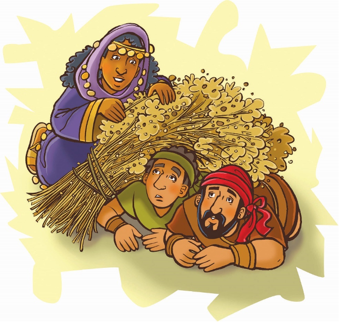
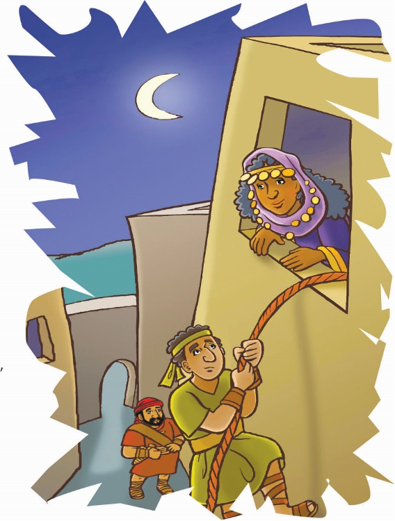

> 
Chângvawn

> “A lalram leh a felna chu zawng hmasa zâwk rawh u, tichuan hêng zawng zawng hi a pêk belhchhah ang che u” (Matthaia 6:33).

### Chhiar tûrte

Joshua 2; Thlahtubulte leh Zâwlneite, pp. 502–505, 511, 512.

> 
Thuchah

> Kohhran chhûngkuate nên thil pawimawh chungchâng kan zir ho.

_Natasha-i chu dawhkân hnuaia ṭhûin blanket-in a inkhuh a. Thingrem chhûnga typewriter hlui thuhrûk hmangin thil a chhu a. Blanket leh thingrem chhanah chuan thil chhut rî pawh chu a ring lo deuh a ni._

_Engati nge chutianga a tih le? Ani kha Kristian lehkhabûte chhut khap a nihna rama chêng a ni a. Mahse amah leh mi dangte tân pawh Isua chanchin chuanna lehkhabûte chu a hlu êm êm bawk si a. Chuvâng chuan, mi dangte pawhin Isua chanchin an lo zir theih nân mahni nun thâp tak meuhin chûng thu chu a chhû a ni._

_Ni khat chu le, sipai hian Natasha-i te kawngka an rawn kik dawt dawt a. Ani chu manin, an hruai bo ta daih mai a ni. Mahse, Pathianin a veng him zêl a._

_Hmânlâi hian Jeriko khaw vêngtu sipai-te pawh-in Pathian tâna thawktute man chhuah an tum a. Chumi thawnthu chu hetiang hi a ni._

Enthlatu sâwmten chanchin lâwmawm lo deuh an rawn thlen aṭang khân kum 40 a liam leh tawh a. Khatih lâia Kaleba nêna Ram Tiam chanchin lâwmawm rawn thlentu, tlangvâl Joshua kha Israelte hruaitu thar a lo ni tawh a. Tûn thleng hian Israel mipuite fuih phûr dân tûr a la zawng zêl a ni.

Mosia lo tih tâk dân ang khân, Joshua pawhin enthlatute a tîr ve a. Hemi ṭum hi chuan Ram Tiam enthla tûrin mi pahnih chiah a tîr thung a. “Va kal ta ula, a bîk takin Jeriko va enthla teh u,” tiin a kaltîr a.

Tichuan, chûng mi pahnihte chu a rûkin khawpuiah chuan an lût a. Chumi zân chuan kulh kotlânga insak pakhatah an lût a. Chu ina chêng chu Rahab-i a ni a, kawngkâ kik dat dat chu a va hawn a. Ani chuan chûng mi pahnihte chu Israel mi an ni tih a hre nghâl mai a; mahse, in chhûnga lût tûrin a sâwm ta tho a ni.

Rahabi chauh ni lo, Jeriko khawpuia chêng zawng zawngte chuan Israelte chanchin chu an hre viau mai a. Lalpan indonaa a beihsak chanchin te an hria a, chuvâng chuan Jeriko khaw lal leh a sipai rualte chu an zâm hle a ni. Rahabi chuan sipaite chu ko lovin, chûng mi pahnihte chu thil a sawipui a. Chutah an pahnih chuan in chûng lama ziza têl zîngah chuan a bihrûktîr ta a ni.

Jeriko khaw lal sipaiten kawngkâ an rawn kik a, Rahabi chuan rang takin a va hawnsak a. Anni chuan, “Kan khua rawn enthla tûra lo kalte kha kan hnênah rawn hruai thuai rawh,” an ti a.

Ani chuan rang taka dâwt sawiin, “Chûng mite chuan ni chin deuh lawk khân he lâi hmun hi an chhuahsan leh tawh. Rang takin ûm zui vat ula, in la man hman ngei ngei ang,” tiin a hrilh a. Sipaite chu rang taka chhuakin, enthlatute chu an zawng nghâl ruai ruai a. Chutah, Jeriko kulh kawngkapui chu khârin, khawpui chhûng chu an mu reh ta ṭhiap a.

Engkim a reh ṭhiap tâkah chuan, Rahabi chu in chûngah a lâwn chho va. Chuta biru mêk enthlatute hnênah chuan, “He ram hi Lalpan in hnênah a pe tawh tih ka hria a. In tâna Tuipui Sen a tih kangchah dânte pawh kan lo hria a. Mi tin hi an zâm êm êm vek mai a; tû mah zâm lo rêng kan awm lo, kan thinlung a tui zo vek a ni. Hei in hriat angin, in chûngah ngilneihna ka lo lantîr ta a. Nangni pawhin kan chhûng-kaw chûngah ngilneihna in lantîr ve dâwn tih chhinchhiahna min pe teh u,” tiin a ngên a.

Mite chuan, “Kan pe êm êm ang che! In nunna âiah kan nunna. Kan thiltih hi i sawi chhuah loh phawt chuan, Lalpan ram hi min pêk hunah chuan in him ang,” an ti a.

Tichuan Rahabi chuan hrui sen a lâ a, enthlatute chu tukverhah a uai thlâktîr a. Anni chuan, “Kan kal hnuin hê hrui hi tukverhah hian lo ṭâwn bet ang che. Tichuan, he in chhûnga lo awm zawngte chu nangmah chawpin, khawpui kan lâk ni-ah chuan kan rawn chhanhim ang che u. Mahse, hrui hi tukverhah hian a lo awm ngei tûr a ni,” tiin an chah a.

Rahabi chuan an uai thla lâi leh, pawn thima an bibo lâi chu a thlîr zui a. Hrui chu tukverhah chuan a ṭâwn bet nghâl a. A thinlung ngaihtuahna ril takah chuan thil thar eng emaw pawimawh tak a hmu chhuak ta a ni tih hriatna a nei a. Israelte Pathian chu Pathian dik a ni a. Khami ni aṭang khân a Pathian a lo ni ve dâwn ta a ni!!

### Ni tina tih tûrte

**Sabbath**

- A theih chuan, in chhûngkuain ramhnuai hmun remchâng lamah lêng chhuak ula, in zirlâi thawnthu hi in chhiar ho dâwn nia.
- Jeriko sipai zawn lâi angah inchan ula. Khawi hmunah nge in bihrûk ang? Kristian an nih avânga bihrûk ngâi mêkte tân ṭawngṭâisak ang che u.
- Chhiar ho tûr: Matthaia 6:33. Kristian an nih avânga bihrûk ngâite tân hê châng hian eng awmzia nge neia in rin?

**Sunday**

- Chhûngkaw worship-naa chhiar ho tûr: Joshua 2:1–11.
- Eng thil pawimawh tak nge Rahabi khân hmu chhuak taa in ngaih?
- Chângvawn mobile siam ula. Chuta tân chuan lazâi têl leh kawrchûng khâina in mamawh ang. Lehkhain kulh angin 20 chep ula (Jeriko kulh ang tûrin ni se). Chutah chuan châwngvawn thumal kha in ziak zêl dâwn nia; a chûngah chuan Isua lem in dah zêl bawk ang a. Puan them 20 inchen lêm lo vin chep ula. In lehkha chehah khân pakhat in châr bet zêl ang a. Puan them chu coat hanger-ah in tibet zêl bawk dâwn nia. Ni tina in hmuh theihna tûr lâiah in târ dâwn nia.
- Hla sak ho tûr: “I Have Decided to Follow Jesus” (Sing for Joy, no. 3). Amah in zui zêl theih nân Pathian ṭanpuina dîlin ṭawngṭâi ang che u.

**Thawhṭanni**

- Chhûngte nêna chhiar tûr: Joshua 2:12–24. Bible thawnthu aṭang hian eng thil thar nge in zir chhuah? Hetah hian ziak teh u:
- Rahabi leh enthlatute lem kha ziak ula.
- In chhûngte hnêna chângvawn zirtîr nân chângvawn mobile kha hmang ṭangkai ang che u.
- Hla sak ho tûr: “Give Your Heart to Jesus” (Sing for Joy, no. 118).

**Thawhlehni**

- Worship-naah, Pathian rawngbâwlsak an thlan hma leh hnu chanchin sawi tûrin puitling tû emaw sâwm ang che u.
- Zawh tûr: “Engtin nge kohhranin Pathian chanchin zir tûra a ṭanpui che? Nangmâ nuna thil pawimawh ber chu eng nge ni?
- Chhiar ho tûr: Jeremia 29:13.
- Engtin nge Pathian chu zîngah te, chhûnah te, zân mut dâwnaahte hmasa ber in nihtîr theih ang? Engtik lâi pawha Pathian chu hmasa bera in dah zêl theih nân a ṭanpuina dîlin ṭawngṭâi ang che u.
- Hla sak ho tûr: “Seek Ye First” (Sing for Joy, no. 37).

**Nilaini**

- In chhûngte nên, Rahabi chanchin sawi ho ula. Engtin nge Pathian chu thil pawimawh ber a ni tih a ring tih kan hriat? Chhiar ho tûr: Joshua 2:9.
- Sum in hlawh chhuah chângin, engtin nge Pathian chu hmasa berah in dah ṭhin? Chhânna thâi zêl ula:
	- Sâwma pakhat Pathian hnêna hlanin.
	- Thawhlawm thawhin.
	- Fing taka sum hman nân Pathian ṭanpuina dîlin.
	- Sum chu khâwlin.
- Pawisa nâwi inang thlap 10 hmang ula. Sâwma pakhat la chhuak ula. Thawhlawma in thawh tûr chungchâng duhthlanna siam ang che u.
- Pathian malsâwmna chûngah lâwmthu sawi ula.

**Ningani**

- Worship nân Matthaia 1:5 chhiar ho ula. Rahabi kha tu pi nge ni? Tu pi chhâwng nge? Matthaia 1-a hming târlan zawng zawngte en vek ula. Tu hming nge hnuhnung ber? Nangni in thlahtute eng zât thleng nge in chhui lêt theih ve?
- Chângvawn hi hlain sa ho ang che u.
- In pindana lehkhabute leh inawmlemnate en vêl ula. Pathian chu in duh ber (pawimawh ber) a ni tih in sawi ve thei ang em? Engtianga hmasâwnna neih nge in duh ang?

**Zirtawpni**

- Chhûngkaw worship-naah, Jeriko kulh te, Rahabi te, leh enthlatute lem chu hmanrua in neih sa chi hrang hrang hmangin siam ula. A thawnthu in sawi nghâl dâwn nia. Rahabi in lem chûngah buhpâwl emaw dah ula, enthlatute chu in bihrûktîr dâwn nia. Chutah tlân chhuak tûrin ṭanpui ang che u.
- Chhûngte hnêna zawh tûr: Engtin nge ni tinin Pathian chu hmasa berah in dah zêl dân tûr ni ang? Eng thutlûknate nge in siam ang? Chhiar ho tûr: Sam 122:1.
- Chângvawn mobile kha entîrin, sawi rual bawk ang che u.
- Hla sak ho tûr: “Turn Your Eyes Upon Jesus” (Sing for Joy, no. 69). Chutah, Sabbath Ni avângin Pathian hnênah lâwmthu sawi ang che u.