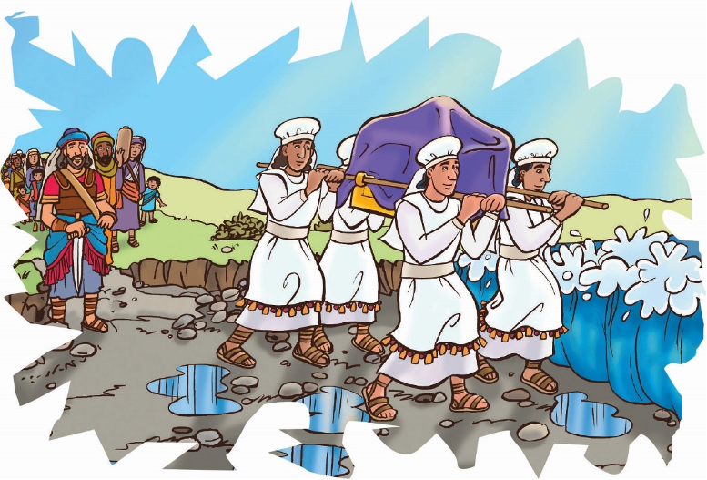

> 
Chângvawn

> “Lalpan in zîngah thil mak takte a ti dâwn e” (Joshua 3:5).

### Chhiar tûrte

Joshua 3; 4; 5:1; Thlahtubulte leh Zâwlneite, pp. 502–508.

> 
Thuchah

> Ama tâna thil ropui takte ti tûra min ṭanpui tûrin Pathianin hruaitute min pe ṭhîn.

_Thil hlimawm tak eng emaw lo thleng tûr i hriatin, engangin nge zîng i thawh ve ṭhin? Thil i la tawn ngâi hauh lo ni ta se, eng nge a an ang le? Tûnah hian Israel mipa naupang thil hlimawm tak tawng tûr angin i’n ngaihruat teh ang._

Joshuan Israel mipuite hnênah thil mak danglam tak thlen tûr ni a ni tih a hrilh a. “Vawiin hian Lalpan thil mak tak a ti dâwn a ni,” a ti a.

Chu chu eng nge ni ta ang le? Pathianin Israelte tân thilmak eng eng emawte a lo tihsak tawh ṭhîn a. Tuipui Sen pawh tiṭhenin, Israel mite chu Aigupta ram aṭangin a hruai chhuak a. Thlalêra an awm chhûng khân manna a tlâktîr zêl bawk a. An ni tin ei tûr châw a pe ṭhîn kha thil mak danglam tak a ni!

Tûn hnâi deuh lawk pawh khân, Pathianin Israel sipaite chu hruaiin, Bashan ram lal pahnih, Sihona leh Og-a te chu a hnehtîr a.

Ni e, Pathianin thil mak tak takte chu chutiang chuan a lo ti tawh a. Mahse chutiang thilte chu Mosian a hruai lâia thleng a ni hlawm a. Tûnah chuan Mosia chu a thi tawh a, Joshua chu an hruaitu thar a lo ni ta. Joshua chu Mosia anga hruaitu ṭha a ni ve ang em le? Pathianin Isralte tân thil mak takte a tihsak zêl ang em?

Tûn hnâi deuh khân ruah a sûr nasa hle a, khua lah chu a lum tial tial bawk a. Tlângsâng chûnga vûr awmte chu a tui a, lui lamah a lo luang thla a. Jordan Lui pawh a lianin, a nu phût a, a kuang a luang liam hial a ni. Ram Tiam, Kanaan chu lui kam lehlam maiah chuan a awm tawh a, hê hmunah hian ni thum lâi an châm tawh bawk a ni.

Joshuan Israelte hnênah hriattîrna thu a sawi ṭan a. “Thuthlung Bâwm chuan in hma hruaiin, Jordan a pan dâwn a. Nangni pawh in hmun aṭanga lo che chhuakin in zui tûr a ni,” tiin a hrilh a.

“Pathian Bâwm zâwntu puithiamten Jordan Lui tui an dâi ve leh, a lui tui luang lâi chu a tâwp ang a, kulh bang ang maiin a lo ding ang. Puithiamte chu lui lâi takah an ding reng ang a, Israelten lui an kân zawh thlengin an ding reng dâwn a ni. Tûnah hian in riah bûkte ṭhiatin, inpeih tawh rawh u le,” tiin a hrilh a.

Kâr lohah kal indawt dân tûr chu hriattîr an ni a.

Puithiamte chu thu-thlung bâwm zâwnin an che chhuak ta a. Hmalam pan zêlin, Jordan Lui lian luang ri hum hum lam pan chuan an chhuk thla zêl a. Puithiamte pawh chuan tîm hauh lo vin lui tui chu an dâi nghâl a. An kein tui a dâi vêleh, a luang lâi chu a ding nghâl hmiah a. Joshua sawi ang ngei khân lui hnâr lamah chuan a ding hmiah a, a intiang vûm thur mai a ni. Lui mawng lama tui erawh chu a luang kang ta thuai a. Tui chu tih tham pawh a tling tawh lo va, puithiamte pawh chu lui lâi takah chuan an ding ta reng a.

Israel mipuite chu ring takin an au ruih ruih a. Mipuite chuan lui kam lam chu an rawn pan ta thuai a. Lui lâi ṭiau zîngah chuan mipuite chu an kal a, vaukam lehlamah chuan an kâi zung zung a.

Puithiamte chu lui lâiah chuan an la ding reng a, thuthlung bâwm pawh chu an la zâwn reng bawk a. Israel mite zînga Ram Tiam kâi tûr a hnuhnung berin a kâi tâk hnu chuan, puithiamte pawh chuan lui chu an kâi ve ta a ni.

Puithiamte an kâi fel chiah tihin, lui tui ding luah kha a insah huk a. A hma âia nasa mah khân a luang liam leh ta vut vut mai a ni.

A tâwp ta! Tûnah chuan an khualzin leh vahvâihna chu a lo tâwp ta a ni. Pathianin Mosia a awmpui ṭhîn ang khân, Joshua pawh a awmpui ngei a ni tih chu rinhlelh rual a ni lo. Tûnlâi hunah pawh hian hruaitu ṭhâte chu Pathianin a awmpui zêl a. Hruaitu ṭhate chuan Pathian thutiam hlenna tûrin a mite chu an hruai ṭhîn a ni.

### Ni tina tih tûrte

**Sabbath**

- A theih chuan, in chhûngkuain lui kamah lêng ho ang che u. Lui kân in tumin eng nge lo thleng ang? Lui kamah ṭhu ula, in zirlâi thawnthu hi in chhiar ho dâwn nia.
- Chhiar ho tûr: Joshua 3:5. In chhûngkaw tâna Pathianin thil mak eng emaw tak a tihsak che u chu sawi ho teh u.
- Hla sak ho tûr: “Bless His Holy Name” (Sing for Joy, no. 9).

**Sunday**

- In chhûngte nên, Joshua 3 chhiar ang che u.
- Chawhtawlhah tui chhûng ula. Thil chi hrang panga chiah ula, engte nge lâng a, engte nge pil nghâl? Tui tihṭhen tumin in kutin hâi ula, a nih loh leh in chhêm vak dâwn nia.
- In chhûngte hnênah in chângvawn in zirtîr dâwn nia. A theih chuan a thlûk siam ang che u. A malsâwmnate avângin Pathian hnênah lâwmthu sawi ang che u.

**Thawhṭanni**

- Chhûngte nêna chhiar ho tûr: Joshua 4–5:1. Hêng thawnthua hruaitu chu tute nge ni?
	- Joshua
	- Pathian
	- puithiamte
	- lui aṭanga lung pu chhuaktu mi 12-te
- Israelte khân an hruaitute kha zui ta lo se eng nge lo thleng ang le? In nuna hruaitu tûr Pathianin a rawn tirh avângin ama hnênah lâwmthu sawi ang che u. Chûng mite tân chuan in ṭawngṭâisak dâwn nia.
- Hla sak ho tûr: “Lalpa Nên Lêng Zâin” (Adventist Hla Bu, No. 338).

**Thawhlehni**

- Chhûngkaw worship-naa chhiar ho tûr: Joshua 3:16. Israelten Jordan Lui an kâi lâi a rûka lo enthlatu angah inchan la. In chhûngte ṭanpuinain, Jeriko khaw lal hnêna thehluh tûr report ziak teh u. Report-a telh tûrin a lem in ziak bawk dâwn nia.
- In chângvawn kha mi dangte hnênah zirtîr ve ang che u.
- Hla sak ho tûr: “All Nations of the Earth” (Sing for Joy, no. 22).

**Nilaini**

- In chhûngte nên, in kohhran hruaitu pathum hming chu hetah hian ziak ang che u:
- Chhiar ho tûr: Isaia 8:20. Engtin nge hruaitute hi Pathian laka lo chhuak an ni tih in hriat theih ang?
- Pathian tâna hruaitu nih in duh ang em? Ama tâna thil mak takte ti thei tûra huaisenna te, finna te, rinna te pe tûr che uin dîl ang che u.
- Chângvawn hla kha in chhûngte nên sa ho ang che u.

**Ningani**

- In chhûngte nên, in zirlâi thawnthu hi chhiar nawn leh ula. Chutah Sam 114:3, 5, 7 chhiar ho ang che u.
- Bâwm dahlau takah vâivut/balu dah khat ula. Construction paper emaw foil emaw hmangin Jordan Lui lem siam ang che u. Hmun lâilî lâi takah dah ula. “Lui” chu a lâi takah chepin, a lehlam lehlam chu in zial ang a, Lui lâi taka lei châr angah in chan dâwn nia. Lui kam, Kanaan lamah chuan thing te, pangpâr leh thil mâwi tak tak in dah dâwn nia. Lui lâi takah chuan puithiam lem palî dintîrin, rangkachak bâwm lem mâwi tak in siam bawk dâwn nia. Mipui lui kân lâi lem belh leh ula (Chutiang atân chuan thlâi chî emaw, lungtê emaw in hmang thei ang chu). Hmun remchâng lâiah chângvawn ziakin târ ula. Naktûk lam atân in dah ṭha rih dâwn nia.

**Zirtawpni**

- Chhûngkaw worship-naah, Jordan ṭiau hmangin in chhûngte hnênah a thawnthu in hrilh dâwn nia.
- Mi tinte chu an tâna Pathianin thil mak eng emaw tak a tihsak chu sawi tûrin insâwm ṭheuh ang che u. Chhiar ho tûr: Sam 86:10.
- In pastor emaw, kohhran hruaitute hnênah emaw lâwmthu sawina (thank you letter) ziakin thawn ang che u. Hruaitu an nih in ngaihhlutna chhan tak chu in hrilh dâwn nia.
- In chângvawn sawi rual ang che u. Hla sak ho tûr: “I Want to Be” (Sing for Joy, no. 124). Pathian tâna hruaitu ṭhâ in nih theih nân A ṭanpuina dîlin ṭawngṭâi ang che u.