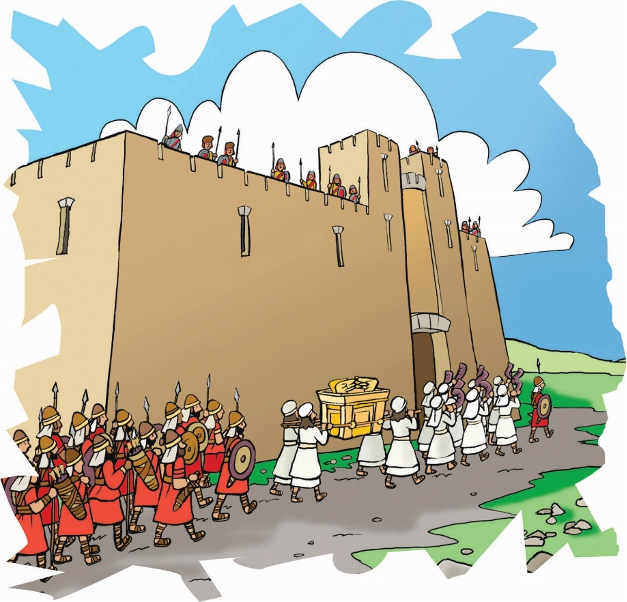

> 
Chângvawn

> “Pathian mite ṭangruala chên ho hi a va ṭhâin, a va hlimawm êm!” (Sam 133:1).

### Chhiar tûrte

Joshua 6; Thlahtubulte leh Zâwlneite, pp. 509–520.

> 
Thuchah

> Pathian chhûngkaw zîngah kan thawk tlâng dial dial ṭhîn.

_I phûr êm vânga muthilh theih loh chângte i nei tawh ngâi em? A nih loh leh, ni hlimawm eng emaw bîk tak lo thleng tûr vânga zîng hma taka thawh chângte i nei tawh ngâi em? Israel sipai rualten Jeriko khawpui an kal hual ṭum pawh kha chutiang chu a ni ve mai thei e._

Israel sipaite leh puithiamte chu zîng khawvâr hma fêin an tho va. Hmanhmawh deuh taka tûkṭhuan eiin, sipaite chu indo thuam an inbel hlawm a. Rei lo têah thuthlung bâwm hnungah chuan an intlar fel ṭhap a. Puithiam palîte chu thawmhnaw vâr sara inthuamin, thuthlung bâwm zâwn mai tawh tûrin an inpeih thlap tawh a.

Israelte hruaitu, Joshua a lo lan chuan, mipuite chu a’n fuih phûr a.

Joshua chuan, “Indo tûr angin au suh u la, in âw pawh chhuah hlek suh ang che u. Au tûra ka hrilh hma loh che u chuan a phun pawh phun suh ang che u,” tiin a hrilh a. Indo au hla hmanga au rual hian sipaite chu a tihuaisenin, hmêlmaten an lo zâm phah ṭhîn a. Mahse, Joshuan sipaite chu Pathian rinchhan zâwk tûrin a duh a ni.

Kâr lohah sipai hote chu an inzui liam ta nguai nguai a. Sipai tam vak lo hian hma an hruai a. An hnungah chuan puithiam eng emaw zâtin berâm pa ki tâwtawrâwt hâm chûngin an zui a. Chutah puithiam palîin thuthlung bâwm zâwn chûngin an zui leh a. Chu mite hnungah chuan sipai rual dang zawngte chuan an zui ve leh ta a ni.

Israelten Jeriko khawpui an hnaih tâkah chuan, kulh kawngkhâr chu nghet taka kalh a ni tih an hmu a. Kulh chûngah chuan an sipai rualte chu an ding tlar a, an râlthuamte hmang tûrin an inpeih sâ diam hlawm a. Mahse, Israelte chu kulh bul chên thleng lo hian an kal kual a, khawpui hêl kual chûngin an kal zêl a. Rei lo te chhûng chu puithiamten an tâwtawrâwt ham chu an châwl a, thâwm awm chhun chu sipai rual kal ri ṭhup ṭhup chauh chu a ni.

Israelte chuan Jeriko khawpui chu an kal hual a, chutah an riah bûk lamah an kîrsan leh rih a. Kulh ko tlânga sipaite pawh chuan an râlthuam chu an lek sâng ta lo va, a ngaihna tak hre lo vin, mak an ti ngei mai. Engtizia nge ni tâ ang le?

A tûkah pawh chuan Israelte chu an riah bûk aṭanga lo chhuakin, Jeriko chu an rawn pan leh a. A hmasa berah sipaite, chutah puithiam pasarih tâwtawrâwt hâmtute chu. A dawt lehah bâwm zâwntu puithiam te, a hnuhnung berah sipai rual chu an lo kal leh ṭhup ṭhup a.

Puithiamte chuan ring takin tâwtawrâwt chu an hâm a. Sipai rualte chuan ngâwi rengin an zui zêl a, ṭawng ri leh thâwm bengchheng rêng rêng a awm lo. Chutianga ngâwi renga kal chuan sâwtna a nei tih sipai hote chuan an hre thiam a ni. Khawpui chu an hêl chhuak a, an riah bûk lamah chuan an kîrsan leh ta mai a. Jeriko vengtu sipaite chuan a ngaihna an hre lo hle mai. Hetiang hi eng indona nge ni ngâi?

A ni thumnaah te, a ni li-na leh ni ngâna leh a ni ruknaah pawh chuan chu-tiang zêl chuan an ti nawn a. Khawpui kulh chhûnga in-kalh hnan mipuite chu din pawh an ding hleithei tawh meuh lo a ni.

A ni sarih niah pawh chuan puithiamte leh sipai hote chu ni dang ang bawkin an inrem leh ṭhap a. An riah bûk chu chhuahsanin, Jeriko khawpui lam chu an pan leh ta a ni. Kulh kotlângah pawh chuan sipaite chu an lo ther leh fur tawh mai a. Israel hote chuan a hma ang khân, vawi khat chu khawpui an han kal hêl leh phawt a. Mahse, an riah bûk lama lêtsan ta mai lo chuan, a vawi hnih nân an kal hêl leh a, a vawi thum nân an kal hêl leh ta zêl mai si a.

Israel sipaite chuan a vawi li nân, a vawi nga nân, leh a vawi ruk nân, chutah a vawi sarih nân an kal hêl leh ta zêl a. Chutah an zâ chuan an ding ta ṭhup mai a. Puithiamte chuan ring thei ang ber tûrin an tâwtawrâwt ṭheuh chu a rualin an han hâm ta ruai ruai mai a.

An hotuta Joashua chuan, “Ring takin au rawh u le! Lalpan khawpui chu a pe ta che u a ni e!” tiin thu a han pe a. Sipai hote chu vanvadâkin, ring theih tâwpin an au rual a. Chutah chiah chuan thil beisei phâk loh, theih rual loh tûra ngaih chu a lo thleng ta. Thâwm ring êm êm mai hian Jeriko kulh chu a tlu ta ruih tuih mai a ni! Israel sipaite chuan khawpui chu luh chilhin, an la ta a ni.

Pathianin Jeriko chu Israelte kutah a pe a. A hnehtu chu Pathian a ni a; mahse, Israelte pawhin an chanvo chu an hlen ve tho a a ni. Joshuan a hrilh angin Pathian nên an ṭang tlâng a ni.

### Ni tina tih tûrte

**Sabbath**

- In chhûngte nên, lung leh thing hmangin “Jeriko Khawpui” lem siam ula. Lungtê emaw, thil chi emaw hmangin sipaite leh puithiam intlar lem siam bawk ang che u. Chutah in zirlâi thawnthu hi in chhiar ho dâwn nia. Kulh chim chungchâng in chhiar hunah in “Jeriko Khawpui” lem siam chu in titlu leh vek dâwn nia.
- Chhiar ho tûr: Sam 133:1. In chhûngte in zirtîr dâwn nia.
- Hla sak ho tûr: “I’m in the Lord’s Army” a nih loh leh kal rem hla dangte pawh.

**Sunday**

- Chhûngkaw worship-naa chhiar ho tûr: Joshua 6:1–16. Hê indonaa Israelte hnehna chantîrtu kha tu nge ni? (Joshua 6:16). Pakhat chiah thâi ang che u:
	- Joshua
	- Pathian leh Israel sipaite
	- Pathian
	- Sipai rual
- Kha hnehnaah khân Israel sipaiten eng nge tih an neih ve?
- Leirawhchan ang 13 siam ang che u. Chûngah chuan chângvawn thumal hi in ziak zêl dâwn nia. Pakhatah chuan Bible bung leh châng ziak ula. Indawt fel taka remin in dah ṭha rih dâwn nia.

**Thawhṭanni**

- In chhûngte nêna chhiar ho tûr: Joshua 6:16–20. ‘Ṭang rual’ tih awmzia chu ṭha taka thawk ho tihna a ni. Hê thuah hian sipai hote kha an ṭangrual em? (Tik rawh: Âw/Âih.)\
Fel takin an intlar. (Âw/Âih)\
Hawi zâwng inang vekin an kal tlar. (Âw/Âih)\
An ngâwi reng. (Âw/Âih)\
Joshuan a hrilh hunin an au ta vak. (Âw/Âih)
- In chângvawn ziahna leirawhchan kha dik taka remin, sawi rual nghâl ang che u.

**Thawhlehni**

- In chhûngte nên, hmawlh emaw thing ṭang emaw la khâwm ula. Pakhat chu kut lâwnin elh tliak ula. Tûnah a dang pali chu thlawptîrin, elh tliah han tum leh teh u. In elh tliak thei em? A awlsam zâwk nge a harsa zâwk? Engati nge? “Ṭanrual hi chakna a ni!”
- In chhûngkua in ṭanrualna lantîr thei thil paruk sawi teh u. Kohhrana ṭanrualna a awmzia thil pathum sawi teh u. Chhiar ho tûr: Ephesi 4:2, 3.
- Chhûngkuaah leh kohhranah ṭan rualna a awm theih nân ṭawngṭâi ang che u.

**Nilaini**

- Chhûngkaw worship nâna chhiar ho tûr: Hebrai 11:30. Engtin nge Israelten Jeriko-ah khân rinna, rinchhanna leh ṭanrualna an lantîr le?
- Tlar hnuhnung ber kha ziak chhuakin, a thlûk siam ula, “Are You Sleeping?” tih thlûkin sa ho teh u.\
Marching ’round Jeriko, marching ’round Jeriko,\
Trusting God, trusting God.
- (Dîm têin) RING TAKA AU! (Ring takin) AU VAK!
- Leirawhchana in thil siam kha titlû ula. Chângvawn in sawi pahin in paih thla zêl dâwn nia. Pathian in rinchhan lehzual theih nân a ṭanpuina dîl ang che u.

**Ningani**

- Biak In leh a chhûnga mipui kut insuih leh ṭawngṭâi ho lâi lem ziak teh u. Chumi hnuaiah chuan: “Ṭawngṭâi ho ṭhîn kohhran chu ṭangrualin an chak ṭhîn” tih thu in ziak dâwn nia.
- Chhûngkuain kut insuih kual ula. Pakhat chu pawna awmin, a chhûnga luhtîr tum tûrin chantîr ang che u. A chhûnga a luh hnuin, chhuahtîr chu phal leh tawh suh ang che u. Engtin nge chu leh kohhran chhûngkua hi a inan ve deuh le?
- Chhiar ho tûr: 1 Korinth 3:9, tîr lam.
- Dârthlalanga inen chûngin châwngvawn sawi rual ang che u.

**Zirtawpni**

- Bible thawnthu hi in chhûngkuain lemchanah hmang ho teh u. Tu nge Joshua lemah chang ang?
- Chhiar ho tûr: Joshua 6. Jeriko khawpui kha a vâiin vawi eng zât nge an kal hual khâ?
- An kal pah khân mipuiten eng nge an tih? In biak inah eng nge mi dangte nên in tih ho ṭhin?
- Pathiana in ṭanrualzia entîr nân chhûngkaw puanzâr (flag) duang ang che u. Chutah chuan in chângvawn in ziak dâwn nia. Chhûngkuaa chângvawn in sawi rualin in vâi vêl dâwn nia. Chutah in chhûngkua in ṭanrual avângin Pathian hnênah lâwmthu sawi ang che u.