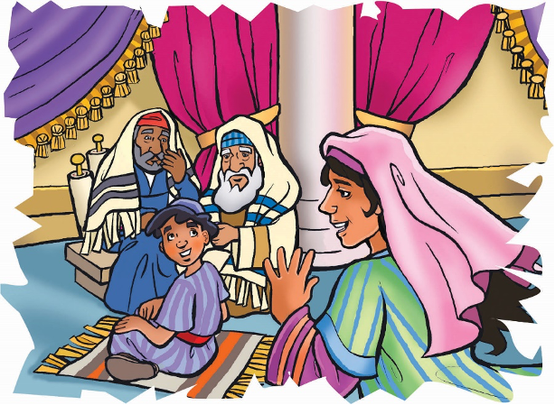

> 
Chângvawn

> “Lalpa in Pathian rawng chu in thinlung zawng zawngin, in thlarau zawngin bâwl rawh u” (Deuteronomi 10:12).

### Chhiar tûrte

Luka 2:41–49; Chatuan Nghahfak, pp. 68–78.

> 
Thuchah

> Kan awmna apiangah Pathian rawng kan bâwl thei.

_Puitling tuten emaw naupang lutuka an ngaih che u in tawng ve tawh ngâi em? Thil pawimawh tak tihtîr tûr chein in duh ngâi em? Hna pawimawh tak thawk ve thei tûrah in inngâi em? Hêng zawhnate hi ‘Aw’ tia in chhan chuan vawiin thawnthu hi in pual tûr a ni ang._

Kum tinin Mari leh Josefa te chu Kalhlen Kût hmang tûrin Jerusalem-ah an kal ṭhîn a, Isua erawh chu in lamah a lo awm ṭhîn a. Tûn ṭum hi Nausên a nih lâi bâka Jerusalem lam a kal leh hmasak ber ṭum a ni. Lal Herodan Isua nausên lâia thah a tum lâi kha ngaihtuahin, hê mi ṭuma an kal pawh hian a nu leh pate chuan hlauhthâwnna an nei maithei a.

An chhûngkua chuan thlenna tûr hmun an hmu thuai a. Chutah Mari leh Josefa’n Isua chu Temple-ah tlâi lam inthâwina hlan tûrin an hruai ta thuai a. Isuan mâichâma berâmno hlan a hmuh chuan a ngaihtuahna a kal thui hle ngei ang.

Inthâwina hian amah a entîr tih pawh a hrethiam thei a. Engtikah emaw chuan Pathian Berâmno-ah la ṭangin, khawvêl sualte phurin a la thihsak dâwn a ni.

Kût hmanna hun pui a lo tâwp chuan, mipuite chu mahni in lama hâwng tûrin an insiam hlawm a. Nazareth khuaa mite chu an inzui dam dam a. Mari pawh chu hmalama kalin, a hmeichhe kalpuite chu a tîtîpui a. Josefa leh mipa hote chuan hnung an dâwl ve thung a. Naupang hote erawh chu a lâi vêlah chuan an kal tawn vêl ruai ṭhîn a.

Chumi tlâi chuan, an zân riahna tûr hmun buatsaihte a lo ngâi ta a. Mari chuan Josefa chu a rawn pan vat a, “Isua i hmu em?” tiin a zâwt a. An pahnih chuan a hming lam lam chûngin an zawng ta zêl a. Mahse Isua chu an hmu mai si lo. Khâ mi ni ni lêng khân Isua hmu âwm rêng an lo awm si lo. An hmuhna hnuhnung ber chu Jerusalem-ah khân a ni tih chu an hre hlawm a.

Zin chhuah nân khua a thim lutuk tawh si. Ṭawngṭâi mai loh chu tih theih rêng an nei ta lo. A tûk zîngah chuan Josefa leh Mari te chu Isua zawng tûrin Jerusalem lam panin an kîr leh vang vang a.

An va thlen chuan ni lêngin khawpui bazâr hmun leh kawtthlêr vêlte chu an zawng a. A tâwpah chuan Temple-ah kalin, hulhliap vêlahte chuan an zawng zêl a. A tâwpah chuan Isua aw ngaihnobei tak chu an hre ta a ni.

Isua kha Temple- a thil zir theih apiang zir tumin a châm bâng a. Josefa leh Mari chuan zirtîrtute ke bula lo ṭhu a, zawhna a lo zâwt lâi chu an hmu a. Zirtîrtute chuan a thil hriatzia chu mak an ti hle zâwk a.

Mari chuan a hnên lam pan nghâl vat chûngin, “Ka fapa! Engati nge hetianga min tih lê? Mangang takin kan zawng che a! Nangmah zawng hian hmun tin kan fang tawh a sin!” a ti a.

Isuan a nu leh pate chu a en rân a. “Engati nge min zawn? Ka Pa ina awm tûr ka ni tih in hre lo vem ni?” a ti a. Isua kha chuan Pathian in kha a nêl hle a ni.

Isuan Mari leh Josefan an ngaihtuahzia chu a hrethiam a. Anni hi a hmangaih a, an thu âwih tak chûngin Nazareth khaw lam panin an kîr tlâng a. Ani chu Pathianin chhûngkaw chênna hmuna rawngbâwl zui zêl rih tûrin a duh a. Kum eng emawti chhûng chu an thilsiamna hmunah chuan hnâ a thawk ve rih dâwn a ni.

Isua ang khân, keini pawhin kan inah te, Schoolah te, leh biak inah te rawng kan bâwl ve thei a. Kan awmna hmun apiangah Pathian rawng kan bâwl thei a ni.

### Ni tina tih tûrte

**Sabbath**

- In chhûngte nên, hmun fianrial lamah lêng ho ula. Hmun remchânga châwlin, chutah chuan zirlâi thawnthu hi in chhiar dâwn nia. Râl khat hla taka Jerusalem khawpui hmu thei angin inngâi ula. Sawi rual tûr: “ ‘Lalpa inah i kal ang u’ ka hnêna an tih lâi khân ka lâwm a. Aw Jerusalem, kan kête chu i kulh chhûngah a awm tâk hi!”
- Chhiar rual tûr: Deuteronomi 10:12. Hei hi in chhûngte hnênah in zirtîr dâwn nia.
- Hla sak ho tûr: “Be Like Jesus” (Sing for Joy, no. 115).

**Sunday**

- Temple lem en ula. Engtin nge biak in nên a danglam?
- Chhûngkaw worship nân, hmanrua in hmuh theih ang angin Temple lem siam ula. Pindan pakhat chu Isuan zirtîrtute a biakna angah khân in chan dâwn nia.
- Chhiar ho tûr: Luka 2:41–52.
- In chângvawn kha sawi rual ang che u. In kohhran member-te malsâwm tûrin Pathian hnênah dîl ula.

**Thawhṭanni**

- Hêng hmanraw narân lehkha, puan leh thil dang dangte vawiina worship hman nân la khâwm ula. Chûng chu Lalpa rawngbâwl nâna in hman ṭangkai theih dân tûr sawi ang che u.
- Chhiar ho tûr: Galatia 5:13.
- Vawiin School kalnaa mi dangte rawng in bâwlsak dân sawi ula, chumi thu-ah chuan Pathian hnênah lâwmthu sawi ang che u. In chângvawn in sawi rual dâwn nia.

**Thawhlehni**

- In chhûngte nên chhiar ho tûr: Luka 2:51. Engtin nge hei hian Isua rawngbâwl dân an târlan? Engtin nge chutiang chuan rawng in lo bâwl ve?
- Isua tih dân in entawn theih nân, Pathian ṭanpuina dîl ang che u.
- In nu leh paten ti tûra an ngen che u chungchâng sawi ho teh u.

**Nilaini**

- Hêng ang thing them te, tuboh te, bowl te, tui chhawpna te, hmunphiahte la khâwm ula. Chûng thilte hmanga Isuan thil a tih âwm takte chu in chhûngte nên worship-naah sawi ho vin, lemchanah hmang teh u.
- Hla sak ho tûr: “I Want to Be” (Sing for Joy, no. 124) leh “A Happy Home” (Sing for Joy, no. 136).
- Chhûngkaw worship neih hnuin, Isua ang khân thil ti ula. In chhûng zînga mi tu emaw ṭanpui tûrin thil eng emaw ti zui ang che u.

**Ningani**

- Chhûngkaw worship-naa chhiar ho tûr: Deuteronomi 10:12. Enganga rawngbâwl tûr nge kan nih ang? Hê chânga eng thu ber hian nge hmangaihnain rawng kan bâwlsak tih lam han kâwk deuh le?
- Naupang an nih lâia mi dangte rawng an bâwlsak dân chungchâng sawi tûrin puitling tû emaw in sâwm dâwn nia. Tui emaw, thei tui emaw no khat hmangin tu nge rawng in bâwlsak ang le? Vawiin ngei hian ti nghâl ang ula.
- In chângvawn sawi rual ang che u.

**Zirtawpni**

- Chhûngkaw worship nân, in Bible zirlâi chungchâng thil pathum chu in chhûngte hnênah hrilh ang che u.
- Chhiar ho tûr: Luka 2:40. Hê thawnthua Isua kha ‘râwlthar’ ang rual vêl a ni ang. Tûnah talk–show neihnaa kaihruaitu anga inchan ula. Khatih lâi Isua ang rual vêlte hnênah eng thil tih nge nuam an tih chungchâng zâwt la. Chûng ang rualte chuan Pathian rawngbâwlsak tûrin eng nge an tih zâwt ang che.
- In chhûngte nên, naktûka Pathian rawngbâwl dân tûr ruahmanna siam ula.
- In chângvawn sawi rual ula. Pathian rawngbâwl lam hla sâ ula, chutah rawngbâwl tûra remchânnate in neih avângin Pathian hnênah lâwmthu sawi ang che u.