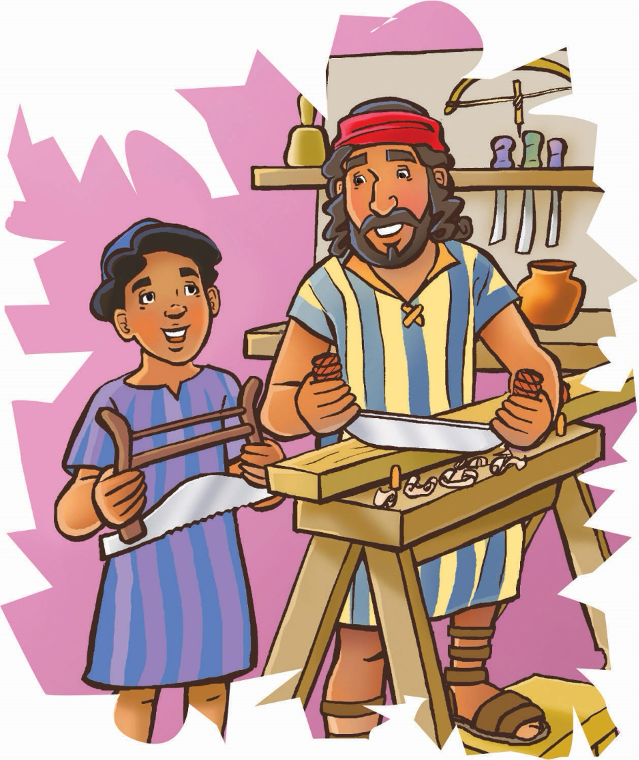

> 
Chângvawn

> “I kutin tihtûr a hmuh apiang chu i theihna zawng zawngin ti zêl rawh” (Thuhriltu 9:10).

### Chhiar tûrte

Luka 2:40, 52; Matthaia 13:55; Marka 6:3; Johana 7:15; Chatuan Nghahfak, pp. 60–67, 79–88.

> 
Thuchah

> Zirnaa theihtâwp ka chhuahin, mi dangte rawng ka bâwlsak thei.

_Malika chuan a thlawhna lem siam zawh hlim lek vâ chûng chuan, “A pa, a pa!” a ti a. A pa chuan, “Taitê, i va siam thiam ve! Theihtâwp i chhuah a nih dâwn hi. Ka va chhuang tak che êm!” tiin a chhâng a._

_Mipa naupang Isua chuan ni tin hian theih tâwp chhuahin thil a zir zêl a. Khatih lâia thil awm dân chiah kan hre lo nâin, hetiang deuh hi a ni mai thei e._

Josefa chuan a hman-ruate chu an thawhna dâwr dawhkân sei chûngah a nghat a. A bân chu phar chhuakin, thing nawhmamna rim chu boruakah a lo nam vang vang a. Ni êng tukverha lo lût thlarah chuan thing nâwi chu a lêng cham cham a. Josefa chuan Isua hnathawhna hmanruate chu a’n thlîr kual zung zung a. Mipa naupang mai chu a la ni nâin, Isua kha hna thawh thiam tak a ni tawh a ni.

Isua chu han dâk chhuakin, Josefan a lo thlîr reng chu a hmu a. Nui var var chûngin, “Kan zo vin ka hria,” a ti a. Nawhmamna hmanga nâwt tûra Josefan a pêk chu a tuai vat vat a.

Josefa chuan Isua thil siam lâi chu a’n ṭanpui a. Thil mâm leh ngîl zaih chu a’n thlîr a. A kutzungṭang chuan thing chu chulin, a rual lo lâi a awm leh awm lo hriat tumin a’n zut a. Duhthusâm ang thlap a ni. Josefa chuan, “I ti ṭha hle mai,” tiin a chhâng a.

“Tû pawhin neitu nih an châk hle dâwn a nih hi!”

Isua chuan inngâitlâwm takin, “Theihtâwp ka chhuah ve a lâwm,” a ti a. Josefa chuan chhuang takin a lu a lo bu nghat nghat a. Isua kha chuan theihtâwp hi a chhuah zêl ṭhîn a ni.

Josefa chuan, “Theihtâwp kan chhuah hi chuan Pathianin atâna ṭha ber tûrin min hmang thei ṭhîn a ni,” tiin a hrilh a.

Isua erawh chuan a chhâng lêm lo. A ngaihtuahna chu hmun hla tak, Jerusalem Temple lamah a lêng daih thung a. Kum 12 mi a nih kumin Isuan chu hmun chu a tlawh tawh a. Chuta chin chu Kalhlen Kût berâmno a hmuh chungchâng hi a ngaihtuah deuh reng mai ṭhîn a. Engtikah emaw chuan Amah ngei chu Kalhlen Kût Berâmno tak takah a la ṭang dâwn tih a hria a. Mahse, tûnah rih chuan carpenter dâwra theihtâwpa ṭhaa hna thawkin Pathian rawng a bâwl mêk a ni tih pawh a hre bawk a.

Josefan Isua hnênah, “Thil i zir theih apiang chu zir zêl rawh. Tichuan, Pathianin i hnêna a rua-hmanna a târlan hunah khawvêl tâna rawngbâwl tûrin i lo inpeih thei dâwn nia,” tiin a hrilh fo ṭhîn a.

Josefa chuan Isua chu a nuih var var a. “Vawiin atân chuan kan bânsan a hun tawhin ka ring,” tiin a hrilh a. Fîmkhur taka hmanruate chu dawhkân chûnga dah khâwmin, bang bulah chuan fel takin a tung a.

Isua pawh chuan, “Ka pa ka lâwm e,” tia chhângin, a hmanraw hmân lâite pawh chu a dah ṭha zui ve nghâl a. Hmanraw dangte pawh chu an hmunah a dah fel a. Thing bungte pawh chu thing tuah atân a chhar khâwm zung zung a. In lama rawngbâwl nâna tuah tûrin a hâwn a.

Josefa leh Isua chu in lam panin an hâwng dûn a. A pa nêna hun hman dun chu Isua nuam tihzâwng tak a ni a. Thawktu zei tak nih dân han zirte chu nuam a ti a. A nu pawh chu amah zirtîr ṭhîntu a ni ve tho va. Pathian Lehkhathu chhiar dân leh zir dânte a kawhhmuh ṭhîn a. An pahnih chuan a Pa vâna mi hnênah pawh an ṭawngṭâi dûn fo ṭhîn a ni.

Isua kha thil zir nuam ti mi leh thiam thei tak mai a ni a. A lo ṭhan len hnu pawhin a thil hriatzia kha miten mak an ti hial a (Johana 7:15). Isua ang khân, keini pawhin theihtâwp chhuah dân kan zirna hmunah hian mi dangte rawng kan bâwlsak a lo ni ṭhîn!

### Ni tina tih tûrte

**Sabbath**

- In chhûngte nên ram lamah lêng chhuak ula. In zînga mipa naupang Isua kha tel ve angin ngaihruat bawk ang che u. Pathian thilsiam chungchâng eng nge in zir ho theih ang? Hmun remchângah ṭhu ho vin, in zirlâi thawnthu hi in chhiar dâwn nia.
- Chhiar ho tûr: Thuhriltu 9:10.
- Hla sak ho tûr: “Thil Êng Mâwi Duhawm Zawng Zawng” (Adventist Hla Bu, no. 30). Chutah Pathianin thil engkim ‘ṭha taka a siam’ avângin lâwmthu sawi ṭawngṭâina hlân ang che u.

**Sunday**

- Chhûngkaw worship nâna chhiar ho tûr: Ephesi 6:7. Mahni ṭawng kauchhehin a awmzia hi sawi ang che u.
- Hla sak ho tûr: “I Want to Be Ready” (Sing for Joy, no. 2).
- In chângvawn kha chhiar emaw sawi ho emaw ang che u.
- Chângvawn in vawn theih nâna ṭanpui tûrin Strong-Hand Cookies* (chhang) in siam dâwn nia. Chhang hlâwm chu nuai phêk ula. Chutah ha khernain in kut thla lain vawi eng emaw zât rîn nawn ula, in kut thla chin chu in ur hmin dâwn nia! In kutte in hman ṭangkâi theih nâna ṭanpui tûr che uin Pathian hnênah ṭawngṭâi ang che u.

_Adapted from Kathie Reimer, 1001 Ways to Help Your Child Walk with God (Wheaton Ill.: Tyndale House Publishers, Inc., 1994), pp. 53, 54._

**Thawhṭanni**

- Chhûngkaw worship nân kawngkhârah lehkha châr bet ula. Chutah chuan thil eng emaw in tih theih tûr ṭheuh chu in ziak dâwn nia. Chutah in thil ziah tlar chu en ula, pakhat chu thlangin chumi chungchâng chu in sawi/sa ho dâwn nia. “Here We Go ’Round the Mulberry Bush,” tih thlûk khân hê hla hi sa ho ang che u:\
This is the way I brush my teeth, brush my teeth, brush my teeth,\
This is the way I brush my teeth. I learn things as I grow.\
(Taksa awp hniamin, chutah ceiling tawng thei hial tûr niawmin ding char leh ṭhîn ang che u.)†\
Adapted from Fun to Learn Bible Lessons (Loveland, Colo.: Group Publishing, 1995), vol. 2, p. 17.

**Thawhlehni**

- Chhûngkaw worship-naa nu leh pate hnênah, naupang an nih lâia an ṭhatna lâi sawi tûrin ngên ang che u. Chhiar ho tûr: Luka 2:40, 52. Isua kha khawi Schoolah nge a luh ve? Chutah chuan eng thil nge a zir ṭhin?
- Isuan thil ṭha a tih ṭhin chi hrang panga sawi teh u. Thil thar in zir duh tûr chu eng nge ni ve le?
- In chângvawn sawi rual ula, chutah ni tina thil thar eng emawte in zir zêl theih nân Pathian ṭanpuina dîlin ṭawngṭâi ang che u.

**Nilaini**

- Worship-naah, puitling tû emaw hnênah thil eng emaw zir tûra Pathianin a lo ṭanpui tawh dân sawi tûrin in sâwm dâwn nia.
- Lehkha phêk hlâi takah in chângvawn hi ziak chhuak ula. Thil ṭha zâwka ti ṭhîn tûra zir an duh tûr thil eng emaw lem chu in chhûngte in ziahtîr hlawm dâwn nia.
- Chhiar ho tûr: Philipi 4:13. Hê châng thu hi a thlûk siamin, sa nghâl teh u. Chutah thil harsa deuhte pawh in tih theih nân Pathian ṭanpuina in dîl dâwn nia.

**Ningani**

- In chhûngte nêna chhiar ho tûr: Matthaia 11:29. Pathianin Isua hnên aṭanga zir tûra a duhsak che u thil pahnih thlang teh u:
	- Chhiarkawp
	- Zâidam-nunnêm
	- Inngâitlâwm
- Bible-a zeh tûr ‘bookmark’ siam teh u. Chutah chuan pangpâr lem mâwi tak leh in Bible châng ngainat tak in ziak tel dâwn nia. Ni tinin châng khat tê têa zirin, vawng zêl ang che u.
- Pathian chanchin tam zâwk in zir theih nân a ṭanpuina dîl ang che u.

**Zirtawpni**

- Vawiina worship neih hmain lehkhain emaw plastic straws hmangin emaw zial tlâwn siam ang che u.
- Worship-naah in chhûngte nên Bible thawnthu hi lemchanah hmang ho ula. Isuan a nu hnên aṭangin thil a zir ṭhin thu in thlen hunah, lehkhazial tlâwn chu phelhin amah lema changtu chu in chhiartîr dâwn nia. Chângvawn thiam takin sawi rual ang che u.
- Chhiar ho tûr: Deuteronomi 10:12. Engtin nge naktûk Sabbath Schoolah mi dangte rawng in bâwlsak ang le? Theihtâwp chhuah tûr a ni tih kha hre reng ang che u.
- Hla sak ho tûr: “Isua Chanchin Ka Hre Zual Ang” (Adventist Hla Bu, no. 120). Chutah, Sabbath ni avângin Pathian hnênah lâwmthu sawi ang che u.