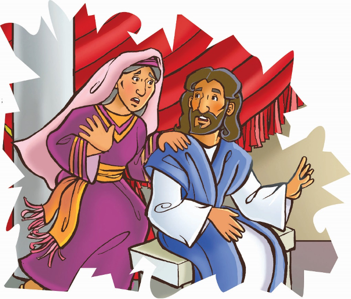

> 
Chângvawn

> “Mi tinin thilpêk in dawn apiang chu. . . mi dangte rawng bâwlsak nân hmang ṭheuh rawh u” (1 Petera 4:10).

### Chhiar tûrte

Johana 2:1–11; Chatuan Nghahfak, pp. 146–157.

> 
Thuchah

> Mi dangte rawngbâwlsakna hmangin Pathian tân ṭhian kan siam.

_Inneih mo lawmnaah in tel tawh ngâi em? Eng thil chu nge in hriat reng ṭhin? Monu thawmhnaw mâwi tak em ni? Mi inchei nalh tak takte em ni zâwk? Pangpâr mâw? Nge rimâwi tum leh zâithiam zâite zâwk? Chhang leh thingpui tui tak te? Nuam in ti viau em? Ṭum khat chu Isua pawh inneih mo lawmnaah a tel ve a nih chu!_

Galili rama Kana khua mo lawmna inah chuan mi sâwmte chu an ṭhu khat hmur mai a. Tual vêlahte pawh mi tam tak an awm bawk a. Mite hlim taka tîtî leh nui thâwm leh rimâwiin a khat a. Ni hlimawm tak a ni.

Mari chuan chu boruak hlimawm tak chu a’n thlîr kual vêl a. An mi sâwmte, ṭhiante leh moneitû nu leh pate pawh chu a en kual zêl a. Chutianga a’n thlîr kual dan dan tâkah chuan, chhiah-hlawh pakhat hi rilru hrehawm tak hmêl pu hian a lo kal a. A beng bulah chuan lo kûn hniamin, “Uainin a daih lo, a zo vek tawh,” tiin a hrilh sâ sa a.

Mari pawh chuan hmêl hlim a pu thei ta bîk lo. A ngaihna hre lo takin a chal chu a tichuar nâng nâng a. A’n hawi vêl ruai a. Uain bêl lian pui pui niawma lang chu a ruak vek mai si! Chutiang a nih vâih chuan mo lawmna hlimawm chu a tâwp nghâl mai dâwn tih hriain, a rilru a hrehawm hle mai. Moneitute chhûngkaw tâna a hmingchhiat thlâk tûrzia chu hriain, a rilru a beidawng a. Engtin nge ruahmanna a neihpui tâk ang le?

Mari chuan a mawhphurhnaah a ngâi a, mahse thil han tih theih chu a nei bawk si lo. Dâwrpui hmun lah khâr a ni tawh bawk si a, han lei belh maina tûr a awm tawh lo. Eng mah tih theih rêng a nei lo. Nge, eng emaw tih theih a nei zâwk?

Chutah Mari chuan harsatna chin fel dân tûr duhthusâm chu a hre ta hlauh mai, chu chu ‘Isua’ a ni. Khatah khân Isua leh a zirtîrte pawh mo lâwm tûra sâwm an ni.

Mari chu hmanhmawh takin Isua hnêna kalin, “Uain an tlachham ta tlat mai!” tiin hlauthâwng takin a hrilh a.

Isua pawhin thil awm dân duhawm lohzia chu a hre ve nghâl mai a. Mahse, ani chuan eng nge a tih theih ang le? Isua chuan, “Hmeichhe duhawm tak, engati nge hetiang thil hi min hrilh a? Ka hun a la thleng rih lo a ni,” tiin damdiai hian a zâwt a.

Mari chu a mangang tak zet ta. Mamawhna hmanhmawh thlâk tak a ni si a. Isua pawhin a ṭanpui thei ngei dâwn tih a hre bawk a. Chhiahhlawhte awmna lam chu pan nghâlin, an hnênah, “In hnêna a sawi apiang chu ti zêl ang che u,” tiin thu a pê a.

Isua chu a’n hawi vêl a, tuibêl lian tak tak paruk a awm tih a hmû a. Tuibêl chu liter 76 vêl dawng ṭheuh a ni hlawm a.

Zâwi deuh sap hian chhiahhlawhte hnênah chuan, “Tuibêlte hi tui chhûng khat rawh u,” a ti a.

A thu âwih an che nghâl vat a. Tuibêl paruk chu a rawng thlengin an chhûng khat nghâl vat a. Isuan an hnênah, “Tui hi tlêm thâl ula, fatu hotu va temtîr rawh u,” tiin a hrilh a. Chhiahhlawhte chuan thil mak danglam tak a thleng a ni tih an hre nghâl mai a.

Hei hi tui pângngâi angin a lang lo va, tui rim pawh a nam hek lo. Fatu hotupa hnênah chuan an kalpui ta vat a. Ani chuan khawia mi nge tih a hre hauh lo va, thil thleng awmzia pawh a hre ve lo. No chu lain, a’n tem nghâl a. Hlim taka nui var var chûngin moneitu hnênah a kalpui a, “Mi dangte chuan a tîrah uain ṭha ber ber an sem hmasa ṭhîn a. Mi sâwmten tam tâwk an in hnu chuan uain narân deuhte an sem zawm mai ṭhîn. Nang erawh chuan tûn thlengin a ṭha ber chî i la nei reng a nih hî!” tiin a fak luam a.

Hei hi Isua thil mak tih hmasa ber a ni. Isuan mi dangte rawng a bâwlsak a thilthleng chu a zirtîrten an hmû a. Amah ring lehzual tûrin an rilrû an siam sauh sauh a. A ṭhian ṭha ber berah an ṭang zêl dâwn a ni. Keini pawhin mi dangte kan ṭanpui hian Pathian tân ṭhian kan siam a ni ṭhîn.

### Ni tina tih tûrte

**Sabbath**

- In chhûngte nên, Pathian tân ṭhian tharte siam tum ang che u. Picnic-naahte kalin hmêlhriat tharte pawh in nei thei ang a. Eitûr/in tûr leh thilpêk chhetê pêk ve hmang pawhin bul in ṭan thei ang.
- Chhiar ho tûr: 1 Petera 4:10, in chhûngte hnênah zirtîr nghâl ang che u.
- Hla sak ho tûr: “Give Me Oil in My Lamp” (Sing for Joy, no. 39). Ṭhian tharte in neih theih nân Pathian ṭanpuina dîl ang che u.

**Sunday**

-In chhûngte nên, Johana 2:1–11chhiar ula. Bible map-ah Kana khua zawng chhuak ula. Hêng mite hian mite rawngbâwlsak tûra an tih ṭheuh chu sawi ang che u:
	- Mari
	- Chhiahhlawhte
	- Isua
- In chhûngte hnênah nimbu tui emaw, thil in tûr eng emaw sem ṭheuh ula. Kana khuaa inneihna chanchin kha sawi zui ang che u.
- Nangmahni rawngbâwksaktû che u avângin Pathian hnênah lâwmthu sawi ula.
- No lem 17 (cup-shaped) chep ula. Chutah chuan in chângvawn thu hi in ziak zêl dâwn nia. Chutah, indawt fel takin rem ang che u.

**Thawhṭanni**

- Chhûngkaw worship-naa chhiar ho tûr: 1 Johana 3:16–18. He thu awmzia hi mahni ṭawng kauchhehin in chhûngte hnênah in hrilh dâwn nia.
- Tûn kâr ni dang la awm chhûng hian, mi dang in ṭanpui/rawng in bâwlsak chungchâng chu lehkha phêk pakhatah in ziak zêl dâwn nia.
- Vawiina rawngbâwlsaktu che u hming ziak tlar ula.
- Hla sak ho tûr: “We Are the Church, Everyone” (Sing for Joy, no. 143). In ṭhian pakhat tân ṭawngṭâisak ang che u.

**Thawhlehni**

- Chhûngkaw worship-naah, Pathian thilthlawnpêk in dawnte hming ziak chhuak ula. (Thil ṭhâ in dawn apiang in ziak thei ang.) Mi dangte chu mi dang tâna thil ṭhâ tihsak nia an inhriat sawi tûrin sâwm ula. Chûng thil ṭhenkhat chu a lem in ziak dâwn nia.
- Chhiar ho tûr: Rom 12:6–8. He chânga târlan mi dangte rawngbâwlsak dân hi a remchân dân angin lemchanah hmang nghâl teh u.
- Chângvawnin thilpêk dawnte hman dân tûr a sawi chu eng nge ni?
- Inneihna hmuna Mari angah khân inchanin ruahmanna siam chhin teh u. Isua pawh sâwm ngei ula.

**Nilaini**

- Chhûngte nêna chhiar ho tûr: Johana 2:5–8. Heta ‘chuta’ (kiang lawka) awm a tih kha eng nge ni (châng 6)? Khâng tuibêl paruka tui awm zât belhkhâwm kha eng zât vêl nge ni ang? Tui leng tûr zât hriat nân tehkhâwng in neih ang ang hmangin teh chhin teh u. Liter khatah tui no eng zât nge awm? Tuibêl pakhat aṭang khân chhiahhlawhten no eng zât nge an thâl chhuah theih ang le?
- Mi dangte ṭanpui nân in kiang vêla thil awm engte nge in hman ṭangkai theih ang?
- En lo vin chângvawn kha nâl takin sawi teh u.

**Ningani**

- Chhûngkaw worship nâna chhiar ho tûr: Johana 2:9, 10. Isua khân engang uain nge a siam? Uain chungchâng zau zâwka hrilh tûr che uin in chhûngte sâwm ula. (Chatuan Nghahfak, phêk 152–153.) Mi dangte kan ṭanpui hian theihtâwp chhuah ṭhîn tûr kan ni ang em?
- Dinhmun duhawm lo taka ding mi pathum lem zawng ula (naupang rethei, chênna nei lo, damdâwi ina damlo, kângmei tuar). Chûng ang mite in ṭanpui theih dân tûr chu sawi ho ula. Chutiang mite ṭanpui tûra thawktute tân ṭawngṭâisak ang che u.
- In chhûngte nên chângvawn sawi rual ang che u.

**Zirtawpni**

- Chhûngkaw worship nân, in zirlâi thawnthu hi lemchanah hmang teh u. Thawhṭanni-a bul in lo ṭan tawh “Pathian Tâna Ṭhian Siam” tiha in thil ziah chungchâng chu sawi tlâng ula. Thil ṭha tih tûr pakhat chu lemchanah hmang nghâl teh u.
- Thil ṭha tih tûr chu inrin chhâwkin, lemchanah inhman chhâwk ula, chutiang chuan in ti ṭheuh dâwn nia. Chutah Galatia 6:9 chhiar ho ang che u.
- In chângvawn sawi rual ula, chutah hê hla: “We Are His Hands” (Sing for Joy, no. 42) hi phûr takin sa ho ang che u.