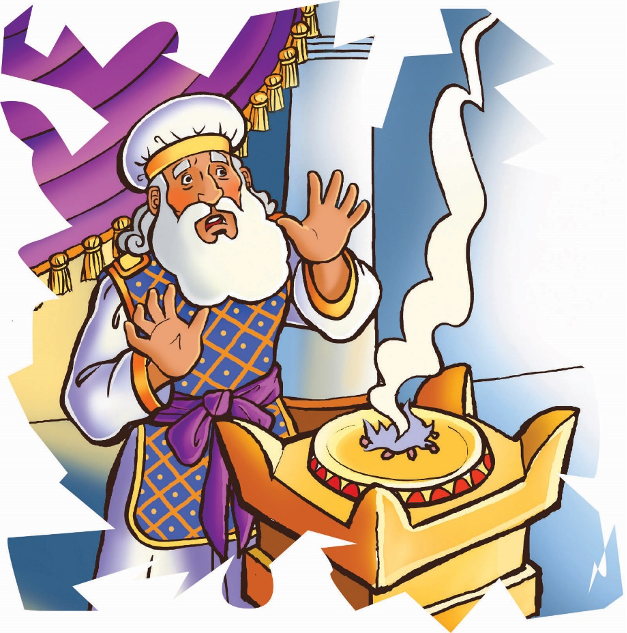
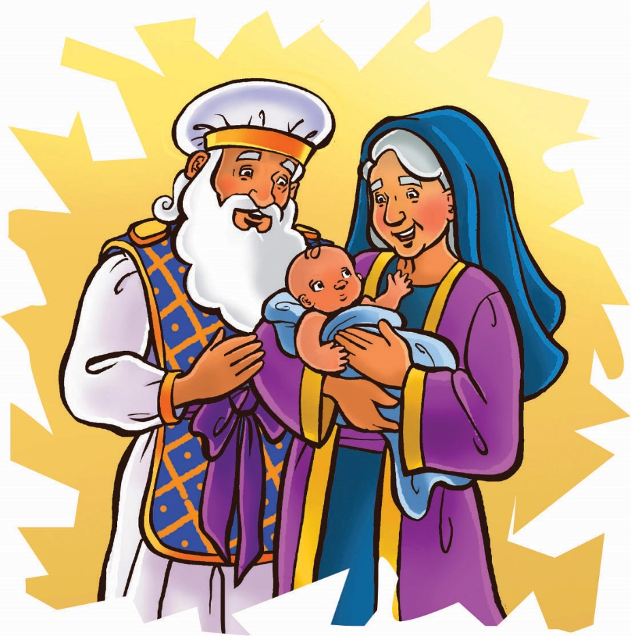

> 
Chângvawn

> “Ama tâna kawng buatsaih tûrin Lalpa hmaah i la kal dâwn a ni” (Luka 1:76).

### Chhiar tûrte

Matthaia 3; Marka 1:1–12; Luka 1:5–25, 57–80; Johana 1:15–34; Chatuan Nghahfak, pp. 89–109.

> 
Thuchah

> Mi dangte rawng kan bâwlsakin Isua tân kawng kan buatsaih a ni.

_Bella-i chu a phûr hle mai a! A pi hnên aṭangin thuchah a dawng zo chiah a. Bella-i chuan thuchah chu a chhiar nawn a chhiar nawn a: “Thla lehah ka rawn tlawh dâwn che u. In beisei loh deuh thil ṭhâ ka rawn hawnsak ang che u,” tih a ni._

_A va phûrawm tak êm! Lo inbuatsaih peih diam tûrin ka nu ka ṭanpui ang a tiin Bella-i chuan a hisâp nauh nauh a._

_Bella-i chu choka lamah a tlân a. A nu hnênah chuan, “A nu, a pi-in min rawn tlawhna tûr atâna inpeih theih nân ṭanpui che ka va duh êm! Engtin nge ka ṭanpui theih ang che min hrilh teh,” a ti a._

_Hmânlâi hunah pawh khân vântirhkoh pakhat chuan putar pakhat hnênah thuchah a rawn thlensak a. Chu thuchah chuan khawvêl hi a her danglam vek dâwn a ni._

Elizabethi leh Za-karia-te nupa khân kum tam tak chhûng chu naute neih an lo beisei ve tawh ṭhîn a. Mahse, tûnah chuan tar an lo ni ta a, beiseina pawh an nei tawh meuh lo a ni. Zakaria chu Temple-a rawngbâwltu pui-thiam tam tak zînga pakhat a ni ve a. Anni hian Jerusalem Temple-a rawngbâwl chu kâr tinin an in thawh chhâwk ṭhîn a. Biak bûk Hmun Thianghlim Bera rawngbâwlna chan hi chu an dam chhûngin vawi khat emaw lek an chang thei a ni.

Rangkachak mâichâm chûnga rimtui hâltu nih chu chanvo sâng tak a ni a. Tichuan, mipui zawng zawngte sual ngaihdamna a dîlsak thei dâwn a ni. Chutiangah chuan Chhandamtu (Messia) lo kal tûr chu rawn kaltîr thuai tûrin Pathian hnênah an dîl ṭhîn a. Zakaria pawhin chu hun lo thleng tûr chu hmathlîr berah a lo nei ve ṭhîn rêng a. Tûnah chuan putar a lo ni tawh a, a hun lo inher chhuak ve ta chu phûr pawh a phûr hle mai.

Zakaria chuan rimtui hâlna bâwma meilingah chuan rimtui chu a’n phul sar sar a. Rimtui tui tak chu a lo khu chhuak cham cham a, tichuan Hmun Thianghlim chu a luah khat ta vek a.

Chutih lâi tak chuan Zakarian mahni maia awm a ni lo tih inhriatna a nei ta thut mai a. A mit a’n meng a, mâichâm sir ding lamah chuan vântirhkoh hi a lo ding reng mai a! Hlauvin Zakaria chu a khûr zawih zawih mai a ni!

Vântirhkoh chuan, “Hlau suh, Zakari, Pathianin i ṭawngṭâina kha a hria e. I nupui Elizabethin fapa a hring dâwn a ni. A hmingah chuan Johana in sa dâwn nia. Lalpa tâna kawng buatsaih tûrin A hmaah a kal dâwn a ni,” a ti a.

Tar hnuin fapa a hring ang mâw? Zakaria chuan vântirhkoh thusawi chu a ring ngam chiah lo va. Chuvângin vântirhkoh chuan chhinchhiahna a pe zui nghâl a. Zakaria hnênah chuan, “Ka thute i rin loh avângin, hê ni hi a lo thlen hma loh chuan ṭawng thei lo vin i ngâwi reng rih ang,” a ti a. Tichuan, vântirhkoh chu a bo leh ta a ni.

Zakaria chuan mipuite tâna dîlsakna hlan tûrin a ka a âng a; mahse, âw rêng rêng a chhuah thei ta lo. Thu a sawi thei tawh lo tlat mai a ni.

Zakaria kha Hmun Thianghlim chhûngah khân a thang rei viau mai a. Pâwna amah lo nghâktu mipuite ngaih pawh a ṭha lo hman hial a. A tâwpa a lo chhuah tâkah chuan, a hmâi chu mak tak maiin a lo êng a. Zaizir hian vântirhkoh a hmu a ni tih anni chu a hrilh a.

Zakaria chu anmahni in lamah a hâwng ta thuai a. Thil awmzia chu Elizabethi hrilh a tum a; mahse a ṭawng thei ta bawk si lo. Thuziak leh zaizir hmangin thil a sawi ta ngawt mai a ni. Nautê an nei dâwn a, naute hmingah chuan ‘Johana’ tih an sa tûr a ni. Chutianga ti tûr chuan vântirhkohin a hrilh a nih kha!

Thla eng emawti hnuah chuan naute chu a lo piang a. Elizabethi ṭhiante chu lo pung khâwmin, an lawmpui hlawm a. Elizabethi chuan an hnênah, “A hming chu Johana tih sak tûr a ni,” tiin a puang a.

Mahse an ṭhiante chuan, “Johana maw? In chhûngte zîngah pawh Johana tih hming pu in la awm ngâi hlei nêm. Engati nge ‘Zakaria’ tih hming in puttîr loh ang ni?” an ti hlawm a.

Elizabethi chuan a pasal lam chu a hawi a. Zakaria chuan a lu a lo thing nar nar a.

An za vâia hmuh theih tûrin: “A hming chu ‘Johana’ a ni” tiin a ziak a. Chu veleh chu puithiam putar chuan âw a rawn chhuah thei leh ta mai a. Mite hnênah chuan thu sawiin, Pathian malsâwmna chûngah chuan amah chu a fak ta a ni.

Zakaria khân Johana hnênah mâichâm bula vântirhkoh a hmuh thute kha a hrilh ve ngeiin a rinawm e. Zakaria chuan, “Pathianin i tân hna thawh tûr bîk a nei a. Lalpa tâna kawng siam tûrin ama hmaah i kal dâwn a ni,” tiin a hrilh a.

Johana chu a lo ṭhang lian a, thute hrilin, mipuite chu an sualte sim a, baptisma chang tûrin a sâwm a. Isua tâwk tûra lo inpeih tûrin mi tam tak chu a ṭanpui hlawm a ni.

Nangma tân pawh Pathianin hna bîk thawh tûr a neihsak che a. Mite mamawh phuhrûksak leh an rawngbâwlsakin Isua tân kawng i buatsaihsak thei a. Tichuan, Isua chanchin zir zêl tûrin an rilrûte a lo inhawng mai dâwn a ni.

### Ni tina tih tûrte

**Sabbath**

- In chhûngte nên, ram lamah lêng ho ula, sava bûte hmuh tum teh u, a nih loh leh lehkhabu lamah in zawng mai dâwn nia. Savaten bû an chheh leh no an neih a, an châwm dân sawi ho ula. Sava chi hrang hrangten bû an chheh dânte hriat tum bawk ang che u.
- Zirlâi chhiar ho ula. Tu nge lo ṭhang lian a, Isua lo kalna tûra kawng buatsaihtu tûr kha?
- Chhiar ho tûr: Luka 1:76. Mi tuten emaw Isua an hriat theihna tûra kawng buatsaihsak tûrin Pathian ṭanpuina dîl ang che u.

**Sunday**

- Chhûngkaw worship-naa ring taka chhiar ho tûr: Luka 1:5–25.
- Minit 23 chhûng vêl chu ring taka eng mawh sawi lo vin awm teh u. Hmûi chu in phun sep sep thei ang a, kut zaizir leh lehkhaa thil ziahte pawh in ti thei ang; mahse âw in chhuah tûr a ni lo! Zakaria kha ngaihtuah ula. Ani tân khân infiamna ang lek a ni ang em?
- In ṭawng theih avângin Pathian hnênah lâwmthu sawi ang che u.
- Dârthlalanga inen chûngin in chângvawn kha ring takin sawi lauh lauh ang che u. In ka chhûng kha in en ngar ngar thei ang em?

**Thawhṭanni**

- Worship-naah, i lo piang dâwn tih an hriata in chhûngkaw rilru awm dân chungchâng sawitîr ang che u. In nausên leh naupan lâi thlalâkte thlîr ho teh u.
- Chhiar ho tûr: Luka 1:13. Zakaria leh Elizabethi-ten Johana a lo piang dâwn tih an hriat a an rilru put hmang ni tûra in ngaih chu sawi tlâng teh u.
- Hla sak ho tûr: “In His Time” (Sing for Joy, no. 4).
- In chângvawn sawi rual ula. Nu leh pate in neih avângin Pathian hnênah lâwmthu sawi ang che u.

**Thawhlehni**

- Chhûngkaw worship-naa chhiar ho tûr: Luka 1:57–66.
- In chhûngte hnênah in hming an phuah chhan sawitîr ang che u. In hming awmziate in hre hlawm em? Johana hming awmzia kha “Pathian duhsakna thilthlâwnpêk” tihna a ni. In hming nên lama Pathianin a hriat che u avângin lâwmthu sawi ang che u.
- Luka 1:66 chuan “Lalpa kut chu a (Johana) chungah a awm” tiin a sawi a. Chu chu eng nge a awmzia ni tûra in ngaih le?
- In chângvawn hi a thlûk siam ula, in chhûngte nên in sa ho dâwn nia.

**Nilaini**

- Worship bulṭan nâna chhiar ho tûr: Luka 3:2–6, 15, 16.
- Johana kha a lo puitlin tâkah khân eng hna bîk chu nge a thawh? Thil pathum sawi ula. Engati nge ‘Baptistu’ tih a nih? Nangni eng tikah nge baptisma in chan ve ang le?
- Damchhûnga Pathian tâna i thawh ve tûr chungchâng chu in chhûngkuain sawi ho teh u. In lo puitlin huna in hmêl lem tûr chu ziak teh u.
- Hla sak ho tûr: “Right Now” (Sing for Joy, no. 123), in hmalam hun chungchâng ṭawngṭâiin dîl ho teh u.

**Ningani**

- In chângvawn hi Zakaria hlaa mi a ni a. Chûng chu sawi emaw, sâ emaw tûrin in chhûngte sâwm ang che u.
- Tû emaw tâna rawng in bâwlsak dân tûr kawhhmuh tûrin Pathian hnênah dîl ula. Chu mi tân chuan ṭawngṭâisak nghâl ang che u. In chhûngkuain ruahmanna siam ula, hlen ngei bawk ang che u.
- Chhiar ho tûr: Galatia 6:2.

**Zirtawpni**

- Zakaria emaw Elizabethi emaw angah khân inchan ula. Nausên Johana lo pian aṭanga a ṭhan chhoh zêl dân chhinchhiahna vawngtu in ni. Chutah chuan tûnkâr zirlâi tlângpui hi in ziak lût dâwn nia. A theih chuan a lem inhmeh tûr pawh bel thei ula. A kâwmah chuan in chângvawn in ziak bawk dâwn nia. In chhûngte nêna worship-naa a thawnthu hrilh nân in diary hmang ang che u.
- Chhiar ho tûr: Jeremia 1:7. Isua hnêna in hruai tûr tû emaw tân in chhûngkuain ṭawngṭâisak ang che u.
- Hla sak ho tûr: “We Are His Hands” (Sing for Joy, no. 42)