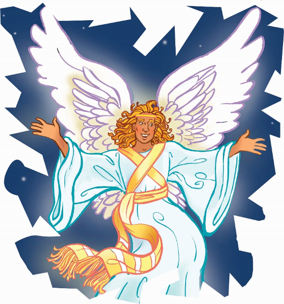

> 
Chângvawn

> “Hlau suh u. Mi tinin nasa taka an hlimpui tûr chanchin ṭha lâwmawm êm êm ka rawn thlen che u a ni” (Luka 2:10).

### Chhiar tûrte

Luka 1:13, 19, 30; 2:10; Chatuan Nghahfak, pp. 36, 89–91.

> 
Thuchah

> Pathian chu kan ṭhian a nih avângin amah kan hlau lo.

_Khawpui ri dur dur hi i hlau ve tawh ngâi em? Kâwlphe zawr zawrte hi, a nih leh thim i hlau ngâi em? Jamie chuan thlipui lo thawk kâra khawpui ri dur durte hi a nuam a ti lo, a bîkin zâna lo thleng a nih hian a hlau zual a. Chu chu a nu pawhin a hriatpui a. Chuvâng chuan a awmpui nghâl vat ṭhîn rêng a ni. A nu chuan, “Hlau suh, ka awmpui ang che. A reh leh thuai ang,” tiin a ṭawng thlamuan a. Chutah Jamie chu tui takin a muhîl zui a. Bible hun lâite kha chuan Pathianin tute emaw hnênah vântirhkohte a rawn tîr ṭhîn a. Hlau lo leh thlamuang taka awmtîr ngei a tum ṭhîn a ni._

Hun rei vak lo kal ta khân vântirhkohin Temple-a puithiam, Zakaria a rawn tlawh thu kha kan zir tawh a nih kha. Rawng a bâwlna hmun, mâichâm kianga ding tûrin Pathianin vântirhkoh a rawn tîr a. Puithiam upa tawh tak, Zakaria chuan a hlau deuh a, mahse rei a ni lo. Rang takin vântirhkoh chuan Zakaria hlauhna chu a tihreh sak thuai a.

Vântirhkoh chuan, “Hlau suh. Pathianin i ṭawngṭâina a lo hria e,” tiin a hrilh a. Zakaria hnênah chuan chan-chin mak leh lâwmawm hrilh tûr a neih pawh a hrilh a. A nupui, Elizabethi chuan fa a nei ang a, a hmingah chuan ‘Johana’ an sa ang tih a hrilh bawk a.

A hnu leh deuhah Pathianin Mari hnênah ‘nau-sên,’ fapa bîk tak a la nei dâwn tih hrilh a duh a. Tichuan, chumi chungchâng chu hrilh tûrin Lalpan vântirhkoh pakhat chu a tîr leh ta a ni. Mari chuan a hlauh loh nân, vântirhkoh chuan damdiai hian thu a hrilh a. “Chibai le, vohbîkna dawngtu! Lalpa chu i hnênah a awm e!” (Luka 1:28) a ti a. Chu chibai bûkna chu thu lâwmawm tak a ni. Hmêlmate hi chuan chutianga chibaibûkna thu chu an inthawn ngâi lo. Mahse, chuti chûng chuan Mari chuan a hlau tho mai a, a rilru a buai deuh nak mai. Tichuan, chiang lehzualin vântirhkoh chuan a sawi zawm a. “Mari, hlau suh,” a ti nawn leh a. ‘Hlau suh’ tih chu Pathian hnên aṭanga thuchah bîk lo thleng a ni.

Chutiang thuchah ang chi tho chu Isua pian zân khân berâmpute hnênah hriattîr a ni a. Thuchah kengtu vântirhkoh a lo lan chuan, ropui leh êng tak maiin, vân chu a kâp êng phût mai zâwk a. Berâmpute pawhin an hlau hle a ni.

Luka lehkhabu-ah chuan hêng mi huaisen takte pawh hian an hlau hle tih a sawi a. Mahse vântirhkoh chuan thu a sawi zui zêl a. “Hlau suh u. Mi zawng zawngte ta tûr, chanchin ṭha lâwmawm êm êm ka rawn thlen che u a ni,” a ti a. Vântirhkoh chuan Nausên bîk tak Bethlehema a pian thu chu an hnênah a hrilh a. Ranchaw pêkna thlenga mû Nausên an hmu dâwn a ni. A tâwpa vântirhkoh thâwm leh ênna a lo reh tâkah chuan berâmpute pawhin an hlau zui zêl ta bîk lo.

Anni chuan, “Hawh u, Bethlehem-ah kal ila, Lalpan kan hnêna a sawi chu i va en teh rêng ang u,” an ti a. Hlauhna nei tawh lo vin, hmanhmawh takin Isua en tûr chuan an kal ta nghâl a.

Tichuan, Pathianin thu a sawiin, min tihhlauh hi a tum a ni ngâi lo. Mi tinte hian “Kan hnêna Pathian awm” thuchah lâwmawm chu hre ve ṭheuh tûrin min duhsak a. Kan hlauh a ṭûlna a awm lo. Pathian chu kan ṭhian a ni a; amah kan hlauh a ṭûl rêng rêng lo a ni.

### Ni tina tih tûrte

**Sabbath**

- In chhûngte nên, khaw pawn hmun remchângah lêng ho ula. Ramhnuaiah hian thil hlauh tûr eng eng emawte in nei em? Hmun him tûra in ngaih hmunah ṭhu châwl ula, in Bible zirlâi hi in chhiar ho nghâl dâwn nia.
- Luka 2:10 keuvin, chhiar ho ang che u. Chanchin lâwmawm chu eng nge ni?
- Hla sak ho tûr: “Khawiah Pawh Lal Isua Nên” (Adventist Hla Bu, no. 299). Chanchin lâwmawm avâng chuan Isua hnênah lâwmthu sawi ang che u.

**Sunday**

- Chhûngkaw worship-naah, an thil hlauh ber chu sawi tûrin insâwm ṭheuh ang che u.
- A huhova chhiar tûr: Luka 1:13, 30 leh Luka 2:10.
- Zakaria khân eng nge a hlauh? Marin eng nge a hlauh a, berâmputen eng nge an hlauh? Engtin nge vântirhkohten an thlamuan?
- Vântirhkoh mobile siam ula. Construction paper hmangin vântirhkoh lem panga chep ang che u.
- Lazâi sei tâwk chu kawrchung khâinaah in bâng dâwn nia. He thu hi in târ tel bawk dâwn nia: “Hlau suh!” Ni tina in hmuh theihna tûr hmunah in khâi dâwn nia.
- In chhûngte hnênah châwngvawn zirtîr ula. A vântirhkohte avângin Pathian hnênah lâwmthu sawi ang che u.

**Thawhṭanni**

- Chhûngkaw worship-naa chhiar a, sawi ho tûr: Luka 1:11–13.
- Mi tinte chu lehkha phêk thlêp a, thlêp nawn leh tûrin tî ula. Phelh leh ula. A kilah chuan “Pathian chu kan ṭhian a ni: Hlau suh” tih in ziak dâwn nia.
- Vântirhkohin Zakaria hnêna thu a sawi lâi lem tûr ziak ula. Chu milem hnuaiah chiah chuan, “Fapa, a hming ‘Johana’ in la nei ang,” tih ziak ula. Naktûk lam atân in dah ṭha rih dâwn nia. In chhûngte nên chângvawn sawi rual ula.
- Hla sak ho tûr: “God Is So Good” (Sing for Joy, no. 1). Chutah in ṭhian a nih avângin A hnênah lâwmthu sawi ang che u.

**Thawhlehni**

- Worship-naah chhiar a sawi ho tûr: Luka 1:26–31.
- Lehkha phêk ṭhen thumnaah vântirhkohin Mari hnêna thu a sawi lâi lem ziak ang che u. A hnuaiah chuan, “Isua i la hring dâwn a ni,” tih ziak ula, in dah ṭha rih dâwn nia.
- Isua chanchin lâwmawm an hriat hmasak ber chungchâng sawi tûrin puitling tû emaw sâwm ang che u.
- “Chanchin ṭhâ” poster siam ula, chutah chuan in thil hlauh zâwng lem ziak ula, ‘X’ in dah zêl dâwn nia. “Pathian chu ka ṭhian a ni a, ka hlau lo vang,” tih ziak ang che u.

**Nilaini**

- In chhûngte nên chhiar a sawi ho tûr: Luka 2:8–10.
- A hmaa lehkha in siam tâk kha zawh tawh tûr a ni. Ṭhen lînaah vântirhkohin berâmpute hnêna thu a sawi lem kha ziak ang che u. A hnuaiah chuan in chângvawn ziak ula.
- Lehkha khawngin berâm lem chep ula, a hmul atân lapua in bel dâwn nia. A hnuaiah chuan, “Hlau suh,” tih ziak ula. In chhûngte nên chângvawn sawi ula.
- Hla sak ho tûr: “Kal Ulangin Va Hril R’u” (Adventist Hla Bu, no. 46).

**Ningani**

- Chhûngkaw worship ṭan nân, construction paper hmangin bial lian tak siam ula, phêk hmâi khatah hlau hmêl lem ziak ula, chutah chuan “Hlau suh” tih ziak ang che u. Hmâi lehlamah chuan hlim hmêl lem ziak ula, chutah chuan “Mi tin tâ tûr, Chanchin ṭhâ lâwmawm êm êm ka rawn thlen che u a ni,” (Luka 2:10) tih in ziak dâwn nia.
- In chhûngte nên, hê zirlâi hi sawi ho ula, Isua lo kal leh tûr kan hlauh loh chhan tûr sawi ho ang che u.
- Chhiar ho tûr: Matthaia 24:30, 31. Engtin nge Isua lo kal lehna chu a hmasâ ang a nih ang? Engtin nge a danglam bawk ang?

**Zirtawpni**

- Chhûngkaw worship-naah, tûn kâr chhûnga in thil siam kha entîrin, hrilh fiah ang che. Vântirhkoh mobile lem chu remchâng lâiah târ ang che u. (Zirlâi 12-na atân in dah ṭha rih dâwn nia.) In lehkhaphêka ṭhen lîna kha entîrin, in chhûngte hnênah Bible zirlâi in hrilh dâwn nia.
- Hlau hmêl in siam kha entîrin, chângvawn sawi nghâl ula. Isua chanchin sawi tûrin insâwm ṭheuh ang che u.
- Chhiar ho tûr: Johana 15:15. Isua ṭhian nih chungchâng hlate sa ho ang che u.