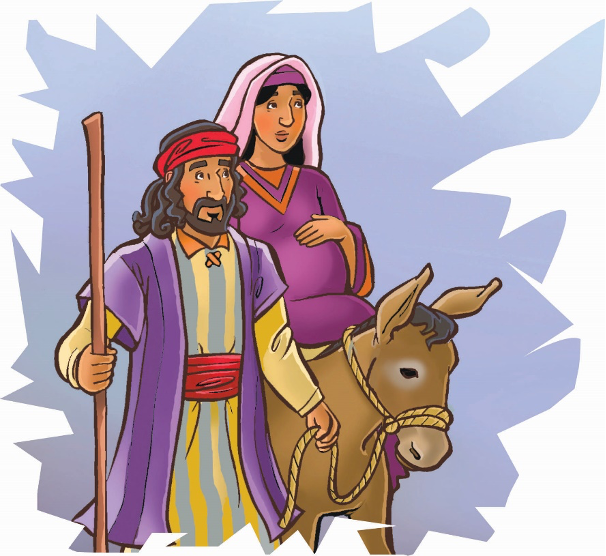
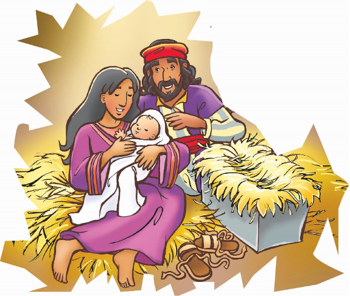

> 
Chângvawn

> “Thilpêk ṭha leh thilpêk famkim zawng zawng chu, chûng lama Pa hnên atâ lo chhuk a ni.” (Jakoba 1:17).

### Chhiar tûrte

Luka 2:1–7; Chatuan Nghahfak, pp. 34–40.

> 
Thuchah

> Pathianin thilthlawnpêk ṭha berte min pe, a thilpêk ṭha ber chu Isua a ni.

_Novi chu a hlim êm avângin a nui deuh reng mai a. Ani hian nautê hi a ngâina a, a nu pawh naute thar nên an lo hâw thuai tawh dâwn a ni! Krismas hnuhnung berah khân thilthlawnpêkah naute lem a dawng a. Tûnah erawh chuan hmangaih leh infiampui tûr naute lem ni lo, nautê chu a takin a nei dâwn ta a ni. Thilthlawnpêk duhawm a va ni êm—naute lem ngawt âi chuan duhawm zâwk tak a ni! Kum tam tak kal ta khân, chhûngkaw dang pakhat pawhin naute duhawm bîk tak hi an nei a. Chu chu tu nge a nih in rin?_

Mari chu ama tâwk têin a nui var var a. A hlim nui chu a tâwp hleithei lo. Nausên bîk tak, Lalpa Krista chu a la hring thuai dâwn a ni si a.

Vântirhkohin chutiang thu a hrilh a chin kha, makti takin a awm zui reng a. A hmasa berin, ani kher Pa-thianin a thlang chu mak a ti a. Ni e, ani leh Josefa hi Davida thlaha mi chu an ni ve ve a. Pathian Thu chuan Messia chu chu hnam aṭanga lo piang tûr a nih thu a sawi a. Chutiang chu ni mah se, an chênna khua nên erawh chuan a intu chiah si lo. Zâwlnei Mika chuan Messia chu Davida khawpui, Be-thlehem khuaa lo piang tûr a ni tih a sawi a. Chutih lâiin Josefa leh Mari te chu Na-zareth khuaa chêng an ni daih si a ni.

Thu pawimawh tak hian an khua chu a rawn dêng ve a. Lalber Augustus-a chuan chhiarpui nei tûrin thutlûkna a siam a. A lalram chhûnga mihring chêng zât hriat a duh a. Chumi awmzia chu chhûngkaw tinte chu chhiar vek tûr an ni. An thlahtute khuaah ṭheuh chhiarpui chu neihpui tûr an ni dâwn a. Chuvângin Josefa pawh an thlahtute khua chhiar tûr an ni a; chuvâng chuan Bethlehem khuaa kal tûr an ni.

Mari naute lo pian hun tûr chu a thleng ṭêp tawh a. Pathianin remruatna engkim fel takin a nei a. A naute chu Bethlehem khuaa piang tûr a ni a, chutiang chuan zâwlnei Mikan a lo hrilh lâwk diam tawh a. A hun takah chuan, sorkarin anni chu Bethlehem khuaa kal tûrin a ngiat a ni.

An zin kawng zawh chu an kal muangin a hahthlâk hle mai. Kawngah pawh chuan kualzin kal lâite chu an tâwt viau mai rêng a. Chu leh chena kawng thui sabengtûng chûnga chuan chu Mari tân pawh a nuam lo khawp mai.

Hah leh chau tak chûngin, a tâwpah chuan Bethlehem khua chu an thleng ta a. Mahse, Josefa chuan thlenna tûr hmun a hmu ta hauh lo mai. Tute mahin hmun ruak an nei tawh lo. Khual bûk zawng zawng chu khualzin chau takin a khat vek tawh a. Josefa pawh a rilrû a beidawng hle mai a, Mari pawh chau tak a ni.

A tâwpah khualbûk vengtu chuan anni chu a khawngaih êm êm a. Mari chu hmuin nautê a hring thuai tawh dâwn tih pawh a hre mai a. An hnênah chuan, “Pawi ka va ti êm! Pindan zawng zawng an luah khat vek tawh si a. Mahse, saw lâi deuhah sâwn ran in a awm a. In duh chuan . . .” a ti a.

Josefa chuan, “Kan luah mai ang e. Chu hmun tal avâng pawh chuan kan lâwm e,” a ti a.

Chumi zân chuan ‘Nausên Isua’ chu a piang ta a. Mari chuan in aṭanga a ken naute puan chuan a tuam a. Mak ti tak chung chuan a pawm hle hle a. A tâwpah chuan Josefan buhpâwl tharlâm a phahna ranchaw pêkna thlengah chuan a muttîr a.

Mari pawh chu Josefan mutna tûr a siamsakah chuan a mu ve ta bawk a. Ani hian a damchhûng hun hi rim takin a lo hmang tawh ṭhîn a. Chuti chûng chuan a hlimin, a lungâwi hle mai! Pathianin a thu chu a hlen a. A hnênah thilpêk duhawm ber chu a pe tawh a. Isua chu Pathian thilpêk duhawm ber chu a ni!

### Ni tina tih tûrte

**Sabbath**

- In chhûngte nên ram lamah lêng chhuak ho ula. Pathian thil min pêk zînga ṭhang lian thei entîrna tûrte la khâwm ula. Pathian thilthlawnpêk chungchâng sawi ho teh u. Hmun remchâng lâiah Bible thawnthu hi in chhiar ho dâwn nia.
- Chhiar ho tûr: Jakoba 1:17. Thilsiama Pathian thilthlawnpêk mak takte avângin lâwmthu sawi ang che u. Krismas hla sain, ṭawngṭâina hlan zui ang che u.

**Sunday**

- Chhûngkaw worship-naa chhiar ho tûr: Luka 2:1–7.
- Krismas Card hlui hmangin “Nausên Isua Lehkhabû” tih siam ṭan ula. (Hei hi kâr tinin belh chhah zêl ang che u.)
- Tûn kârah hian vântirhkohin Mari hnêna thu a sawi lem te, Bethlehem zin kawng leh Isua pianna kha telh ula. Phêk tinah a thupui siam zêl ula. In nu leh paten an siamsak che u a nih chuan en dîl ula.
- Chângvawn sawi rual ula. “Ṭhafamkim” tih awmzia hi dictionary-ah zawng ula. Eng nge a awmzia?

**Thawhṭanni**

- Chhûngkaw worship-naa chhiar ho tûr: Mika 5:2. Messia kha khawi khuaa piang tûr nge? ______________ Josefa thlahtute zînga langsâr zual deuh, Bethlehem khuaa mite târlang ang che u. En tûr: Ruthi 1:1, 2, 22; Matthaia 1:5, 6, 16. An hmingte ziak ang che u: 1)______________________ 2)___________________ 3)______________________
- In chhûng zînga puitlingte hnênah an pianna khuate sawitîr ula. Khawia piang nge an nih?

**Thawhlehni**

- In chhûngte nêna chhiar ho tûr: Luka 2:5–7.
- In inah khân Isua pianna hmun lemte siam ang che u. Isua chênna in hmasa ber leh nangni chênna in kha engtianga danglam leh inang nge a nih? Isua chênna in hmasa ber—ran inah khân eng rante nge awm tûra in ngaih? An lemte chu “Nausên Isua Lehkhabû” ah in bel dâwn nia. A lem in ziah ran lem pahnih chungchâng chu zir ula.
- In chhûngte hnênah chângvawn zirtîr ang che u. Chutah chênna tûr hmun in neih avângin Pathian hnênah lâwmthu sawi ang che u.

**Nilaini**

- Vawiin worship neihnaah, Isua pianna hmun lem vêlah khân Krismas thilpêk lemte dah ang che u.
- Nausên Isua chu Pathian thilthlawnpêk duhawm ber a ni tih hrilh nawn leh ula. Ribbon hmangin thilpêk cheina lem siam ang che u. Chutah chuan in chângvawn in ziak dâwn nia. Ni tina in hmuh theihna tûr hmunah in târ dâwn nia.
- Hla sak ho tûr: “Zân Thiang Reh Lâi” (Adventist Hla Bu, no. 57). Chutah a thilpêk duhawm ber—Isua avângin Pathian hnênah lâwmthu sawi ang che u.

**Ningani**

- Vawiin worship neihnaah, Bible map thlîr ho ula. Nazareth aṭanga Bethlehem kha engtia hla nge ni? In chênna hmun aṭanga chutiang vêla hlaah eng khua nge awm? Motor-in engtia rei thang tûr nge? Ke-a kalin?
- Chhiar ho tûr: Johana 1:10, 11.
- Krismas hlate sa ho ula. Worship zawhah, Zirtawpni tlâi atân Krismas chhang thlum in siampui dâwn nia. Chutiang in tih pah chuan in chângvawn kha in sawi/sa rual dâwn nia.

**Zirtawpni**

- Chhûngkaw worship nân, Isua pianna hmun in siam kha thlîr ula.
- Chhiar ho tûr: Luka 2:7.
- In chhûngte chu: Josefa, Mari, leh vântirhkoh, khualbûk vengtu, ran lema chang tûrin chanvo insem ula. (Berâmpute chu kâr leh a tân in dah ṭha rih dâwn nia.) Tu nge an nih leh, Isua pianna an ngaih dân chu zâwt ṭheuh ang che u.
- In thilpêk ‘chhang thlum’ sem chûngin in chângvawn sawi rual ang che u. Pathian thilthlawnpêk mak tak chu in pawm a ni tih A hnênah hrilh ang che u.