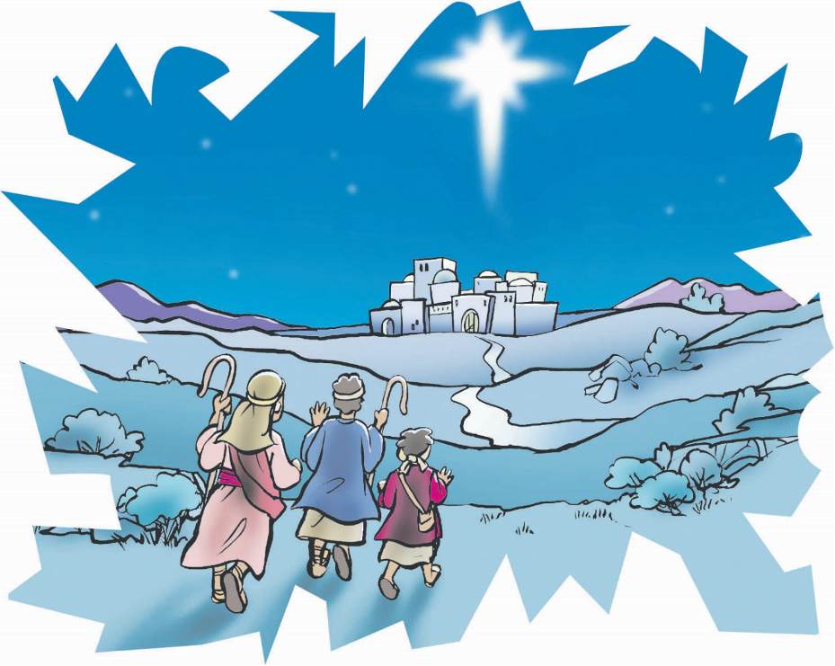

> 
Chângvawn

> “Hlau suh u. Mi tinin nasa taka an hlimpui tûr chanchin ṭha lâwmawm êm êm ka rawn thlen che u a ni. Vawiinah hian in tân Davida khuaah Chhandamtu a piang ta, Lalpa Krista chu.” (Luka 2:10, 11).

### Chhiar tûrte

Luka 2:8–20; Chatuan Nghahfak, pp. 36–40.

> 
Thuchah

> Isuan lâwmna min pe.

_Thil eng emaw neih duh êm êm châng i nei tawh ngâi em? Chumi dîl chuan ni tinin i ṭawngṭâi ṭhîn a. Zân mutnaahte pawh i mumangahte i hmu fo bawk a. Chutah beisei loh deuhin mi tûin emaw i thil duh tak chu an rawn pe ta hlauh mai che a. Kum tam tak kal ta khân berâmpute pawhin thil duh êm êm an nei ve a. Chu tak mai chu beisei loh kawng mak takin a lo thleng ta phut mai a ni!_

Berâmpute chu hnim rim nâm chêk chêk zîngah chuan an ṭhu khâwm a. An kiang hnâi lawkah chuan an berâmte pawh zân thimah chuan an bawk ṭhap bawk a. Zân thla êng pawh a fiah vak lo va, vân arsite chu zân thiang kûk maiah chuan an êng de sep sep hlawm a.

Berâmpute chu thâwm ring vak lo hian an phun sap sap hlawm a. Anni hian an thupui sawi nuam tihzâwng tak chu an sawi tlâng leh a ni ngei ang. Chumi chungchâng chu zan tinin an tîti thupui berah an nei ṭhîn a—chu chu Messia lo kal tûr thu a ni. Ni e, ni lênga nisa hnuaia an berâm ven hna avâng chuan an hah thei êm êm a. Mahse, Messia lo kal tûr chu ṭawngṭâi thupuia neiin, an thinlung chu chu hun lo thleng tûr nghah-hlelhna chuan a khat a.

Zân thiang reh tak hnuaiah chuan berâmpute chu thâwm nei mang lo chûngin an ṭhu a. Chutiang hun reh taka berâm lo bê leh zauh ṭhîn chu thâwm awm chhun chu a ni deuh mai.

Chutah vân boruak chu a lo êng ta phut mai a. Chu êng chuan anmahni lam chu a rawn pan a. A lo êng zual zêl a, chûng lâi ram zawng zawng chu a ên chhuak ta vek a, chhûn lâi ang maiin a êng a ni. Berâmpute chuan êng lakah chuan an mit an hliahtîr a. Ṭhenkhat chuan an hmâite an hup bawk a. An hmaah chuan mi pakhat êng zet mai hi a lo ding a. Chu chu vântirhkoh a ni thei ang em le âw?

Aw ngaihnobei tak hian, “Hlau suh u! Chanchin ṭha lâwmawm êm êm ka rawn thlen che u a ni. Chu lâwmna chu mi zawng zawng tân a ni ang. Vawiinah hian Davidâ khawpuiah in tân Chhandamtu a piang ta; Amah chu Lalpa, Krista chu a ni! Hei hi in tân finfiahna tûr a ni ang: Nausên, puana tuam, ranchaw pêkna thlenga mu in hmu ang,” tiin a rawn hrilh a.

Thuchah kengtu vântirhkoh chu vân vântirhkoh zâipâwl ropui tak mai chuan an rawn zawm ve nghâl vat a. Vân pumpui mai chu vântirhkoh hlîrin a khat a, an zavâi chuan phûr takin an zâi hup hup mai a ni! An hla sak chu: “Vân chung sâng berah khian Pathian chu châwimâwiin awm rawh se! Leia Pathian duhsakna dawngtu zawng zawngte hnênah rem lêng rawh se!” tih a ni.

Berâmpute chuan makti tak chûngin vântirhkohhote chu an thlîr reng a, an rilru ngaihtuahna chu a insual nasa hle mai a! Hlim taka an zâi rimâwi leh êng chu a nasa zual deuh deuh a, zân boruakah chuan a khat vek a ni ber mai.

Vân sâng chu rawng êng mâwi êm êm hian a khat a ni ber a, berâmpute chuan makti takin an thlîr vawng vawng a. Vântirhkoh zâi mâwi ri chuan an thinlung a khat a, an thinlung chu a tâwn puak lo chauh a ni ber mai!

A tâwpah chuan rimâwi chu a lo chuai ta riau riai a. Vân vântirhkoh hote chu vân sâng lam panin an chho delh delh a, vân lamah an kîr leh ta a ni. Êng pawh chu a lo chuai ta riai riai a, thâwm pawh chu a reh tial tial bawk a. Nakin lawkah chuan a reh leh ta vek a. An thinlung phu dut dut pawh a lo pângngâi ve leh ta a ni.

Berâmpu pakhat chuan, “Kha kha i lo hmu ve em?” tiin a zâwt a.

Pakhat dang chuan, “Khâ kha ataka thilthleng a ni, a ni lo’m ni?” a lo ti ve a.

“Khatiang kha tûn hma lamah ka la hmu ngâi rêng rêng lo!”

“Hawh u!”

“Khawiah nge kan kal ang?”

“Bethlehem lamah! Vântirhkoh khân vawiin ngeiah hian ‘Messia’ a lo piang ta tih a sawi a nih kha! Vawiinah ngei hian!”

Berâmpu pakhat chuan phûr zet hian a berâm ven tiang chu a la a, khaw lam panin tlâng pângah chuan a kal chhuk ta nghâl mai a. Mi dang zawng zawngte pawh chuan rang takin an zui nghâl a. Berâmpute chu an hlim ngei mai. Kha thil khân mite hnênah hlimna ropui tak a la thlensak zui zêl a. Keini pawh Isuan hlim leh lâwmna chu min pe ṭhîn a ni.

### Ni tina tih tûrte

**Sabbath**

- In chhûngte nên, berâm tlatna ramah lêng chhuak ula. Berâmte hual vêl angah inchan ula. Chutah chuan ṭhu khâwmin in zirlâi Bible thawnthu hi in chhiar nghâl dâwn nia. In bula vântirhkoh hote lo kal angin ngaihruat ula. An hlimna ang kha in nei ve thei ang em?
- In chângvawn, Luka 2:10, 11 chhiar ula.
- Hla sak ho tûr: “There’s a Song in the Air” (Sing for Joy, no. 82).

**Sunday**

- Chhûngkaw worship-naa chhiar ho tûr: Luka 2:8–14. “Nausên Isua Lehkhabû” tih tûr kâr kal taa bul in lo ṭan tawh kha chhunzawm ula.
- Vawiin hian vântirhkohten berâmpute an rawn tlawh lemte leh berâmpute lem pawh bel belh zêl ang che u.
- In chângvawn hi in chhûngte hnênah zirtîr ve ang che u.

**Thawhṭanni**

- In chhûngte nên worship nâna chhiar ho tûr: Luka 2:15–20.
- Hla mâwi rawn satu vântirhkoh hote kha êng mâwi takin a hual vêl a. Nangni, in in chhûnga êng pawr ber chu eng nge ni le? Vawiina vâna thil êng nasa ber chu eng nge ni? Engati nge mit lâwnga en a ṭhat loh? Êng avângin Pathian hnênah lâwmthu sawi ang che u.
- Hla sak ho tûr: “Now Is Born the Divine Christ Child” (Sing for Joy, no. 78).

**Thawhlehni**

- Chhûngkaw worship neih lâiin “Nausên Isua Lehkhabu” kha heta târlan ang hian tih chhunzawm ang che u:
	- Nausên Hming: Isua Krista
	- Nu leh pa: Mari leh Thlarau Thianghlim (Josefa—leia a pa hming)
	- Pianna Hmun: Bethlehem
	- Naute rih zâwng: ________________(a âwm tâwka in rin ang)
- Matthaia 1:1, 2, 5, 6-a Nausên Isua thlahtute zînga langsâr zual deuhte hming zawng chhuak ula.

**Nilaini**

- “Nausên Isua Lehkhabû” phêk khatah Krismas Hla in ngainat deuh chu ziak kâi ula, mâwi takin in chei dâwn nia. Hla chu in sa ho nghâl dâwn nia.
- Berâmpute kha Bethlehem lam panin an tlân nghâl thuai a. In ṭhiante nên han intlânsiak ve teh u. Infiam leh tlânte in tih theih avângin Pathian hnênah lâwmthu sawi ula.
- In chhûngte chu an tâna hlimna thlentu thil pakhat sawi ṭheuh tûrin sâwm ang che u. Chumi hnua chhiar ho nghâl tûr: Philipi 4:4.

**Ningani**

- Worship-naah, milem ziahna tûr lehkha leh a cheimâwina tûr rawng pe ṭheuh ula. A chûngah chuan “Rawng Cheimâwi Nawmna” tih ziak ula. Rawnga cheimâwi nawmna lem chu siam ang che u. In lemziah chuan engtin nge ‘lâwmna’ a târlan?
- In chângvawn sawi rual ula. Hlim leh lâwmna hi khawi aṭangin nge in dawn ṭhin? Lalpa hnên aṭanga dawng ṭhîn in nih chuan, in chûngah eng nge lo la thleng ang? En tûr: Nehemia 8:10, tâwp lam.
- Amâ chûnga in lâwmna chungchâng mi dangte hnêna hrilh tûrin Pathian ṭanpuina dîl ang che u.

**Zirtawpni**

- In chhûngkaw tân ‘Christmas worship’ neih ho dân tûr ruahman ula. Chuta tâna rawtna ṭhenkhat: Bati chhit ên. Berâmpute chanchin Luka 2:8–20 chhiar. Berâmputen anmahni chanchin bâkah, Isua chungchâng an ngaihdânte sawitîr. Lâwmna thupuia neih.
- Belhchhah nân: Krismas hla ngainat zâwngte sak ho, Krismas thuchham mite chhiar.
- Christmas card siama ṭhenawm vêla mite pêk. Mâwi taka chei a, a chhûnga chângvawn ziah.
- Ṭhenawmte tâna ṭawngṭâisak. Isuan hlim leh lâwmna a pêk che u mi dangte hnêna sem ve tûrin naktûkah eng nge in tih ang?