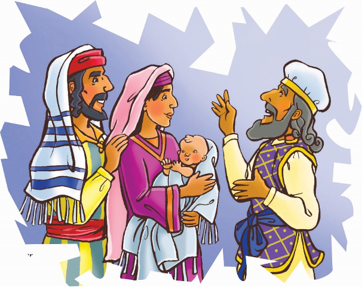
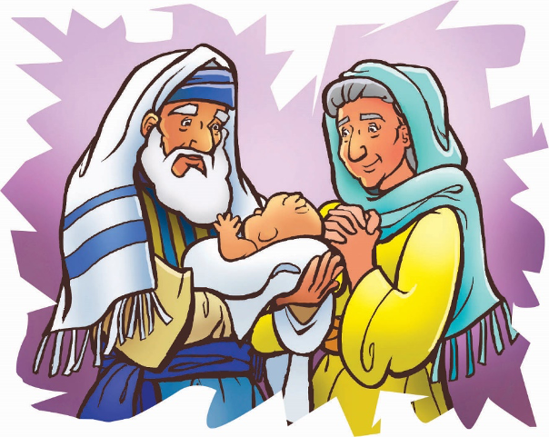

> 
Chângvawn

> “Isua Kristan ... a khawngaihnain, chatuana phûrna leh beiseina ṭhâ min pe ta a.” (2 Thesalonika 2:16).

### Chhiar tûrte

Luka 2:21–38; Chatuan Nghahfak, pp. 41–49.

> 
Thuchah

> Isuan beiseina min pe.

_Johnnie leh Katie-te chu an phûr hle mai a. Vawiin hian an pi chu a lo lêng dâwn a ni! Tukverh aṭangin an lo thlîr deuh fo mai a. Chutah phone a lo ri rang rang a. An pi ngei a lo ni bawk a. Thlipui na zet mai a lo thawk a, chuvângin vawiin hian a lo kal thei dâwn lo tih a rawn sawi a. Naktûkah chuan thlipui chu a reh tawh dâwn a; chutah chuan a lo kal thei ang. Johnnie leh Katie-te rilrû chu a hnual rawih mai. Mahse an pi chuan a thutiam angin a lo kal ngei dâwn tih an hria a ni. Kum eng emaw zât liam ta khân, Simeona leh Anna-i te chuan Messia lo kal tûr chu an lo nghâk vang vang tawh a. Beiseina pawh an nei! A lo kal ngei ang tih an ring tlat a. Mahse engtin nge a lo kal hunah an hriat chat theih ang le?_

Simeona thinlung chu a phu deuh dut dut a. Temple awmna tlânga lâwn thuai tûra chak deuh zâwka kal a’n tum a. Tih tûr neia lo kal hê putar tân hian mipuite chuan zah takin kawng an lo kian zêl a.

Thlarau Thianghlimin Semeona chu Temple-ah a rawn hruai a. Chutia a kal pah chuan a hun kal tâte kha a hre reng a. Thlarau khân a hnênah thutiam pawimawh tak a lo siam tawh a. Chu chu: “Messia i hmuh hma loh chuan i thi lo vang!” tih a ni.

Simeona chuan he thutiam hi a ngaihtuah rauh rauh ṭhîn a. Ani chuan Messia chu a hmu thei dâwn a nih chu! Temple lam pana a chhoh lâi chuan thaw chham lek lek chûngin a nui var var a. A tha a ṭhum tawh a, chakna a nei vak tawh lo. Mahse, a pawi chuang lo ve; thil ṭha zâwk chu a nei si a! Beiseina a nei a, Messia hmuh beiseina chu.

Temple- a luh pah chuan Simeona chu a hawi kual vat vat a. Thil danglam awm âwm pawhin a lang lêm lo. Puithiamte chuan an tih dân pângngâiin puithu taka rawngbâwlna an nei a. Mahse mipui zîngah chuan, “Messia chu a lo kal ta e!” tih nghâkhlel taka lo thlîrtu âwm rêng an awm lo. Simeona chuan nupa rethei ve tak hi a kal pêl a.

Nu tuaitîr te pakhat chuan naute hi a pawm a. Chhan ṭha tak neiin an fa chu Temple-ah an rawn kalpui a. Dânin a ngiat angin Naute chu Lalpa hnêna hlan tûr a ni. Simeona chu a nui var var a. Nu leh paten hlim taka an nausênte an rawn hruai hmuh hi nuam a tihzâwng tak a ni a. Temple rawngbâwlnaa thil hlimawm tak a ni rêng a ni.

Chutah chiah chuan Simeona chu a ding nghâl chawih a. He nupate hian danglamna bîk tak an nei tlat mai. Chu an Nausên rawn hlan tûr chu chîk deuh tak hian a’n thlîr vang vang a. Chutah chuan hriatna danglam bîk a nei ta thut a. Chiang taka hriatna a nei ta a ni!

Hlimnaa a hmêl lo êng chûngin, chu mite nupa chu a pan ta nghâl a. Lu kûnin an nupa chuan chibai bûkin, Nausên chu a pawmsak ta a ni. Vân lam a thlîr zui a. Nausên nu leh pate chuan makti takin an lo thlîr reng a. Simeona hmêla hlim leh lâwmna lo êng chhuak leh, lâwmthu sawi chu an hmû a. A bianga lâwmna mittui lo luang ngiai ngiai pawh chu an hmu bawk a. Ṭawngṭaina a hlan chu makti takin an lo ngâithla rân a.

“Tûnah hian, Lalpa, i lo tiam tâk ang khân, i chhiahhlawh hi thlamuang takin i kaltîr dâwn ta e. I chhandamna chu keimâ mit ngeiin a hmu ta si a!” a ti a. Mari leh Josefa chu hlim takin an nui dûn var var a. He zâwlnei putar hian a hria a ni! Ani hi chuan Messia chungchânga an thurûk chu a hria a ni!

Chutih lâi tak chuan zâwlneinu, Anna-i chu a lo pên chhuak a. He zâwlnei hi kum eng emawti chhûng chu ni tin Temple-ah a lo tâp tawh a. Ani pawh hian Pathian khawngaihna thiltiam lo thleng tûr chu a beisei reng a. Simeonan Nausên Isua vânga Pathian a fakna chu a rawn zawm ve a.

Simeona leh Anna-i te kha Isua chu Messia, Israelte beiseia chu a ni tih hretu hmasate zînga mi an ni. Messia chu a lo kal ta tih thu thehdarhtû hmasâte zînga mi an ni bawk. An Beiseia chu hetah hian a awm! Chu beiseina chu tûna keini tân pawh hian a ni ve tho va. Isuan beiseina min pe ṭhîn a ni!

### Ni tina tih tûrte

**Sabbath**

- In chhûngte nên lawnglên awmna hmun lamah lêng ho ula. A nih loh leh, lawnglêng lem thlîr ho teh u. Lawngte hi thlîin a len bo loh nân engtin nge an tih ṭhin?
- Thîrchakâi chi dang hriat theih nân Bible zirlâi chhiar ho ang che u.
- Chhiar ho tûr: Hebrai 6:19. Khawi hmunah nge Simeona leh Anna-i ten Messia (Nausên Isua) kha an hmuh?
- Chhiar ho tûr: 2 Thesalonika 2:16. Thîrchakâi lem lehkhain chep ula, chutah chuan in chângvawn hi ziak ula. In hmuh fo theihna tûr remchâng lâiah in târ dâwn nia.
- Hla sak ho tûr: “In His Time” (Sing for Joy, no. 4). Isua chu in tâna ‘thîrchakâi’ a nih avângin lâwmthu sawi ang che u.

**Sunday**

- Worship-naa chhiar ho tûr: Luka 2:21–24. In nu leh pate hnênah nau hlanna an neih chungchâng in zâwt dâwn nia.
- Tûn kârah hi chuan “Nausên Isua Lehkhabu-a” tih tûr awmte kha ti zo tawh ang che u.
- Mari leh Josefa ten ṭhûro pahnih nêna Nausên Isua Temple-a an rawn hlan lâi lem ziak ula. Phêk tinah a thupui ziak zêl ula.
- In chhûngte hnênah in chângvawn in zirtîr dâwn nia.

**Thawhṭanni**

- Chhûngkaw worship-naa chhiar ho tûr: Luka 2:25–35.
- Simeon-an Nausên Isua a lo ngaihven viau kha eng nge a chhan ni ang? (A chhânna dik apiang thâi zêl ula.)
	- Ani khân nausênte a ngâinâ.
	- Israel zawng zawngten Messia lo kal tûr an beisei tlâng ṭheuh.
	- Messian a mite chu an sualte lakah a chhandam dâwn a ni.
	- A thih hma ngeia Messia hmuh a duh vâng a ni.
- Puitling hnênah Isuaa beiseina an neih chungchâng sawi tûrin sâwm ang che u.
- A Fapa min pêk avângin Pathian hnênah lâwmthu sawi ang che u.

**Thawhlehni**

- In chhûngte nêna chhiar tûr: Luka 2:36–38. Simeona leh Anna-in Isua kha khawngaih thilthlawnpêk chu a ni tih a hria a. Chumi awmzia chu: (A chhânna dik chu thâi ang che:
	- Isuan hlimna min pe ṭhîn.
	- Isuan ngaihdamna min pe ṭhîn.
	- Isuan beiseina min pe ṭhîn.
- Thîrchakâi chungchâng dang pawh hriat belh tum ang che u. Engati nge lawng ṭhenkhat hian thîrchakâi lian deuh zâwk an mamawh ṭhin?
- Puitling pakhat chu Isua hi kan tân thîrchakâi a nihzia sawi tûrin sâwm ang che u.
- In chângvawn kha chhiar/sawi rual ang che u.
- Hla sak ho tûr: “Ka Puang Châk E” (Adventist Hla Bu, no. 189).

**Nilaini**

- In chhûngte hnênah kâr thar, nakum leh chatuan atâna beiseina an neih chu sawitîr ang che u.
- Engtin nge Anna-i khân a beiseina thu mi dangte hnênah a sawi? Chhiar ho tûr: Luka 2:38
- Engtin nge beiseina hi in thehdarh zêl theih ang?
- Hla sak ho tûr: “We Are His Hands” (Sing for Joy, no. 42).

**Ningani**

- In chhûngte nên thlipui chungchâng sawi ho ula. Tûnah lawnglêngin tuipuia in chhuah lâiin thlipui lo thawk ta se, engangin nge in ngaih ang?
- Chhiar ho tûr: Hebrai 6:19.
- Isuaa kan beiseina chu eng nge ni? Hlumin emaw, lehkhain emaw lawnglêng lem siam ang che u.
- Thîrchakâi lem siamin, hruiin in thlun zawm dâwn nia. Chawhtawlhah tui bunin, in chiah dâwn nia.
- Engtin nge chu chuan kan nuna harsatna awm chu a entîr?
- Chhiar ho tûr: Hebrai 6:20 tîr lam. Nangni tu nge in thîrchakâi ni ve le?

**Zirtawpni**

- Bible thawnthu hi lemchanah hmang ula.
- “Nausên Isua Lehkhabu-a” phêk hnuhnung ber ziak ang che u. Chuta ziah tûr: “A lo kal leh dâwn—Beiseina Lâwmawm chu!” Beiseina lam hla sa ho ang che u.
- Kum thar atâna in beiseina leh thil tihtum ruahmannate chu in sawi dâwn nia.
- Chhiar ho tûr: Jeremia 29:11 leh Tita 2:13. In hmalam hun atân eng ruahmanna nge Isuan a neih? In chhûngkaw tân pawh?
- Kum Thar atâna Pathian hruai zêlna dîlin ṭawngṭâi ang che u.