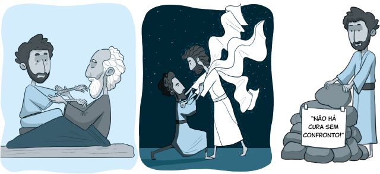

`A partir da tirinha, do texto-chave e do título, anote suas primeiras impressões sobre o que trata a lição.`

**Leia o texto bíblico desta semana: Gn 28:10-15**

Pesquise em comentários bíblicos, livros denominacionais e de Ellen G. White sobre temas contidos neste texto.