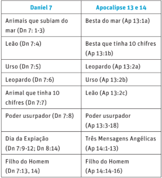

**TEXTO-CHAVE:** Jr 9:24

**FOCO DO ESTUDO:** 2Tm 3:15-17

#### ESBOÇO

**Introdução:** No começo de cada semestre de aulas sobre a Bíblia, um professor do seminário desafiava seus alunos com uma pergunta direta: “Qual é a ferramenta mais importante que os ajuda a compreender a Bíblia?” Os alunos ofereciam diversas respostas: “dicionários bíblicos”, “oração”, “o Espírito Santo”, “conhecimento dos idiomas da Bíblia” (hebraico e grego), “software bíblico”, etc. Contudo, o professor lhes informou que, embora todas essas coisas fossem úteis, havia uma ferramenta que eles não mencionaram que era o recurso mais importante de todos: o tempo.

Indiscutivelmente, a ferramenta mais necessária ao lidar com as Escrituras é aquela que frequentemente parece ser a mais escassa: o tempo. Quando estivermos dispostos a investir tempo no estudo da Bíblia, seremos levados a considerar a seguinte questão: como lemos a Bíblia? Ou seja, quais são os princípios que devem orientar nossa busca e compreensão deste livro tão singular?

**Temas da lição:** Nesta semana, vamos explorar os dez princípios para a leitura dos textos proféticos da Bíblia. Os primeiros cinco princípios de leitura se concentrarão no próprio texto: lê-lo com atenção (como se fosse um texto novo), com cuidado (como um texto importante), lê-lo apreciando sua estética (como um texto belo), lê-lo dentro do seu contexto (dentro do seu ambiente bíblico) e lê-lo à luz de outros textos bíblicos (intertextualmente).

Os próximos cinco princípios de leitura se concentrarão em nossa resposta ao texto para garantir que estamos verdadeiramente ouvindo a Palavra de Deus: o princípio de ler o texto espiritualmente (como um texto inspirado), lê-lo de forma inteligente (como um texto desafiador), lê-lo coletivamente (como um texto para a comunidade), lê-lo de modo pessoal (como um texto que impacta nossa vida) e lê-lo com responsabilidade ética (para uma interpretação responsável). 

#### COMENTÁRIO

**Atenção ao texto**

O texto bíblico é a base de qualquer discussão sobre a profecia bíblica. A primeira intenção do leitor, portanto, deveria ser ler o texto bíblico profético com uma mente atenta.

1. _Ler com atenção e disposição de aprender._ Leia o texto como se fosse algo novo e que você não compreende. Daniel só começou a entender sua profecia em Daniel 9:2, depois de reconhecer que não a entendia: “não havia quem a entendesse” (Dn 8:27). A Bíblia diz que os seres humanos estão naturalmente nas “trevas” (Jo 1:5). A tentação mais comum ao lidarmos com a profecia bíblica é acreditar que já entendemos sua mensagem antes mesmo de ler o texto. Assim, impomos o nosso pensamento ao texto (_eisegese_), em vez de permitir que o texto fale por si (_exegese_). Isso acontece quando interpretamos a profecia à luz de nosso próprio raciocínio ou dos eventos contemporâneos.

2. _Ler com atenção._ A profecia bíblica contém informações importantes sobre o destino do mundo, além de verdades vitais para a salvação (2Tm 3:15-17). Os profetas bíblicos escolheram cuidadosamente as suas palavras e formas de expressão para transmitir sua visão inspirada. Portanto, leia o texto devagar, prestando muita atenção às suas palavras. Leia-o diversas vezes para garantir que nada falte na leitura do texto. Assim, “encontraremos fontes vivas a borbulhar onde o descuidado leitor apenas avista um deserto” (Ellen G. White, _Educação_ [CPB, 2021], p. 135). É preferível reconhecer que não se entende alguma coisa do que se contentar com uma compreensão superficial ou falsa de um texto.

3. _Ler com apreciação estética:_ As formas literárias do texto (sua estrutura e paralelismos) ajudarão a decifrar a mensagem da profecia. A profecia da imagem em Daniel 2 é esclarecida pelo seu paralelo com a profecia sobre os quatro animais em Daniel 7. Há também paralelos entre as profecias de Daniel e do Apocalipse. Veja o quadro a seguir, no qual a visão apocalíptica em Apocalipse 13 e 14 é paralela, em muitos aspectos, à profecia de Daniel 7, que também é paralela à profecia de Daniel 8, como segue:

Esses paralelos mostram que o Dia da Expiação/Dia do Juízo celestial, em Daniel 7 e 8, corresponde e é contemporâneo da proclamação terrena das três mensagens angélicas, em Apocalipse 14.

4. _Ler dentro de um contexto_. No contexto histórico, o evento do encontro militar entre o exército babilônico do norte e o exército egípcio do sul em Carquemis (compare Dn 1:1 com Jr 46:2) será utilizado pelo profeta Daniel como modelo para sua profecia sobre as guerras escatológicas entre o rei do norte e o rei do sul, descritas no capítulo 11. No contexto literário, o fato de Daniel 7 estar escrito em aramaico, o idioma franco da época, enquanto Daniel 8 está escrito em hebraico, o idioma de Israel, sugere que a profecia de Daniel 7 se concentra nos reinos terrestres e tem um impacto universal. Em contraste, a profecia de Daniel 8 se dirige ao povo de Deus e tem um impacto espiritual.

5. _Ler intertextualmente_. Visto que o texto profético é seu próprio intérprete, é necessário buscar o significado do texto principalmente dentro do próprio texto. Essa abordagem também está enraizada no princípio fundamental estabelecido por Ellen G. White ao ecoar o reformador Martinho Lutero: “Um texto explica outro texto, sendo uma passagem a chave de outras passagens” (_Evangelismo_ [CPB, 2023], p. 403). Por exemplo, a associação do carneiro com o bode, em Daniel 8, além de suas muitas ligações linguísticas com Levítico 16, sugere que a profecia de Daniel 8 se refere ao Dia da Expiação.

**Concentrando-se na resposta pessoal**

A qualidade do estudo da profecia depende também da mente da pessoa que aborda o texto.

1. _Ler espiritualmente_. As Escrituras Sagradas são inspiradas por Deus. Portanto, é lógico que, para compreender plena e verdadeiramente um texto em particular, o fator espiritual deve estar envolvido. As verdades espirituais devem ser “discernidas espiritualmente” (1Co 2:14). De modo prático, essa ideia significa que a fé e a oração constituem fatores importantes no sucesso da operação exegética. A oração trará ao estudo de alguém o milagre da assistência de Deus. Ter fé na inspiração divina do texto bíblico e acreditar que a profecia se cumprirá proporciona à mente a capacidade de perceber seu cumprimento onde outros não veem nada.

2. _Ler de forma inteligente_. Compreender o texto inspirado exige diligência e esforço meticuloso de nossa parte. Eclesiastes descreve esse esforço de maneira pessimista: “Que enfadonho trabalho Deus impôs aos filhos dos homens, para com ele os afligir!” (Ec 1:13). O verbo “entender” é a palavra-chave no livro de Daniel, pois aparece 15 vezes. Afinal, Jeremias exorta: “Aquele que se gloria, glorie-se nisto: em Me conhecer” (Jr 9:24). Em outras palavras, o objetivo final da sabedoria é conhecer a Deus.

3. _Ler coletivamente_. Assim como o texto bíblico da profecia chegou até nós por meio do testemunho da comunidade do povo de Deus, tal profecia é igualmente destinada à comunidade do povo de Deus. Embora o estudo da Palavra de Deus não exclua a contribuição criativa do indivíduo, ele envolve também outros irmãos e irmãs na fé. Quando Deus fala, Ele geralmente Se dirige ao Seu povo como uma comunidade de adoração: “Ouve, ó Israel” (Dt 6:4). Daniel prevê que, no fim dos tempos, muitos (isto é, o povo de Deus, os sábios) entenderão (Dn 12:10).

4. _Ler de modo pessoal_. A menos que as Escrituras nos mudem e afetem nossa vida, não as entenderemos. Para ilustrar esse ponto, faríamos bem em considerar uma história sobre um missionário europeu na África que zombou de seu servo africano porque ele estava lendo a Bíblia: “Por que você lê a Bíblia?” O missionário então acrescentou: “Isso é apenas um monte de contos de fadas”. O servo africano respondeu: “Se eu não tivesse lido a Bíblia, eu já teria comido você”. Esta lição contém um princípio importante sobre o efeito poderoso da Palavra de Deus, que é “mais cortante do que qualquer espada de dois gumes” (Hb 4:12). Assim, a Palavra profética de Deus pode não apenas penetrar nitidamente nos pecados de nossos inimigos e opressores, mas também pode falar ou testificar “contra” nós (Jr 28:8).

5. _Ler com responsabilidade ética_. É triste dizer, mas as profecias bíblicas muitas vezes foram usadas para justificar a iniquidade humana. Teorias racistas que promoviam a ideia da superioridade da raça branca sobre a negra, justificando o _apartheid_ e a escravidão, foram baseadas em uma interpretação distorcida de Gênesis 9:25. O antissemitismo, que resultou nos _pogroms_, nas Cruzadas e no assassinato de seis milhões de judeus, foi alimentado por uma má interpretação das profecias bíblicas (Dn 9:24). Ao longo da história, abusos e crimes contra mulheres dentro das famílias foram frequentemente justificados pela referência a Gênesis 3:16. Ao estudarmos a Palavra profética de Deus neste trimestre, permitamos que as Escrituras inspiradas assumam o controle total de nossa mente e coração, com o propósito de transmitir “instrução em justiça” (2Tm 3:16).

#### APLICAÇÃO PARA A VIDA

Aplique as lições desta semana às perguntas abaixo, concentrando-se em 2 Timóteo 3:15-17.

**Com relação ao texto:**

`1. Quais são as palavras-chave de 2 Timóteo 3:15-17?`

`2. Discuta e reflita sobre a importância das seguintes palavras: “Escritura”, “sábio”, “inspirada por Deus”, “perfeito”.`

`3. Por que o estudo das Escrituras inspira o pensamento criativo?`

`4. Qual é a estrutura desse texto?`

`5. Qual é o contexto dessa passagem bíblica?`

`6. Encontre dois outros textos bíblicos com o mesmo tema. Por exemplo, Salmo 119:97-104 e João 5:39. Identifique os paralelos entre esses textos, comparando e contrastando seus temas. Em que aspectos eles são semelhantes e em quais aspectos diferem?`

**Perguntas para respostas pessoais:**

`1. Quais palavras em 2 Timóteo 3:15-17 destacam a importância e a necessidade de abordar o estudo das Escrituras com uma atitude de reverência? Por exemplo, reflita e discuta os seguintes termos: “Sagrada Escritura” (implicando a necessidade de uma abordagem espiritual), “inspirada por Deus” (dom de Deus) e “inspiração” (obra do Espírito Santo).`

`2. Quais palavras no texto se referem à necessidade de ler de forma inteligente? Por exemplo, reflita e discuta sobre as seguintes palavras: “saber” (função cognitiva; informação para aprender), “sensatez” (exercício de pensamento) e “instrução” (habilidade de receber instruções e aprender novas lições).`

`3. Quais palavras se referem à necessidade de leitura coletiva? Por exemplo, reflita e discuta sobre as seguintes palavras: “desde a infância” (envolvimento dos pais), “correção” (envolvimento dos pais e professores), “boa obra” (algo feito em nome de pessoas necessitadas).`

`4. Quais palavras se referem à necessidade de aplicação do texto na vida pessoal? Por exemplo, reflita e discuta sobre as seguintes palavras: “tornar-se sábio” (aprimora o senso de discernimento e julgamento pessoal). Quais palavras se referem à necessidade de sensibilidade ética? Por exemplo, reflita e discuta sobre a expressão “na justiça” (desenvolve a capacidade de discernir o que é certo).`

`Notas`
