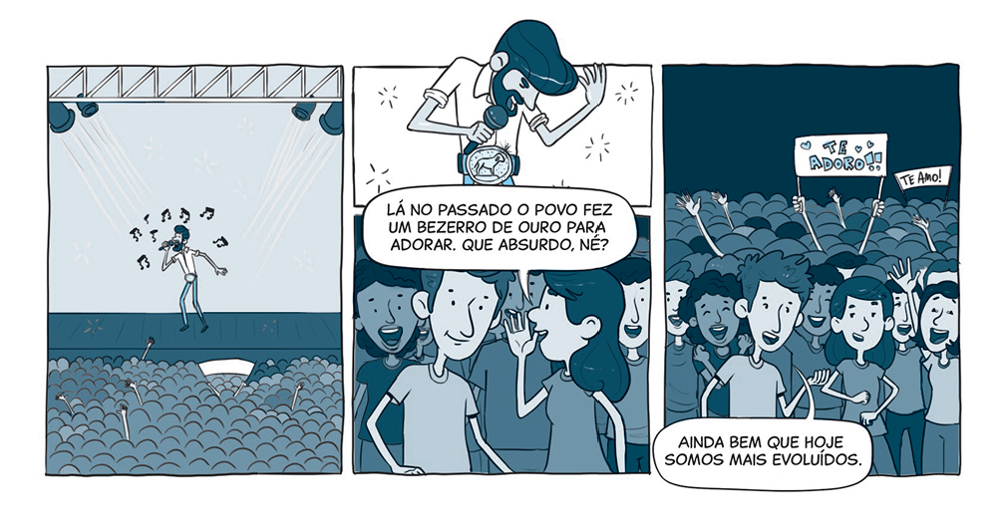

`A partir da tirinha, do texto-chave e do título, anote suas primeiras impressões sobre o que trata a lição:`

Leia o texto bíblico desta semana: Êx 32:1-35; 33:1-11

Pesquise em comentários bíblicos, livros denominacionais e de Ellen G. White sobre temas contidos nestes textos: Êx 32:1-35; 33:1-11