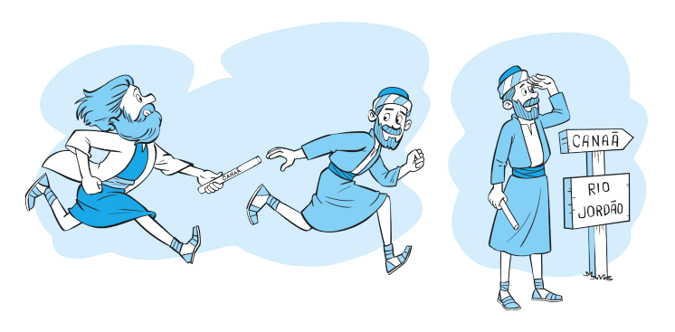

`A partir da tirinha, do texto-chave e do título, anote suas primeiras impressões sobre o que trata a lição:`

Leia o texto bíblico desta semana: Js 1

Pesquise em comentários bíblicos, livros denominacionais e de Ellen G. White sobre temas contidos neste texto: Js 1

### comTEXTO

Para os israelitas, a hora da mudança tinha chegado. Moisés havia sido um líder fiel em meio às maiores crises do povo de Israel, mas agora era hora de descansar – enxergando a Terra Prometida, mas sem entrar nela. Sabendo disso, Moisés passou suas responsabilidades para Josué e o comissionou a liderar o povo até a Terra Prometida.

Foi um momento marcante. Moisés precisou renunciar a um sonho que carregava havia muito tempo. Josué, por outro lado, recebeu o bastão da liderança das mãos de alguém a quem amava profundamente – e cuja ausência certamente sentiria com dor no coração. O povo, que tantas vezes havia desafiado Moisés, agora assistia enquanto ele dizia a Josué: “Seja forte e corajoso” (leia Dt 31:7, 8). Quando os gigantes se levantassem e a vitória parecesse fora de alcance, Josué deveria seguir em frente, firme nas promessas de Deus.

Josué sabia muito bem o tamanho da missão que estava recebendo. Deus o havia chamado para liderar um povo teimoso, medroso, reclamão e, muitas vezes, rebelde. Ele tinha visto Moisés lidando com tudo isso ao longo de 40 anos no deserto. Mas, agora, os desafios seriam outros. Enquanto Moisés havia conduzido o povo pelo deserto, Josué os guiaria em batalhas. Aquele grupo de ex-escravos, sem preparo militar, teria que enfrentar cidades fortificadas, exércitos experientes e inimigos impiedosos. **Josué teria que ser corajoso o bastante para enfrentar os gigantes – e ainda inspirar o povo a fazer o mesmo.**

Talvez o povo tenha se perguntado: “Será que Josué vai conseguir seguir os passos de Moisés?” Mas Deus deixou claro que Josué era a escolha Dele (Dt 31:7).

**Antes, Deus falava com Josué por meio de Moisés. Agora, Ele fala direto com Josué – anuncia a morte de Moisés e ordena que ele prepare o povo para seguir adiante e tomar posse da herança prometida. E junto com essa missão, Deus dá uma promessa: Ele estaria com Josué, que precisava ser forte, depender totalmente de Deus e permanecer fiel à Sua Palavra.**

### Mergulhe + Fundo

Leia, de Ellen G. White, Patriarcas e Profetas, capítulo 44: “A travessia do Jordão”.