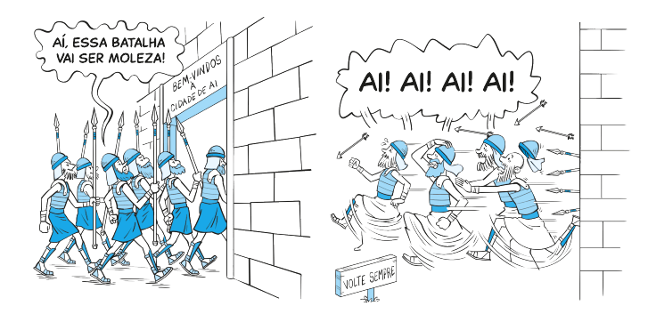

`A partir da tirinha, do texto-chave e do título, anote suas primeiras impressões sobre o que trata a lição:`

Leia o texto bíblico desta semana: Js 7; 8

Pesquise em comentários bíblicos, livros denominacionais e de Ellen G. White sobre temas contidos nestes textos: Js 7; 8

### comTEXTO

Você já saiu confiante de uma vitória e, depois, enfrentou uma derrota humilhante? Josué sabia bem como é isso. Depois do sucesso em Jericó, os israelitas estavam certos de que venceriam de novo. Sem demora, Josué enviou espias para avaliar o próximo alvo: a cidade de Ai.

Localizada cerca de 19 quilômetros montanha acima, Ai ficava a mais de 790 metros de altitude, enquanto Jericó estava no vale do Jordão, a 274 metros abaixo do nível do mar. Ao observarem a cidade, os espias viram poucos moradores e concluíram que a vitória seria fácil. De volta ao acampamento, sugeriram que apenas três mil soldados seriam suficientes. O líder Josué concordou.

Confiantes na vitória, os israelitas foram surpreendidos pelos homens de Ai, que os derrotaram com facilidade e os fizeram fugir ladeira abaixo, deixando 36 mortos para trás. Embora esse número pareça pequeno, em Jericó Deus lhes dera vitória sem nenhuma perda. Os israelitas acreditavam que o Senhor sempre lutaria por eles – mas, em Ai, algo claramente estava errado.

A derrota gerou grande preocupação. Israel estava vulnerável, sem muralhas nem proteção. E se os cananeus descobrissem sua fragilidade? Em desespero, Josué rasgou suas roupas, lançou pó sobre a cabeça e se prostrou diante da arca da aliança, clamando a Deus: “Por quê?” (leia Js 7:7-9). Foi um dos momentos mais angustiantes da sua vida.

Às vezes, Deus permite derrotas para nos fazer parar, examinar o coração e buscar Sua direção. É nos vales escuros que encontramos respostas vindas do alto. **A história de Ai nos alerta a não tomarmos o crédito pelas vitórias, ou Deus pode permitir uma queda humilhante para nos despertar.**

Na segunda tentativa, Josué levou mais de dez vezes o número inicial de soldados, e 12 mil moradores de Ai foram mortos. Mas o verdadeiro problema não era estratégico – era espiritual. Israel havia quebrado sua aliança com Deus por causa do pecado de um só homem. Josué estava prestes a descobrir essa dolorosa verdade.

### Mergulhe + Fundo

Leia, de Ellen G. White, Patriarcas e Profetas, capítulo 46: “As bênçãos e as maldições”.