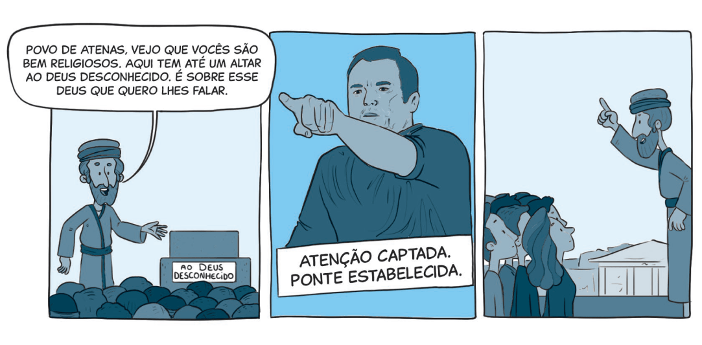

`A partir da tirinha, do texto-chave e do título, anote suas primeiras impressões sobre o que trata a lição:`

Leia o texto bíblico desta semana: At 17:16-34

Pesquise em comentários bíblicos, livros denominacionais e de Ellen G. White sobre temas contidos neste texto: At 17:16-34

### comTEXTO

O discurso de Paulo no Areópago (At 17:16-34) é uma aula de sensibilidade cultural combinada com clareza teológica. Ele começa reconhecendo a espiritualidade do público, cita frases conhecidas dentro da tradição grega e constrói uma ponte entre a fé cristã e os anseios espirituais dos ouvintes.

Na Grécia antiga, os atenienses tinham medo de ofender algum deus desconhecido. Por isso, às vezes erguiam altares a divindades que nem sabiam se existiam. Era uma forma de “garantir” que ninguém fosse deixado de fora. Esses altares mostravam que, no fundo, os gregos sabiam que podia haver algo — ou Alguém — além do que eles conheciam. E foi justamente esse reconhecimento que deu a Paulo a chance de apontar para o Deus verdadeiro — o Criador do céu e da Terra. Ele falou sobre a grandeza desse Deus, Sua proximidade com a humanidade, Seu papel como fonte da vida e o chamado que Ele faz a todas as pessoas: que O busquem e O encontrem.

Entender o contexto de Atenas é essencial para perceber o impacto da mensagem. A cidade era um centro de filosofia, com linhas de pensamento como o epicurismo, que ensinava que os deuses eram distantes e indiferentes; e o estoicismo, que acreditava em uma espécie de força divina impessoal. Quando Paulo apresentou um Deus pessoal, presente e profundamente envolvido com a humanidade, ele estava confrontando diretamente essas ideias.

Charles Malik, um importante pensador cristão do Líbano, certa vez disse que a missão do cristianismo é “salvar a alma — e salvar a mente”. Ele lembrou que **as universidades nasceram com a teologia no centro. De fato, instituições como Oxford, Cambridge e Harvard começaram com uma base cristã. A teologia era o ponto de partida, pois lidava com as perguntas mais importantes da existência: sobre Deus, o ser humano e a realidade.**

`Anotações`

### Mergulhe + Fundo

Leia, de Ellen G. White, Atos dos Apóstolos, capítulo 23: “Bereia e Atenas”.
