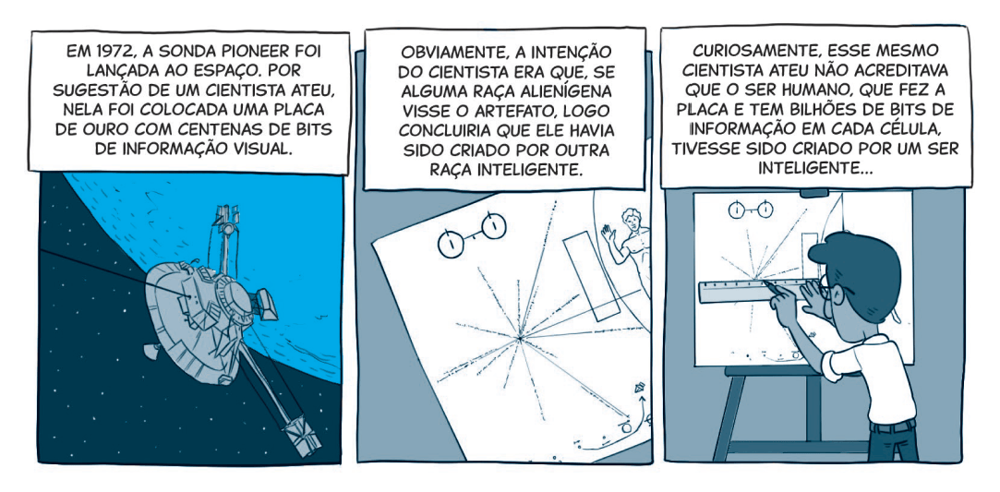

`A partir da tirinha, do texto-chave e do título, anote suas primeiras impressões sobre o que trata a lição:`

### Texto-Chave
Leia o texto bíblico desta semana: Gn 1:1-31; 2:1-25

Pesquise em comentários bíblicos, livros denominacionais e de Ellen G. White sobre temas contidos nestes textos: Gn 1:1-31; 2:1-25

### comTEXTO

Conhecido por sua honestidade intelectual, sua vasta produção literária e seus debates provocativos, o filósofo britânico Antony Flew foi, durante décadas, uma referência mundial entre acadêmicos e ateus. Aos 15 anos, Flew chegou à conclusão de que Deus não existia. Mais tarde, ao estudar filosofia, tornou-se professor em Oxford e em outras universidades renomadas da Inglaterra. Nesse período, ganhou fama por sua defesa firme e sofisticada do ateísmo acadêmico.

Mas em 2004, já com mais de 80 anos, Flew fez uma declaração surpreendente que abalou o mundo da filosofia e da ciência — e cujos ecos ainda se fazem ouvir até hoje. Durante uma entrevista com o doutor Gary Habermas, ele revelou que agora acreditava na existência de um Criador inteligente.

Apesar dos ataques, ele permaneceu firme e respondeu com lucidez: “Fui acusado por colegas de estupidez, traição, senilidade e todo tipo de coisa — sendo que nenhum deles leu uma linha sequer do que escrevi” (Um Ateu Garante: Deus Existe [Ediouro, 2008]).

Mas o que levou Antony Flew a mudar de ideia sobre Deus? Ele explicou: **“Embora eu tenha sido um crítico ferrenho do argumento do design, hoje vejo que, quando bem formulado, ele é uma defesa convincente da existência de Deus.”** Flew se referiu ao argumento teleológico — ou argumento do design —, que aponta para a existência de um Criador com base na ordem e complexidade do Universo. Ele afirmou que foram justamente essas evidências, vindas das descobertas da física e da biologia, que o fizeram abandonar o ateísmo e reconhecer que a explicação mais razoável para a harmonia do cosmos é a existência de um Criador inteligente.

**Falar em _design_ inteligente vai muito além de discutir dados e argumentos. É abrir uma janela para o coração de Deus. A criação reflete quem Ele é — um Deus de beleza, propósito, ordem e amor.** Quando contemplamos a natureza, enxergamos os traços desse Designer. Mas é a narrativa da criação em Gênesis que nos revela por que tudo foi feito e quem está por trás de cada detalhe.

### Mergulhe + Fundo

Leia, de Ellen G. White, Patriarcas e Profetas, capítulo 2: “A criação”.