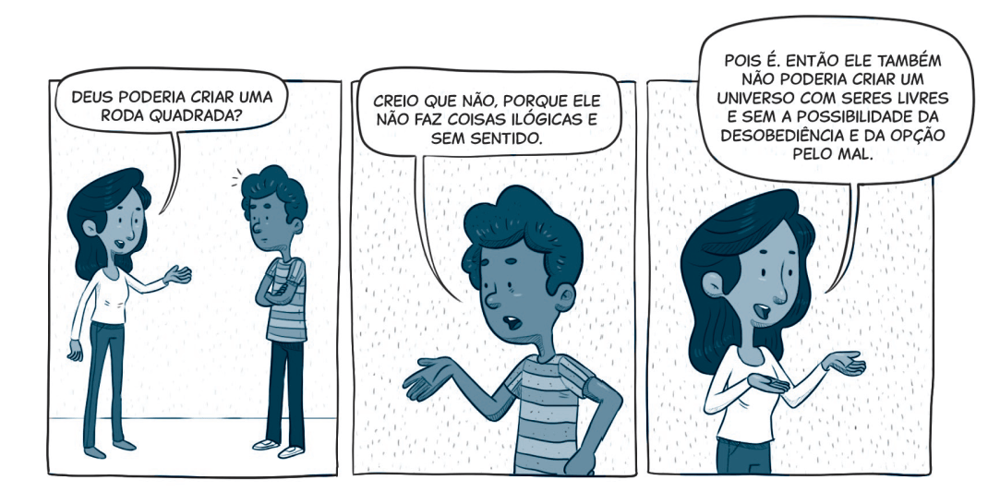

`A partir da tirinha, do texto-chave e do título, anote suas primeiras impressões sobre o que trata a lição:`

### Texto-Chave
Leia o texto bíblico desta semana: Jó 1:1-22; 2:1-13

Pesquise em comentários bíblicos, livros denominacionais e de Ellen G. White sobre temas contidos nestes textos: Jó 1:1-22; 2:1-13

### comTEXTO

Será que Deus é culpado de crimes contra a humanidade? Essa pergunta nos leva ao âmago do problema do mal: Se Deus é realmente bom, por que há tanto sofrimento? E mais: Se Ele é todo-poderoso, por que não impede a existência do mal?

O filósofo cristão Peter Kreeft escreveu: “O problema do mal é o mais sério do mundo. [...] Mais pessoas abandonaram a fé por causa dele do que por qualquer outro motivo. É o maior teste da fé — e a maior tentação à descrença. E não é só uma objeção intelectual. Sentimos isso. Vivemos isso. [...] A pergunta é simples: Se Deus é tão bom, por que o mundo está tão ruim? [...] Por que coisas ruins acontecem com pessoas boas?” (Peter J. Kreeft, “The Problem of Evil”, disponível em https://link.cpb.com.br/753dce).

**Logo na primeira página da Bíblia, lemos: “No princípio, Deus criou os céus e a terra” (Gn 1:1). Encontramos um Deus perfeito, que criou um mundo perfeito, para pessoas perfeitas, vivendo em harmonia com Ele e entre si.** Nos dois primeiros capítulos de Gênesis, vemos o plano original: alegria, liberdade, amor e vida plena. Era assim que tudo foi criado para ser.

Agora, feche a Bíblia por um momento. Olhe ao seu redor. O que você vê? Violência, sofrimento, desespero, fome, injustiça, morte. Um contraste gritante com aquele plano inicial.

Então, reabra a Bíblia. Qual é a pergunta que vem à sua mente?

Se ainda não ficou claro, imagine esta cena: você sai de casa com tudo limpo e organizado. Roupas lavadas, pratos limpos no escorredor, almofadas no lugar. Mas, ao voltar, encontra o caos. Roupas espalhadas, janelas quebradas, objetos desaparecidos. Qual é a sua primeira pergunta? O que aconteceu? Quem fez isso?

É isso que Deus quer que perguntemos sobre o mundo: O que aconteceu com a criação? O que aconteceu com o plano original? De onde veio o mal?

### Mergulhe + Fundo

Leia, de Ellen G. White, A Verdade Sobre os Anjos, capítulo 4: “A origem do mal”.