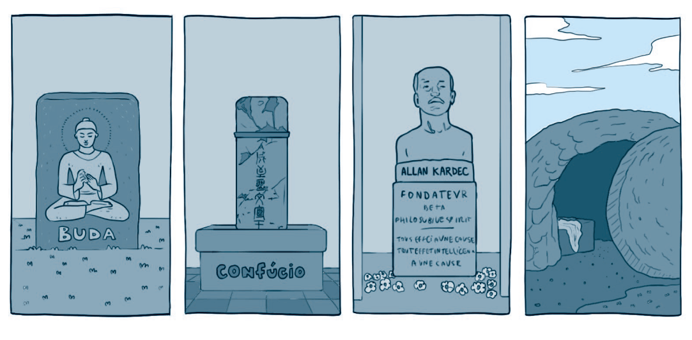

`A partir da tirinha, do texto-chave e do título, anote suas primeiras impressões sobre o que trata a lição:`

### Texto-Chave
Leia o texto bíblico desta semana: Jo 20:1-18

Pesquise em comentários bíblicos, livros denominacionais e de Ellen G. White sobre temas contidos nestes textos: Jo 20:1-18

### comTEXTO

Nas primeiras horas daquele domingo, o mundo testemunhou um acontecimento que mudaria a história para sempre: a ressurreição de Jesus. Um anjo poderoso removeu a pedra que selava o túmulo, e Aquele que é a ressurreição e a vida saiu vitorioso sobre a morte. Foi o momento em que a esperança venceu o desespero, e o pecado recebeu um golpe fatal.

A ressurreição de Jesus O distingue de todos os outros líderes religiosos da história. Sidarta Gautama, fundador do budismo, ensinou que cada pessoa deve escapar do sofrimento por seus próprios esforços. Maomé, profeta do islamismo, proclamou o que seus seguidores consideram ser a revelação final de Deus. Confúcio, grande pensador chinês, foi sepultado e teve seus ensinamentos preservados por discípulos. Zaratustra, criador do zoroastrismo, também morreu e permaneceu no túmulo. Nenhum deles venceu a morte.

Jesus foi o único a prometer e cumprir a vitória sobre a morte. E isso muda tudo. Sua ressurreição não apenas confirma o que Ele ensinou, mas também oferece uma promessa que nenhum outro líder pode fazer: a esperança da vida eterna. Essa boa-nova é um presente disponível a todos os que creem Nele; é o coração do evangelho. **A ressurreição não é apenas mais um acontecimento bíblico — é o próprio alicerce da fé cristã.**

Mas por que a história do túmulo vazio importa tanto? Esse fato declara que a morte não tem a palavra final. Assim como Jesus ressuscitou, todos os que pertencem a Ele também ressuscitarão para a vida eterna. Essa esperança dá um novo sentido à forma como encaramos a vida, o sofrimento e a morte.

Naquela manhã, o anjo disse às mulheres: “Ele não está aqui; ressuscitou” (Mt 28:6). **Essa foi a única vez na história em que a ausência de Jesus foi uma _boa notícia_. E foi boa notícia para todos nós — porque o túmulo vazio de Jesus é o sinal de que o nosso túmulo também ficará vazio um dia.**

Nesta semana, vamos refletir sobre o impacto da ressurreição, examinar as evidências que a sustentam e redescobrir a esperança profunda que ela oferece.

### Mergulhe + Fundo

Leia, de Ellen G. White, O Desejado de Todas as Nações, capítulo 82: “Por que choras?”