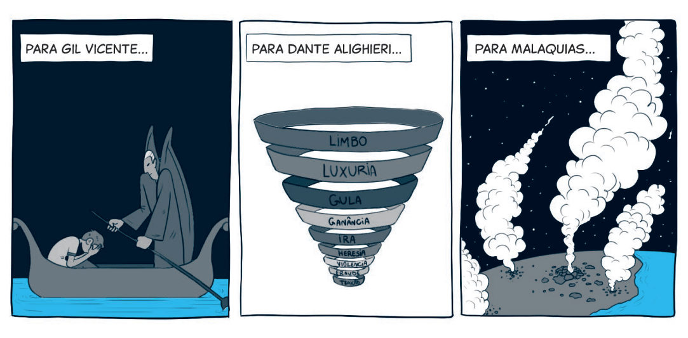

`A partir da tirinha, do texto-chave e do título, anote suas primeiras impressões sobre o que trata a lição:`

### Texto-Chave
Leia o texto bíblico desta semana: Ml 4:1-3

Pesquise em comentários bíblicos, livros denominacionais e de Ellen G. White sobre temas contidos neste texto: Ml 4:1-3

### comTEXTO

Imagine isto: um inferno eterno, onde chamas consomem os condenados sem nunca destruir sua carne, e gritos de dor ecoam sem cessar. Nesse cenário de pesadelo, não há alívio — apenas tormento interminável, sem esperança e sem misericórdia. Como conciliar uma cena dessas com um Deus amoroso e justo?

O impacto dessa doutrina tem sido profundo. Charles Darwin, considerado o pai da teoria da evolução, refletiu sobre isso em sua autobiografia: “É difícil imaginar por que alguém desejaria que o cristianismo fosse verdadeiro, já que, de acordo com o texto bíblico, as pessoas que não creem — incluindo meu pai, meu irmão e quase todos os meus melhores amigos — seriam punidas eternamente. Essa é uma doutrina abominável” (The Autobiography of Charles Darwin: 1809-1882 [Collins, 1958], p. 87). Esse pensamento, entre outros, contribuiu para que Darwin se afastasse cada vez mais da fé cristã.

**A verdade é que o ensino do inferno como um lugar de tormento eterno tem sido um dos grandes responsáveis pelo avanço do ceticismo e da descrença.** Afinal, como aceitar que um Deus de amor manteria pessoas vivas sofrendo para sempre? Será que os cristãos não deveriam se posicionar contra essa imagem distorcida de Deus?

Um livro que analisa os danos causados por esse conceito é Deconstructing Hell: Open and Relational Responses to the Doctrine of Eternal Conscious Torment [Desconstruindo o Inferno: Respostas Abertas e Relacionais à Doutrina do Tormento Eterno Consciente]. A obra revela como essa doutrina causa traumas espirituais dolorosos, leva muitos ao ateísmo e alimenta o medo e a desconfiança em relação ao caráter de Deus.

Ao longo desta semana, vamos mergulhar no que a Bíblia realmente ensina sobre o inferno. **Descobriremos que o ensinamento bíblico verdadeiro é o da aniquilação: a destruição definitiva do mal, e não um sofrimento eterno.** Essa compreensão não apenas está em harmonia com o caráter de um Deus justo e amoroso, mas também é a única que faz sentido quando analisamos cuidadosamente as Escrituras.

### Mergulhe + Fundo

Leia, de Ellen G. White, O Grande Conflito, capítulo 33: “É o homem imortal?”.