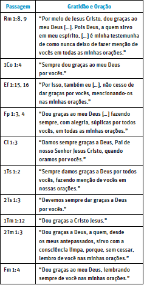

**TEXTO-CHAVE: Fp 1:6**

**FOCO DO ESTUDO: Fp 1:1-18; Ef 5:18-21; Cl 1:4-8**

**Introdução: **O autor D. A. Carson escreveu sobre qual seria a maior necessidade da igreja cristã hoje. Ele levantou hipóteses sobre diferentes respostas que as pessoas poderiam dar a essa pergunta. Carson menciona áreas como pureza nas questões sexuais, integridade financeira e generosidade, evangelismo, plantio de igrejas, pensamento bíblico e a genuína experiência da adoração coletiva. Ele conclui: “Há um sentido em que essas necessidades urgentes são meramente sintomáticas de uma carência muito mais séria. Aquilo de que mais urgentemente precisamos na cristandade ocidental é um conhecimento mais profundo de Deus. Precisamos conhecer melhor a Deus. [...] Um dos passos fundamentais para conhecer a Deus, e uma das demonstrações básicas de que O conhecemos, é a oração, uma oração espiritual, persistente e fundamentada nas Escrituras” (D. A. Carson, _A Call to Spiritual Reformation: Priorities from Paul and His Prayers_ [Grand Rapids, MI: Baker Books, 1992], p. 15, 16).

Paulo constantemente enfatizava disciplinas cristãs, como a oração e a gratidão. A ação de graças também era um elemento essencial de suas orações e até uma seção típica de suas cartas. Ele não apenas expressava sua gratidão a Deus por meio de orações constantes, como também incentivava os outros a fazer o mesmo (Cl 3.17; 1Ts 5:18). Para ele, a gratidão é o fruto da atuação de Deus no coração do indivíduo (Fp 1:6, 10, 11).

A lição desta semana enfatiza dois temas principais:

1. A gratidão e a oração estão intrinsecamente conectadas, como as duas faces de uma mesma moeda.

2. A gratidão e a oração, entre outras coisas, servem como manifestações concretas da boa obra de Deus em nós.

#### COMENTÁRIO

**Gratidão e oração estão intrinsecamente interligadas**

Um elemento característico nas cartas de Paulo é a seção de ações de graças, que funciona essencialmente como um ato de oração. Essa ideia pode ser ilustrada de forma mais clara na tabela a seguir.

Três observações principais podem ser extraídas da tabela anterior. Primeiro, para Paulo, dar graças é um ato de oração, uma vez que a ação de graças está constantemente entrelaçada com a oração. Segundo, mesmo quando a seção de agradecimento em algumas cartas de Paulo não menciona explicitamente o termo “oração”, é importante perceber que sua gratidão é dirigida a Deus (2Ts 1:3; 1Tm 1:12). Terceiro, a repetição do termo “sempre” sugere que tanto a oração quanto a ação de graças eram componentes constantes e, inclusive, essenciais na vida de Paulo.

É importante notar que Paulo esperava que seu público o imitasse quanto a uma vida de ação de graças e oração. Para Paulo, uma característica visível dos ímpios é o fato de não honrarem nem agradecerem a Deus (Rm 1:21). Em contraste, ele incentivou os membros da igreja em Roma a ser agradecidos a Deus (Rm 14:6). Ao pedir aos coríntios que orassem por ele e por seus colaboradores, Paulo desejava que muitos dessem graças a Deus em favor deles (2Co 1:11).

Em Efésios 5:18 a 21, Paulo descreveu as características daqueles cuja vida estava cheia da presença do Espírito Santo. Essas pessoas (1) promoviam a edificação mútua, “falando entre” si “com salmos, hinos e cânticos espirituais”; (2) enchiam sua vida de louvor a Deus, “cantando e louvando” no coração ao Senhor; (3) expressavam gratidão “dando sempre graças por tudo a nosso Deus Pai”; e (4) se sujeitavam “uns aos outros no temor de Cristo”. Assim, dar graças a Deus estava no mesmo nível de cantar louvores a Ele: era um ato de adoração.

Em Colossenses 3:17, Paulo foi um pouco além ao dizer: “**E tudo o que fizerem**, seja em palavra, seja em ação, **façam** em nome do Senhor Jesus, dando por Ele graças a Deus Pai” (ênfase acrescentada). De modo semelhante, Paulo disse aos tessalonicenses: “Em tudo, deem graças, porque esta é a vontade de Deus para vocês em Cristo Jesus” (1Ts 5:18). Paulo incentivou seu público a incorporar a gratidão e a oração na vida, de modo a refletir seu próprio compromisso profundo com essas práticas.

**A obra de Deus em nós**

A carta aos filipenses contém uma das declarações mais notáveis de todas as epístolas de Paulo: “Estou certo de que Aquele que começou boa obra em vocês há de completá-la até o Dia de Cristo Jesus” (Fp 1:6). Alguns leitores podem ser tentados a interpretar a “boa obra” de forma restrita, vendo nela apenas uma referência ao cuidado e ao amor que os filipenses demonstraram por Paulo, por meio do apoio financeiro durante sua prisão. Embora a preocupação deles com Paulo e com o avanço do evangelho fosse, sem dúvida, resultado da obra de Deus no coração deles, Paulo se referia a um conceito mais amplo: a salvação por meio de Cristo.

Deus foi apresentado como Aquele que iniciou a boa obra da salvação e que a levaria à conclusão por ocasião do retorno de Cristo. É importante que esse pensamento seja expresso dentro da seção de ações de graças. Nesse sentido, a gratidão é vista como uma evidência poderosa da atuação de Deus no coração da pessoa. Paulo disse algo semelhante em Filipenses 2:12, 13: “Desenvolvam a sua **salvação** com temor e tremor, porque **Deus é quem** **efetua** em vocês tanto o querer como o realizar, segundo a Sua boa vontade” (ênfase acrescentada).

O conselho de Paulo, de desenvolver a própria salvação, foi, no mínimo, intrigante. Afinal, como alguém faria isso? Podemos encontrar uma boa resposta em Hebreus 12:2, onde Jesus foi apresentado como “o Autor e consumador da fé”. Assim, Paulo afirma que devemos correr “com perseverança a carreira que nos está proposta, olhando firmemente para Jesus” (Hb 12:1, 2). Mas isso não é tudo. Também precisamos nos livrar “de todo peso e do pecado que tão firmemente se apega a nós” (Hb 12:1). Textos como Filipenses 1:6 e Hebreus 12:2 nos lembram de que a salvação é, em última análise, obra de Deus, e não nossa. Ainda assim, fomos chamados a desenvolver nossa própria salvação ou, em outras palavras, a correr [...] “a carreira que nos está proposta” (Hb 12:2), vivendo uma vida de oração, buscando as virtudes cristãs concedidas pelo Espírito (Fp 1:9-11; Cl 1:4-8) e sendo agradecidos pela obra de Deus em nós (Fp 1:3-6). Em resumo, devemos “viver de maneira digna do Senhor, para o Seu inteiro agrado, frutificando em toda boa obra e crescendo no conhecimento de Deus” (Cl 1:10).

#### APLICAÇÃO PARA A VIDA

Reflita sobre os temas a seguir. Em seguida, peça aos alunos que respondam às perguntas ao fim desta seção.

Todos nós gostamos quando coisas boas nos acontecem. Seja ao comprar um carro novo, adquirir uma casa, concluir os estudos após anos de esforço árduo e intenso ou escapar de uma situação perigosa, agradecemos a Deus por essas bênçãos. São marcos significativos que enchem nosso coração de alegria e gratidão. Se prestarmos atenção a tudo ao nosso redor, encontraremos incontáveis motivos para ser gratos. Ainda assim, nada deveria inspirar mais gratidão do que o reconhecimento da boa obra de Deus em nós. Ellen White escreveu: “Nossa mente precisa se expandir para que possamos compreender o significado das provisões de Deus. Devemos refletir os mais elevados atributos do caráter de Deus. **Devemos ser gratos** por não sermos deixados entregues a nós mesmos” (_Para Conhecê-Lo_, 23/10, ênfase acrescentada).

**Perguntas:**

**1. **Por quais bênçãos espirituais você é grato a Deus? E por quais bênçãos físicas e materiais você também é grato a Ele?

**2. **O que significa dar graças em todas as circunstâncias, em contraste com dar graças por todas as circunstâncias? Qual é a diferença crucial entre essas duas atitudes?

**3. **O que significa o fato de que não somos “deixados entregues a nós mesmos”, conforme a citação anterior de Ellen White? Por que devemos nos sentir gratos por essa certeza?

`Notas`
