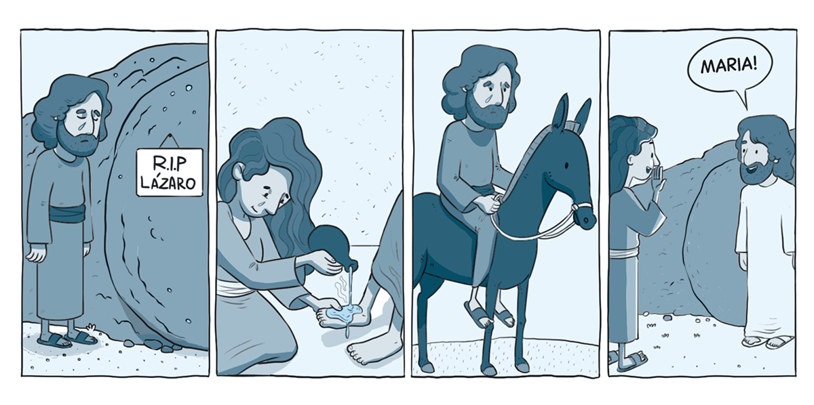

`A partir da tirinha, do texto-chave e do título, anote suas primeiras impressões sobre o que trata a lição:`

### Texto-chave

Leia o texto bíblico desta semana: Jo 11:43–12:33

Pesquise em comentários bíblicos, livros denominacionais e de Ellen G. White sobre temas contidos nestes textos: Jo 11:43—12:33

#### comTEXTO

### O início do fim

A ressurreição de Lázaro foi o último grande milagre realizado por Jesus durante Seu ministério público. Ao mesmo tempo, tornou-se o ponto decisivo para os líderes religiosos, desencadeando a sequência de acontecimentos que marcaria as cenas finais da vida de Cristo e culminaria em Sua morte.

**Mesmo sabendo o que viria após ressuscitar Lázaro, Jesus ainda assim realizou esse milagre.** É provável que a consciência da dor e da perda que se aproximavam acompanhasse essa decisão, o que ajuda a explicar a intensidade das emoções presentes ao longo do relato. Depois que Lázaro voltou à vida, Jesus passou a empregar palavras que deixavam claro que Seus dias na Terra estavam chegando ao fim.

Ellen White escreveu: “Muitos que assistiram à ressurreição de Lázaro foram levados a crer em Jesus. No entanto, o ódio dos sacerdotes por Ele se intensificou com isso. Haviam rejeitado todos os sinais menores de Sua divindade, e esse novo milagre apenas os deixou enfurecidos. O morto havia sido ressuscitado em pleno dia e perante uma multidão de testemunhas. Nenhum artifício poderia explicar essa demonstração. E, exatamente por isso, tornou-se ainda mais implacável a inimizade dos sacerdotes. Mais do que nunca, estavam decididos a dar um fim à obra de Cristo” (Ellen G. White, O Desejado de Todas as Nações [CPB, 2021], p. 429).

Jesus sabia que o tempo estava se esgotando. Nesse período, repetidas vezes procurou preparar os discípulos, revelando o que estava por vir (veja Jo 12:7, 8, 23, 24, 27, 31, 32).

**Cristo seguiu adiante rumo à morte, movido por um amor mais intenso do que o sofrimento que O aguardava. Ao considerar Suas opções, “Jesus não considerou o Céu um lugar desejável enquanto nós nos achávamos perdidos” (Ellen G. White, A Ciência do Bom Viver [CPB, 2021], p. 56). Abandonar os seres humanos Lhe causaria uma angústia maior do que a própria cruz.**

### Mergulhe + fundo

Leia, de Ellen G. White, O Desejado de Todas as Nações, capítulo 58: “Lázaro, sai para fora”.