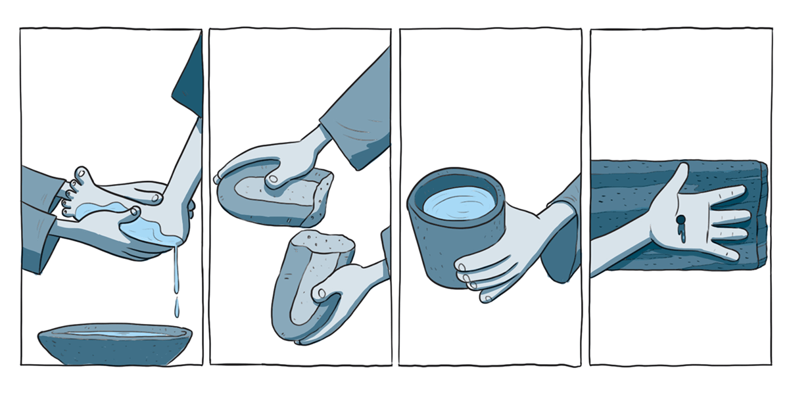

`A partir da tirinha, do texto-chave e do título, anote suas primeiras impressões sobre o que trata a lição:`

### Texto-chave

Leia o texto bíblico desta semana: Jo 13

Pesquise em comentários bíblicos, livros denominacionais e de Ellen G. White sobre temas contidos neste texto: Jo 13

#### comTEXTO

### O que está acontecendo aqui?

Volte comigo quase dois mil anos atrás, para a refeição de Páscoa que Jesus e Seus discípulos estavam prestes a celebrar. O que Jesus disse – que já havia um local preparado para eles – cumpriu-se com precisão (Mc 14:12-16). Ele orientou dois discípulos a irem à cidade. Lá, encontrariam um homem carregando uma vasilha de água, que os conduziria a um aposento pronto para ser usado. **Antes de ser traído e crucificado, Jesus queria que todos soubessem que nada do que aconteceria naquele fim de semana O pegaria de surpresa.**

Ao anoitecer, os discípulos se reuniram com Jesus no cenáculo. Por um instante, ninguém se moveu. Os pés precisavam ser lavados, mas não havia nenhum servo presente. Cabia aos discípulos fazerem algo, mas isso significava que alguém teria de se humilhar. Infelizmente, o clima entre eles era de disputa e ressentimento. Ninguém quis assumir aquela tarefa.

Essa atitude orgulhosa partiu o coração de Jesus. Ele estava prestes a morrer. Ainda precisava compartilhar muita coisa com os discípulos, mas o coração deles não estava preparado para receber Suas palavras. Então, Ele tirou Sua capa, amarrou uma toalha à cintura e, como um servo, começou a lavar os pés dos discípulos (Jo 13:1-5).

Pedro ficou escandalizado ao ver o Messias Se rebaixar daquele jeito (v. 6-8). Como tantos outros, ele imaginava o Mestre com um cetro, não com uma toalha. Imaginava Jesus vestido com trajes reais, não com a roupa de um servo. Para Pedro, aquilo não fazia sentido.

No mundo de hoje, governantes e líderes gastam fortunas para encomendar retratos que os imortalizem. Em geral, são imagens cuidadosamente elaboradas: a pessoa aparece no melhor uniforme, cercada por símbolos de poder e luxo. **Com Cristo, o retrato é outro. Em vez de ficar em pé, impondo respeito, Ele Se ajoelha para servir.**

Os discípulos prepararam a mesa, mas esqueceram de preparar o coração. Quando Jesus lavou os pés deles, quis mostrar que também precisavam de limpeza e humildade. Ele queria oferecer uma lição prática dos mesmos princípios que ensinava.

### Mergulhe + fundo

Leia, de Ellen G. White, O Desejado de Todas as Nações, capítulo 72: “Em memória de Mim”.