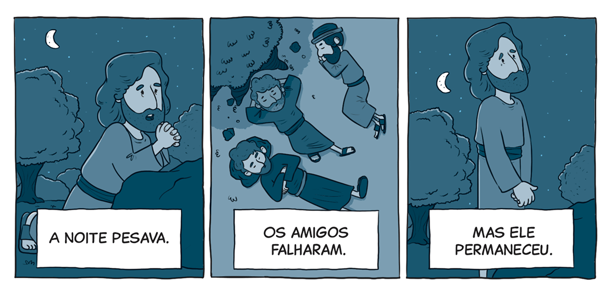

`A partir da tirinha, do texto-chave e do título, anote suas primeiras impressões sobre o que trata a lição:`

### Texto-chave

Leia o texto bíblico desta semana: Mt 26:36-56

Pesquise em comentários bíblicos, livros denominacionais e de Ellen G. White sobre temas contidos neste texto: Mt 26:36-56

#### comTEXTO

### Estranhamente em silêncio

Há pessoas que parecem não se abalar por nada. Quando os outros estão no limite, elas permanecem calmas e centradas. Às vezes, dá a impressão de que nada as tira do eixo. No Getsêmani, Jesus, “estranhamente ficou em silêncio” (Ellen G. White, O Desejado de Todas as Nações [CPB, 2021], p. 550). O cenário era sombrio. Ele já não estava tão sereno e firme como antes. Estava visivelmente abalado, vulnerável, como se estivesse desmoronando diante deles.

Algo diferente estava acontecendo: “Quando se aproximaram do jardim, os discípulos notaram a mudança que havia ocorrido em seu Mestre. Nunca antes O tinham visto tão extremamente triste e silencioso. À medida que andava, mais se aprofundava essa estranha tristeza” (O Desejado de Todas as Nações, p. 550).

**Os discípulos tiveram o privilégio de estar perto de Cristo, para apoiá-Lo quando Ele mais precisava. No entanto, em vez de tentarem compreender o que estava acontecendo e de encorajá-Lo, adormeceram, deixando Cristo lutar sozinho.** A sensação de solidão e isolamento aprofundou Sua tristeza e aumentou Seu fardo.

**Cristo sabia que estava entrando no “vale da sombra da morte” (Sl 23:4). Ele entendia perfeitamente que aquele caminho O levaria à morte; ainda assim, não resistiu nem fugiu.** Resumiu toda a experiência do jardim com estas palavras: “Tudo isto, porém, aconteceu para que se cumprissem as Escrituras dos profetas” (Mt 26:56).

A Palavra de Deus Lhe dava clareza sobre os acontecimentos que estavam se desenrolando diante Dele. Esse conhecimento poderia ter despertado medo ou revolta, mas o que Ele sentiu foi uma tristeza esmagadora. Nesta semana, vamos nos aprofundar nas causas dessa dor e nos acontecimentos do Getsêmani.

### Mergulhe + fundo

Leia, de Ellen G. White, A Verdade Sobre os Anjos, capítulo 16: “Os anjos durante a paixão e morte de Cristo”.