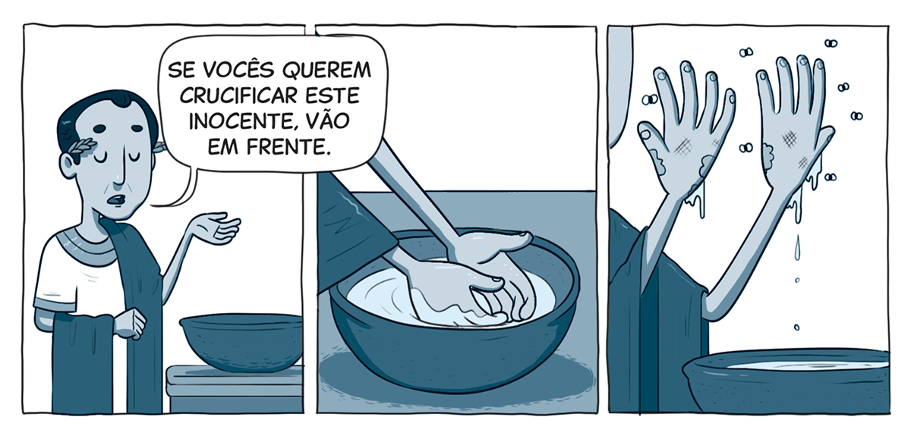

`A partir da tirinha, do texto-chave e do título, anote suas primeiras impressões sobre o que trata a lição:`

### Texto-chave

Leia o texto bíblico desta semana: Lc 23:1-31

Pesquise em comentários bíblicos, livros denominacionais e de Ellen G. White sobre temas contidos neste texto: Lc 23:1-31

#### comTEXTO

### Conflito de consciência

Pouco depois da morte de João Batista, o ministério de Jesus começou a ganhar ainda mais notoriedade. Quando Herodes ouviu falar daquele Rabino que operava milagres, passou a se perguntar se não seria João ressuscitado. Sua consciência, claramente, não estava em paz. Anos mais tarde, ele finalmente teve a chance de ver Jesus face a face. Jesus havia sido levado diante de Pilatos, e, assim que Pilatos soube que Ele estava sob a jurisdição de Herodes, aproveitou a oportunidade para passar o problema adiante.

Quando Cristo ficou diante dele, Herodes tentou puxar conversa. Mas Jesus não disse uma palavra. Herodes esperava ver algum milagre, como os de que tinha ouvido falar – e, mais uma vez, Jesus não reagiu. Herodes se ofendeu com o silêncio, mas percebeu que havia algo diferente naquele Homem. Ele não era como os criminosos com quem estava acostumado a lidar. Ainda assombrado pela morte de João, Herodes não estava em condição de ceder à pressão dos líderes judeus e condenar Jesus à morte (Lc 23:8-11).

Ironicamente, o pai dele – Herodes, o Grande – tinha sido o primeiro a tentar matar o Messias quando Ele ainda era bebê. Mas Herodes Antipas não queria se envolver com algo assim. Ele não suportaria carregar mais uma execução nas costas. Por isso, mandou Jesus de volta a Pilatos, afirmando que não via nada de errado Nele (v. 11, 15).

Depois de ler sobre essa cena, uma pergunta não sai da minha cabeça: Por que Jesus não disse nada? Ele falou com Pilatos – então por que, aqui, houve silêncio total?

**Jesus ficou em silêncio diante de Herodes porque Ele já tinha dito tudo o que precisava dizer por meio do Seu profeta, João Batista. Isso nos ensina uma lição fundamental: quando Jesus nos fala por meio dos Seus profetas e da Sua Palavra, a mensagem precisa ser levada a sério.** Caso contrário, quando nos encontrarmos com Ele face a face, talvez Ele não tenha mais nada a nos dizer. Ele fala com amor e nos chama a responder, mas a escolha é nossa.

### Mergulhe + fundo

Leia, de Ellen G. White, Vida de Jesus, capítulo 21: “Perante Herodes”.