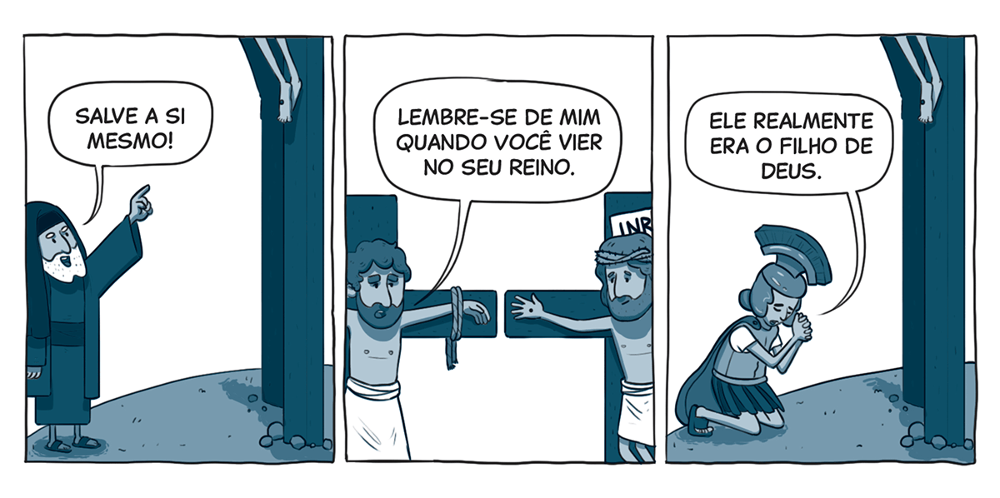

`A partir da tirinha, do texto-chave e do título, anote suas primeiras impressões sobre o que trata a lição:`

### Texto-chave

Leia o texto bíblico desta semana: Mt 27:32-56

Pesquise em comentários bíblicos, livros denominacionais e de Ellen G. White sobre temas contidos neste texto: Mt 27:32-56

#### comTEXTO

### Aviso ignorado

Enquanto caminhavam rumo a Jerusalém, Jesus explicou aos discípulos com a maior clareza possível o que aconteceria: “Eis que subimos para Jerusalém, e o Filho do Homem será entregue aos principais sacerdotes e aos escribas. Eles vão condená-Lo à morte e entregá-Lo aos gentios. Vão zombar Dele, cuspir Nele, açoitá-Lo e matá-Lo; mas, depois de três dias, ressuscitará” (Mc 10:33, 34). Mais claro do que isso, impossível. O que mais Ele poderia dizer?

Infelizmente, o que acontece logo em seguida mostra que os discípulos ainda não tinham entendido. Tiago e João chegaram a Jesus com um pedido urgente sobre o trono que esperavam que Ele estabelecesse em Jerusalém: “Permite-nos que, na Sua glória, nos assentemos um à Sua direita e o outro à Sua esquerda” (v. 37).

O Mestre ficou profundamente triste. Ele tinha acabado de revelar a experiência angustiante da crucifixão que se aproximava, e eles estavam mais preocupados com status e posição. Então Jesus respondeu: “Vocês não sabem o que estão pedindo” (v. 38). E, de fato, não sabiam.

A cruz nunca deveria ter sido uma surpresa para os 12 discípulos. No entanto, quando aconteceu, eles estavam completamente despreparados. **A história deles nos lembra como é fácil fechar os ouvidos para mensagens que não se encaixam nas ideias que já alimentamos.** O aviso pode ser claro como a luz do dia, e, ainda assim, os acontecimentos podem nos pegar de surpresa – como se ninguém tivesse dito nada.

Os discípulos não estavam nem perto de Jesus quando Ele foi levado amarrado e sangrando até o Calvário. Não era para isso que eles tinham deixado tudo para segui-Lo. A essa altura, ninguém estava pedindo para ficar à direita ou à esquerda Dele.

### Mergulhe + fundo

Leia, de Ellen G. White, História da Redenção, capítulo 29: “A crucifixão de Cristo”.