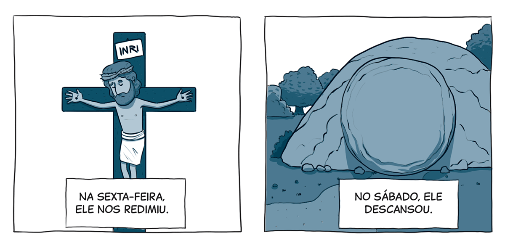

`A partir da tirinha, do texto-chave e do título, anote suas primeiras impressões sobre o que trata a lição:`

### Texto-chave

Leia o texto bíblico desta semana: Jo 19:25-42

Pesquise em comentários bíblicos, livros denominacionais e de Ellen G. White sobre temas contidos neste texto: Jo 19:25-42

#### comTEXTO

### Véu rasgado

Quando alguém trazia um sacrifício ao santuário e o abatia, o sacerdote recolhia o sangue daquele animal e o borrifava diante do véu, que ficava diante da arca da aliança – onde estava a lei que a pessoa havia quebrado. Assim, a pessoa voltava para casa perdoada, com a certeza de que estava em paz com Deus.

Uma vez por ano, no Dia da Expiação, o sumo sacerdote entrava além do véu – mas só depois de encher o compartimento com a fumaça do incenso. Desse modo, a presença de Deus permanecia, de certa forma, velada enquanto o sacerdote colocava o sangue do bode sacrificado sobre o propiciatório (a tampa da arca).

Por centenas de anos, esse sistema apontou para o sacrifício definitivo de Jesus, o “Cordeiro de Deus, que tira o pecado do mundo” (Jo 1:29). Então, no ano 31 d.C., enquanto o sacerdote se preparava para sacrificar um cordeiro na oferta da tarde, o verdadeiro Cordeiro, sem mancha, estava sendo crucificado fora da cidade.

Quando Jesus deu Seu último suspiro, a terra tremeu, as rochas se partiram, e o véu do templo se rasgou de alto a baixo – um ato evidente de Deus (Mt 27:51). **Aquele véu, que funcionava como barreira entre a presença de Deus e Seus filhos, foi rasgado. E, da mesma forma, Cristo abriu o caminho para que pecadores fossem perdoados, purificados e restaurados à presença de Deus.**

O apóstolo Paulo diz que o véu representava a “carne” de Cristo (Hb 10:20). O véu foi rasgado quando o corpo de Jesus foi ferido e entregue por nós. Sua morte na cruz derrubou as barreiras e tornou possível que nos aproximássemos de Deus. O rasgar do véu também mostrou que o santuário terrestre já não era necessário, porque o preço do pecado havia sido pago por completo. Com a morte de Jesus, cumpriu-se a profecia: “Ele dará fim ao sacrifício e à oferta” (Dn 9:27, NVI). Foi o começo de uma nova era: agora, precisamos olhar para Cristo, que hoje ministra como nosso Sumo Sacerdote no santuário celestial.

### Mergulhe + fundo

Leia, de Ellen G. White, Vida de Jesus, capítulo 25: “No sepulcro de José”.