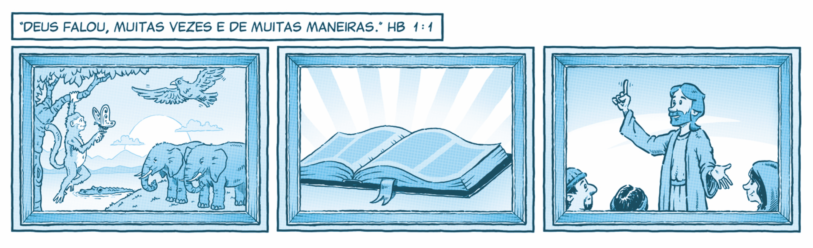

`A partir da tirinha, do texto-chave e do título, anote suas primeiras impressões sobre o que trata a lição:`

### Texto-chave

**Leia o texto bíblico desta semana:** Gn 3

Pesquise em comentários bíblicos, livros denominacionais e de Ellen G. White sobre temas contidos neste texto: Gn 3

### Comunicação no Éden

Os seres humanos foram criados para um relacionamento direto com o Criador e uns com os outros. Gênesis 1 e 2 relatam a história da criação. Deus fez um mundo maravilhoso e, nele, colocou Adão e Eva, a coroa de Sua obra criadora.

Entre todas as criaturas da Terra, somente os seres humanos foram feitos “à imagem de Deus” (Gn 1:27) – privilégio não concedido aos animais. Como portadores dessa imagem, foram criados para viver plenamente em todas as dimensões da existência, experimentar o amor em suas múltiplas expressões e andar em comunhão com o Senhor.

Em Gênesis 2:18 a 23, Deus criou Eva para Adão porque “não é bom que o homem esteja só” (Gn 2:18). Assim, ao unir homem e mulher em matrimônio, estabeleceu a família como a primeira instituição social humana. Não surpreende que Satanás tenha como alvo os fundamentos da família.

A cada dia no lar do Éden, Adão e Eva tinham um momento especial com o Criador, “quando soprava o vento suave da tarde” (Gn 3:8). O sábado, como parte essencial do ato criador de Deus, foi separado como um tempo ainda mais especial de comunhão entre o Senhor e Seus filhos (Gn 2:2, 3; Êx 20:8-11). Nesse dia, nossos primeiros pais experimentavam de modo singular o amor e o cuidado de Deus.

Com a queda, o solo foi amaldiçoado e começou a produzir “espinhos e ervas daninhas” (Gn 3:18). Os seres humanos passaram a conviver com a dor e com o árduo trabalho para obter o sustento, até que, por fim, morressem e voltassem ao pó (v. 19). Em consequência do pecado, perdemos a comunicação face a face com o Senhor.

Para restaurar a comunicação com Suas criaturas amadas, Deus falou por meio de profetas, Seus mensageiros. Alguns de seus escritos foram preservados na Bíblia; outros não chegaram até nós.

### Mergulhe + Fundo

Leia, de Ellen G. White, Patriarcas e Profetas, capítulo 3: “A tentação e a queda”.