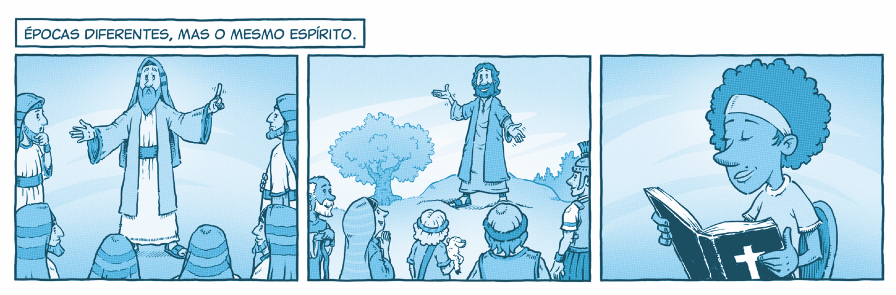

`A partir da tirinha, do texto-chave e do título, anote suas primeiras impressões sobre o que trata a lição:`

### Texto-chave

**Leia o texto bíblico desta semana:** Ef 2:19–3:7

Pesquise em comentários bíblicos, livros denominacionais e de Ellen G. White sobre temas contidos neste texto: Ef 2:19—3:7

### A mesma fonte

Deus falou por meio de profetas no Antigo e no Novo Testamento, em mensagens contínuas e harmoniosas, pois o Espírito Santo é o mesmo e mantém Cristo no centro da revelação (Hb 1:1-3).

Ao ler o Novo Testamento, é importante distinguir semelhanças e diferenças entre profetas e apóstolos. Os profetas continuam exercendo funções semelhantes às do Antigo Testamento. Já o termo apóstolo é próprio do Novo Testamento.

Os apóstolos eram “mensageiros” ou “enviados” do Senhor, como indica o termo grego apóstolos. Nos evangelhos, o termo refere-se aos doze discípulos, mas o restante do Novo Testamento também o aplica a outras pessoas além do grupo original de Cristo.

Em Romanos 1:1 e 2, Paulo relaciona seu chamado apostólico e o conteúdo de sua pregação com a mensagem dos profetas do Antigo Testamento. Ele se via como apóstolo dos gentios (Rm 11:13) e defendia seu apostolado como alicerçado na obra de Cristo, que é o Fundamento da igreja (Ef 2:20).

Ao contrário do sacerdócio, que seguia uma linhagem física, passando de pai para filho, Deus designava profetas e apóstolos de acordo com Sua vontade. Como receptores da revelação divina, os apóstolos tinham o mesmo grau de inspiração que os profetas (Ef 3:1-5).

Em 2 Pedro 3:1 e 2, o apóstolo menciona os profetas como mensageiros que vieram antes, cujas palavras continuam importantes, e coloca os apóstolos no mesmo patamar de autoridade. No período do Novo Testamento, o dom de profecia não estava limitado aos apóstolos, e nem todos os profetas eram apóstolos (At 15:32).

Por meio de sonhos e revelações, Deus guiou Seus mensageiros quanto aos lugares para onde deveriam ir (At 10:1-23; 16:6-10). Inspirados pelo Espírito Santo, os profetas recordaram as palavras de Jesus e registraram os evangelhos para que fossem lidos por todo o mundo (Jo 14:26). O Espírito Santo também lhes ensinou verdades e revelou acontecimentos futuros (Jo 16:13; Ap 1:1-3).

### Mergulhe + Fundo

Leia, de Ellen G. White, Caminho a Cristo, capítulo 3: “Libertos da culpa”.