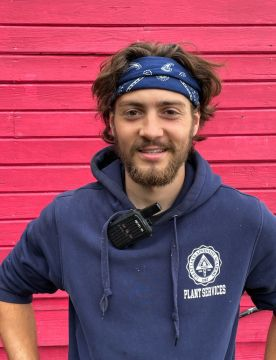

#### Od sbírání odznaků k táborníkovi

_Andrew McChesney_

Celá rodina Jacoba Pierce milovala sbírání a výměnu odznaků a na Camporee (mezinárodním táboře Pathfinderů) ve Spojených státech se rozptýlili, aby našli nové odznaky.

Pak matka uviděla muže s odznakem Aljašky. Protože věděla, že Jacob miluje aljašskou přírodu, snažila se muže přesvědčit k výměně.

„Nemohu ji vyměnit,“ řekl. „Je to unikátní odznak pro kazatele na Aljašce.“.

Matčin zájem jen vzrostl. „Co vlastně děláte na Aljašce?“, zeptala se.

Muž se představil jako Tobin Dodge, ředitel Aljašských táborů, misijní iniciativy aljašské konference Církve adventistů sedmého dne, která každé léto sponzoruje tábory pro děti ve věku od 8 do 17 let.

„Mohl by tam můj syn pracovat?“, zeptala se matka.

„Ano, přijímáme vedoucí procházející vůdcovským kurzem, kteří mají 16 let a vedoucí, kteří mají 18 let,“ řekl.

Jacobovi se nápad strávit léto na Aljašce zalíbil. Připojil se k táborovému personálu - a jezdil tam tři roky po sobě.

„Táborová zkušenost může být náročná“, řekl. Jeden rok se mu líbilo trávit čas s aljašským domorodým chlapcem v táboře Polaris, který se nachází u jezera Aleknagik na jihozápadě Aljašky. Měli společný zájem o přírodu a vylezli na horu Jackknife, která se tyčí nad táborem. Chlapec se však odmítal chovat slušně. Používal také vulgární výrazy a zdálo se, že má větší zájem propagovat pověry než poslouchat biblickou pravdu. Z deštivého dne obviňoval chlapce, který zabil pavouka, a říkal: „Když zabiješ pavouka, bude pršet“.

Jacob byl frustrovaný. Na konci tábora však chlapec Jacoba objal a zamířil k otci. Jak se Jacob na ty dva díval, najednou začal chlapcovo chování chápat. Chlapec prakticky vychovával sám sebe.

„Většina dětí nemá vůbec žádné křesťanské zázemí,“ řekl dvacetiletý Jacob v rozhovoru na táboře Polaris. „Proto mi to opravdu otevírá oči a je to pro mě úžasné misijní pole.“

Řekl, že duchovní boje v táboře Polaris se liší od těch na jiných letních táborech sponzorovaných Aljašskou konferencí, protože se skládají téměř výhradně z dětí aljašských indiánů, které často čelí problémům s traumaty, pověrčivostí a zneužíváním návykových látek.

„Ale být tady stojí za to,“ řekl. „Je to povolání, které je silnější než jakékoli jiné, které jsem zažil. Bůh zde dobrovolníky opravdu potřebuje. Je to misijní pole.“

_Děkujeme vám za dary třinácté soboty v roce 2016, která pomohly opravit a rozšířit tábor Polaris, aby se ho mohlo účastnit více dětí. Část darů třinácté soboty v tomto čtvrtletí pomůže otevřít centrum vlivu v adventistickém sboru v Bethelu na Aljašce. Církev v Bethelu posílá každoročně místní děti na tábor Polaris._

  
Jacob Pierce
