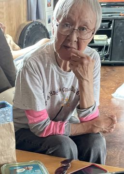

#### „Prosím, zůstaňte“

_Andrew McChesney_

V osm hodin večer zaklepal na dveře kazatele, který se ubytoval vedle sboru Církve adventistů sedmého dne v Savoonze na Aljašce, starší manželský pár. Nebylo tak pozdě. Na obloze jasně svítilo letní slunce. Mělo zapadnout až v půl třetí ráno. Sibiřští Jupíci žijící na ostrově svatého Vavřince, který se nachází pouhých 36 mil východně od Ruska v Beringově moři, nešli spát ještě několik hodin.

Eugen a Marie, kterým bylo kolem 80 let, nečekali, až jim někdo otevře dveře. V odlehlé vesnici s 835 obyvateli nikdo nečeká, až mu někdo otevře dveře. Každý zaklepe a vejde. Manželé chtěli mluvit s návštěvou, která se ubytovala v kazatelském bytě. Byl jsem na ostrově, abych sbíral příběhy pro Adventistickou misii.

Marie se mě přímo zeptala: „Vy jste kazatel?“

Když jsem pokýval hlavou, oči se ji naplnily emocemi. „Prosím, zůstaňte,“ řekla tiše. „Potřebujeme někoho, kdo by udržoval sbor otevřený a učil nás.“

Od roku 1972, kdy byl sbor i s bytem kazatele postaven, byl již několikrát zavřený. Nějakou dobu tam kazatelé bydleli a kázali, ale pak se přítomnost adventistů na dvě desetiletí smrskla na minimum. V roce 2010 byl kostel znovu otevřen, když do něj přijeli dva vysloužilí ošetřovatelé ze Severní Karolíny, Bill a Elouise Hawkesovi, jako bibličtí pracovníci v rámci programu Arktické misijní dobrodružství Aljašské konference pro pomoc původním obyvatelům Aljašky. Bill v roce 2016 zemřel a Elouise zůstala. Krátce před mou návštěvou však Elouise ze zdravotních důvodů odešla.

Marii se po Elouise strašně stýskalo a popisovala, jak zvala vesničany k sobě domů na jídlo a připravovala jim potravinové balíčky. „Potřebujeme ji,“ řekla.

S Elouise jsem se nikdy nesetkal. Když jsme si vyměňovali e-maily ohledně mé cesty, byla nadšená a ochotná. Můj respekt rostl, když jsem slyšel o její lásce k vesničanům.

Když náš rozhovor v devět hodin večer skončil, Marie se na mě znovu podívala.

„Prosím,“ řekla. „Zůstaňte. Potřebujeme někoho, kdo nás bude učit o Bohu.“

Při jejím prosebném pohledu jsem pocítil soucit, který musel pociťovat Ježíš během své pozemské služby. „Když však viděl zástupy, pojal k nim soucit, protože byli unavení a rozptýlení jako ovce, které nemají pastýře“ _(Matouš 9,36)_. Nechtěl jsem odejít. Srdce mě bolelo pro vzácné lidi ze Savoongy a dalších více než 200 domorodých komunit na Aljašce. Pouze v jedenácti z těchto komunit jsou přítomni adventisté.

Když Ježíše bolelo srdce, „Tehdy řekl svým učedníkům: 'Žeň je velká, dělníků málo. Proste proto Pána žně, ať vyšle dělníky na svou žeň!’“. _(Matouš 9,37.38) _

_Modlete se za Savoonga. Modlete se za Aljašku. Děkujeme vám za dary třinácté soboty v tomto čtvrtletí, které pomůžou otevřít centrum vlivu pro sdílení Boží lásky s aljašskými domorodci v Bethelu na Aljašce._

  
Marie
