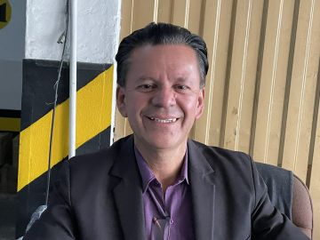

#### Dárek pro dobře oblečenou ženu

_Andrew McChesney_

Dobře oblečená žena vjela autem do garáže sboru Církve adventistů sedmého dne v konferenci Horní Magdaléna v kolumbijské Bogotě. „Jste křesťané?“ zeptala se obsluhy parkoviště.

„Ano,“ odpověděl 52letý Ruben Campos.

„Jakého jste náboženství?“ zeptala se.

„Jsme adventisté sedmého dne,“ odpověděl. „Můžeme vám nějak pomoci?“

„Někdo mi řekl, že adventisté neradi pomáhají druhým,“ řekla.

Ruben byl překvapený. „Pomůžeme vám,“ řekl. „Jsme připraveni sloužit.“

Žena se zeptala, zda může zaparkovat své auto ve sborové garáži. Její byt se nacházel nedaleko, ale neměl žádné parkoviště a ona se necítila bezpečně, když nechávala auto v noci na ulici.

„Ano, můžete tu zaparkovat,“ řekl Ruben.

„Kolik by to stálo?“ zeptala se.

„Nebude vás to stát nic,“ řekl Ruben. „Bude to náš dárek pro vás.“

„Děkuji vám!“ zvolala žena. „Můžu vás obejmout?“

Toho večera nechala žena své auto v garáži. Vrátila se také další noc. Třetí noc požádala Rubena o Bibli.

Oba pak začali studovat Bibli. Ruben jí přinesl židli a při studiu seděl v jeho buňce. Po měsíci žena řekla, že chce Rubena představit svému manželovi. Zavolala mu ze svého mobilního telefonu. „To s ním studuji Bibli a chci se nechat pokřtít,“ řekla.

Ženin manžel byl vysoký kolumbijský vojenský důstojník a byl na dočasné misi v zahraničí. Řekl Rubenovi, že chce také studovat Bibli. „Můžeme začít, až se vrátím do Kolumbie,“ řekl.

Ruben byl možná nejšťastnější obsluhou parkoviště v Kolumbii, když byla žena pokřtěna ve sboru adventistů sedmého dne v Bogotě. Nyní čeká, až se její manžel vrátí do země, aby také studoval bibli.

Ježíš se zapojil do misijní práce tím, že sloužil druhým. Řekl: „Syn člověka nepřišel, aby si nechal sloužit, ale aby sloužil.“ _(Mt 20,28)_ Ruben se snaží následovat Jeho příkladu.

„Můžeme ovlivnit mnoho životů, pokud budeme jen sloužit,“ řekl Ruben, který již osm let pracuje jako obsluha parkoviště. „Někdo za vámi může brzy přijít. Musíte být připraveni sloužit bez ohledu na to, kdo nebo kde se ten člověk nachází.“

_Děkujeme vám za dary třinácté soboty, které v minulém čtvrtletí pomohly dvěma misijním projektům v Kolumbii._

  
Ruben
