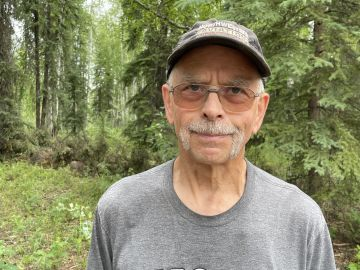

#### Kľúč k aljašskej dedine

_Andrew McChesney_

Misijný pilot Jim Kincaid vedel, aké ťažké je letieť z jednej odľahlej dediny do druhej odľahlej dediny v americkom štáte Aljaška. Vzlet a pristátie v buši  bola tá jednoduchšia časť. Nájsť srdcia vnímavé na posolstvo evanjelia u pôvodných obyvateľov Aljašky bolo oveľa náročnejšie.

Keď Jim pristál s malým lietadlom v osade vzdialenej asi 150 míľ severne od Fairbanksu, zdalo sa, že budeme mať problém. Lietal s knižnými evanjelistami z dediny do dediny, aby predávali Biblie a inú kresťanskú literatúru. Keď pristál, okolo lietadla sa zhŕkli terénne vozidlá. Muži, ktorí z nich vystúpili, boli veľmi neprívetiví.

„Kto ste?“ opýtal sa jeden.

„Čo tu robíte?“ opýtal sa ďalší.

V tej chvíli si Jim spomenul na jedno meno. Akýsi muž z tejto dediny sa zúčastnil jedného alebo dvoch evanjelizačných stretnutí, ktoré Jim pred nejakým časom viedol vo Fairbanks. Jim sa otočil k strážcom dediny.

„Je Robert Frank doma?“ spýtal sa.

Výraz ich tváre sa okamžite zmenil. Nahnevané pohľady ustúpili zvedavosti a neskôr pohostinnosti.

„Ach, vy poznáte Roberta Franka?“ povedal jeden z nich.

„Dovedieme vás k nemu!“ povedal ďalší.

A tak vzali Jima na návštevu k Robertovi. Bolo to, ako keby kľúčom otvoril dedinu. Robert práve jedol, keď prišiel Jim. Žiaľ, nepodarilo sa mu hneď spoznať nášho pilota. Jim mu musel pripomenúť, ako a kedy sa stretli. Ale keď si Robert spomenul, bol veľmi srdečný. Ponúkol Jimovi kus čerstvého medvedieho mäsa.

Tak sa stalo, že Jim a knižní evanjelisti mohli vstúpiť do novej dediny, ktorá by inak nebola oslovená. Všetko, čo bolo potrebné, bolo poznať niečie meno.

Aj Ježiš pozná mená ľudí. Povedal, že on je dobrý pastier, „volá svoje ovce po mene a vyvádza ich“. (Jn 10,3)

Ak Ježiš pozná mená, nemali by aj jeho nasledovníci nasledovať jeho príklad?

„Poznať niekoho v dedine – možno stačí poznať len meno nejakého človeka v dedine – môže byť kľúčom k zblíženiu sa s celou dedinou,“ povedal Jim. „Podobne ako v akejkoľvek inej kultúre. Zapamätať si meno niekoho môže mať ďalekosiahle následky.“

_Časť darov tejto trinástej soboty pomôže otvoriť spoločenské centrum pre pôvodných obyvateľov Aljašky v meste Bethel na Aljaške. Ďakujeme, že ste si na túto sobotu pripravili štedrý dar._

  
Jim
