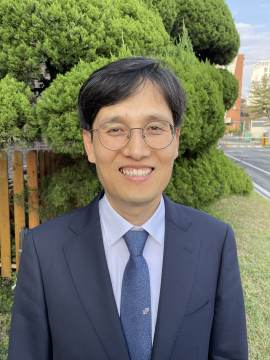

#### Za bambusovou oponou

_Andrew McChesney_

Kľakol som si k študentovi z Južnej Kórey a opýtal sa ho, či má nejaké námety, za čo sa budeme modliť predtým, než si umyjeme nohy počas slávnosti Večere Pánovej. Boli sme práve v medzinárodnom zbore Cirkvi adventistov siedmeho dňa v Moskve, hlavnom meste Ruska.

„Modlime sa za Severnú Kóreu,“ povedal študent, ktorý študoval na Moskovskej štátnej univerzite. „Evanjelium sa musí dostať aj tam, aby sa Ježiš mohol vrátiť.“

Vďaka tejto prosbe, ktorá bola vyslovená v roku 2006, som sa dozvedel o jednej zvláštnej veci – ako vnímajú adventisti siedmeho dňa v Južnej Kórei svojich bratov a sestry v Severnej Kórei. Ježiš povedal: „A toto evanjelium o kráľovstve sa bude hlásať po celom svete na svedectvo všetkým národom. A potom príde koniec.“ (Mat 24,14) Adventisti z Južnej Kórey považujú Severnú Kóreu za cieľ svojho misijného pôsobenia v rámci hlásania evanjelia po celom svete. Mnohí aj dnes hľadajú na modlitbách spôsob, ako sa dostať za tzv. bambusovú oponu.

Pôsobenie Cirkvi adventistov s. d. na severe začalo ešte v roku 1904, potom sa rozšírilo aj na juh. Južná Kórea má dnes 52 miliónov obyvateľov a 285 000 členov Cirkvi adventistov s.d. Nie je známe, že by na severe bol jediný adventista. Severná časť má populáciu 26 miliónov. Boem Seok Oh je vedúci Severnej ázijsko-pacifickej divízie a má na starosti šírenie Božieho posolstva smerom na sever. Hovorí, že majú určité neoficiálne správy, že Boh má aj tam svojich ľudí. Keď som pricestoval do Južnej Kórey, rozprával mi o žene, ktorá žila v Severnej Kórei a v sobotu ráno vždy vypila sojovú omáčku, aby dostala horúčku a nemusela ísť v sobotu do práce. Keď bola uväznená, prepašovala si do väzenia Bibliu, zahrabala ju do zeme a potajomky ju čítala. Neskôr sa jej podarilo tajne prejsť cez hranice na juh, kde môže uctievať Boha slobodne. Vedúci cirkvi sa pripravujú na čas, keď sa otvoria severné hranice. Ak sa tak stane, plánujú vyslať na sever misionárov.

Dovtedy sa veriaci z Južnej Kórey starajú aspoň o utečencov, ktorým sa podarí prejsť cez hranice. Jeden diakon spolu s manželkou pravidelne navštevujú jedného nového utečenca a pomáhajú mu s upratovaním, prípravou jedál a vypĺňaním rôznych byrokratických dokumentov a žiadostí. Kazateľ miestneho zboru Chang-Seop Lee, z ktorého tento diakon pochádza, hovorí, že po šiestich mesiacoch utečenec vyznal svoju vieru v Boha.

Iný utečenec zasa nemohol spávať, pretože stále myslel na svoju manželku a deti, ktoré ostali na severe. Kazateľ Lee sa s ním modlil a utečenec priznal, že verí v Boha a ešte keď býval na severe, tak čítal Bibliu. Tieto skutočnosti upevnili kazateľove rozhodnutie pomáhať utečencom zo severu. „Verím, že môžeme rozšíriť náš vplyv smerom na sever práve tým, že začneme slúžiť tým, ktorých stretávame už dnes,“ povedal kazateľ Lee.

_Modlite sa za Severnú Kóreu. Ďakujeme za vaše štedré dary trinástej soboty na konci marca, ktoré pomôžu šíriť evanjelium v rámci Severnej ázijsko-pacifickej divízie._

  
Čang-Seop Lee
