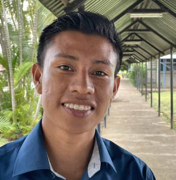

Sibú – Boh Biblie

_Andrew McChesney_

Melvin si nebol istý, či bol človek stvorený z prachu alebo kukurice. V Biblii sa píše, že „Hospodin, Boh, stvárnil človeka, prach zo zeme, a vdýchol mu do nozdier dych života. Tak sa stal človek živou bytosťou.“ (1Moj 2,7) Melvin patril ku kmeňu Cabécar, ktorý je na Kostarike najväčším domorodým kmeňom s populáciou 17 000 členov. Ich učenie hovorí, že Sibú, čo v preklade z ich pôvodného jazyka znamená „Boh“, stvoril človeka z kukurice.

Keď bol Melvin mladý, myslel si, že Sibú jeho pôvodného náboženstva a Sibú z Biblie je to isté božstvo. Keď však začal študovať Bibliu s adventistami siedmeho dňa, uvedomil si, že vlastnosti Boha z Biblie sa výrazne líšia od tých, ktoré mal Sibú jeho pôvodného náboženstva. Rozhodol sa, že prijme Boha Biblie a spolu so svojimi rodičmi a dvoma súrodencami bol pokrstený.

O rok neskôr, keď jeho mama mala 40 rokov, utrpela mozgovú príhodu, na ktorej následky zomrela.

Melvin mal vtedy 22 rokov a veril, že smrť je ako spánok. Človek vtedy nič nevníma a nevie. Tradícia jeho kmeňa Cabécar však učila, že jeho mama ostáva nažive. Ak jej rodina nesplní štyri dni rituálov, ktoré ju prevedú na druhý svet, bude naveky zatratená v temnote. Súčasťou tradičných pohrebných rituálov je aj zabiť dve prasatá a tri sliepky, ktoré poslúžia ako pohostenie pre smútiacich. Ak by to odmietli, ostatní by ich považovali za veľmi sebeckých. Tradícia kmeňa Cabécar odsudzuje sebeckých ľudí ako veľmi odporných. Napriek obrovskému tlaku starých rodičov a ostatných príbuzných, aby sa držali tradície, Melvin a jeho rodina sa rozhodli riadiť sa pravdami Biblie. Adventistický kazateľ im pomohol nájsť miesto mimo teritória kmeňa Cabécar, kde mohli pochovať zosnulú.

Melvin sa vtedy rozhodol, že sa stane kazateľom. Už od svojho krstu cítil, že ho Boh povoláva do služby evanjelia, ale dosiaľ váhal. Keď mama zomrela, rozhodol sa zasvätiť svoj život šíreniu zvesti o Sibú z Biblie. Chcel ukázať svojim ľuďom cestu od boha Sibú, ktorý stvoril človeka z kukurice, k Bohu Sibú, ktorý stvoril človeka z prachu. Chcel im ukázať, že zvieracie obety nie sú potrebné k získaniu večného života na druhom svete, pretože Sibú z Biblie dal svoj vlastný život ako obetu za všetkých. A z toho sa môžeme všetci tešiť.

24-ročný Melvin Madriz je dnes študentom teológie na Adventistickej univerzite Strednej Ameriky v Kostarike. Po promóciách bude prvým kazateľom Cirkvi adventistov, ktorý pochádza z kmeňa Cabécar. V súčasnosti je v tomto kmeni približne 30 členov cirkvi.

„Verím v Sibú, ale len toho, ktorý je z Biblie, nie toho tradičného,“ povedal Melvin na záver.

_Modlite sa za to, aby mohol byť Boh Biblie hlásaný nielen v kmeni Cabécar, ale aj v ostatných domorodých kmeňoch sveta. Ďakujeme za vaše misijné dary, ktoré pomáhajú šíriť evanjelium aj tam, kde sa ešte nedostalo._

  
Melvin Madriz
