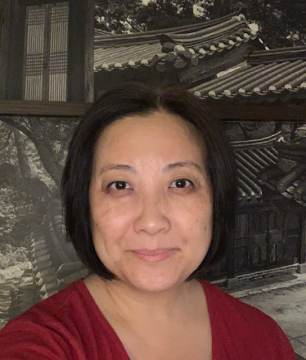

#### Útoky opitých mužov

_Andrew McChesney_

Opitý muž začal obťažovať 21-ročnú misionárku v autobuse verejnej dopravy. Snažil sa ju objať a pobozkať. Zatiaľ čo ostatní pasažieri pozerali iným smerom, mladá žena sa snažila brániť. Po chvíli však jedna staršia žena čosi zakričala vodičovi autobusu. Autobus zastavil a pod vedením staršej ženy ho niekoľkí cestujúci vyhodili von. Potom prišla ku vzlykajúcej misionárke, objala ju a povedala jej čosi, čomu misionárka nerozumela.

Toto bola nočná mora, ktorej musela Joanne Park Kim čeliť skoro každý týždeň počas jej pobytu v Mongolsku. Bolo to začiatkom 90-tych rokov minulého storočia. Joanne bola mladá slobodná Američanka, ktorá slúžila ako jedna z prvých misionárov Cirkvi adventistov siedmeho dňa v post-komunistickom Mongolsku.

Pri inej príležitosti si zas opitý sused pomýlil jej byt so svojím. Vykopol jej chatrné drevené dvere svojimi ťažkými topánkami s oceľovou špicou a začal ju biť. Joanne schytila metlu a s krikom sa bránila. Bol to však márny boj, kým Joanne nepoužila metlu, aby zaklopala na strop, kde bývali jej ďalší kolegovia misionári z Ameriky. Manželský pár klopanie počul a rýchlo sa ponáhľali dolu zachrániť ju. 

Poslednou kvapkou pre Joanne bolo, keď spolu s ďalším misionárom čakali na autobusovej zastávke na predmestí hlavného mesta Mongolska Ulanbátar. Jedna mama ich pozvala na oslavu prvého strihania vlasov jej dieťaťa, čo je v Mongolsku dôležitou udalosťou. Joanne dostala inštrukcie, že má počkať na autobusovej zastávke, pretože sama by na neoznačených uliciach ich domov nikdy nenašla. A tak spolu s druhou misionárkou sedeli na obrubníku a čakali, kým po nich príde táto mama.

Vtom prišli štyria opití muži, sadli si vedľa nich a snažili sa Joanne objímať a bozkávať.

Joanne spolu s kolegyňou odišli preč, ale muži šli za nimi. Ostatní ľudia, ktorí stáli na preplnenej zastávke, sa pozerali každý iným smerom. Muži zatlačili ženy do opustenej uličky. Joanne začala kričať, kopať a brániť sa, ale proti štyrom mužom nemala šancu. Muži zhodili dievčatá na zem. Joanne si myslela, že toto je koniec.

Zrazu muži zbledli, otočili sa a utiekli preč. Joanne sa obzerala okolo seba, aby videla, kto ich prišiel zachrániť. Nikto tam však nebol. V tom momente pochopila, že muži museli uvidieť anjela.

_Tento misijný príbeh nám ponúka pohľad do života americkej misionárky Joanne Park Kim, ktorá stála pri zrode Cirkvi adventistov siedmeho dňa v post-komunistickom Mongolsku a potom tam pokračovala v misijnej práci. Aj vy sa môžete stať súčasťou tejto misie prostredníctvom darov trinástej soboty. Časť z nich poslúži na otvorenie komunitného centra určeného pre duchovný, mentálny, sociálny aj fyzický rast detí v Ulanbátare, hlavnom meste Mongolska. O Joanne sa dočítate viac budúci týždeň v ďalšom misijnom príbehu._

  
Joanne Kim
