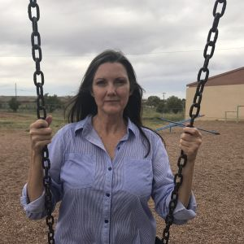

#### Náboženstvo jedného dievčaťa (1)

_Andrew McChesney_

Keď mala Diana dvanásť rokov, začala piť alkohol, fajčiť marihuanu a počúvať tvrdú rockovú hudbu. Počas jednej párty začala rozmýšľať o Bohu. Boh nebol súčasťou jej raného detstva. Otec trávil veľa času v zámorí ako vojak vojenského námorníctva, takže ich rodina, podobne ako mnohé ďalšie rodiny vojakov, sa sťahovala každé dva alebo tri roky. Niekoľkokrát bola spolu s mamou a sestrami v nedeľu v kostole, ale to ešte boli veľmi malé a žili na Floride.

Keď mala Diana desať rokov, zúčastnila sa prázdninovej biblickej školy. V tom čase bývali v Norfolku vo Virgínii. Cestovala tam spolu so staršou sestrou autobusom z baptistického kostola. Vtedy si zapamätala text Ján 3,16 a niektoré biblické knihy. Dozvedela sa o misionároch a záväznosti nemenného Božieho slova. Rozhodla sa dať pokrstiť. Zbor bol pre ňu duchovným základom. 

Ale život mimo zboru – to bol iný príbeh. Diana bola sexuálne zneužívaná. Táto trauma ju ovplyvnila na dlhé roky. Keď mala dvanásť rokov, rodina sa opäť sťahovala – tentoraz do Albuquerque v Novom Mexiku. Mnohé deti v susedstve užívali alkohol a drogy a Diana sa k nim pridala.

Keď mala 14 rokov, presťahovali sa do Monte Vista v Colorade. So svojimi novými kamarátmi fajčila marihuanu a občas im hovorila o Bohu. Keď mala 16, mnohí jej kamaráti museli v škole navštevovať hodiny náboženstva. Pretože s nimi chcela nadviazať hlbšie priateľstvo, chodievala na náboženstvo s nimi. Na jednej hodine kňaz vyhlásil, že autorita cirkvi je nad autoritou Božieho slova, pretože cirkev zmenila deň uctievania Boha z biblického siedmeho dňa – soboty – na prvý deň – nedeľu.

Dianu to šokovalo a znepokojilo. Spomenula si, že kedysi sa učila, že Božie slovo sa nemá meniť. Kládla si otázku: „Prečo ľudia zachovávajú prvý deň, keď Biblia jasne hovorí, že máme zachovávať siedmy deň?“ Rozhodla sa, že na hodiny náboženstva bude chodiť do konca, ale do kostola chodiť nebude. Stále pila, brala drogy a počúvala tvrdú rockovú hudbu. To bola jej identita, jej život, jej náboženstvo.

_Tento misijný príbeh rozpráva o tom, ako Boh zázračne pôsobil v živote Diany Fish, manažérky na škole Holbrook Seventh-day Adventist Indian School. Tejto škole boli venované dary trinástej soboty v roku 2021. Ďakujeme vám za podporu šírenia evanjelia prostredníctvom darov trinástej soboty v tomto štvrťroku. Zbierka sa uskutoční 28. júna._

_Pokračovanie nabudúce._

