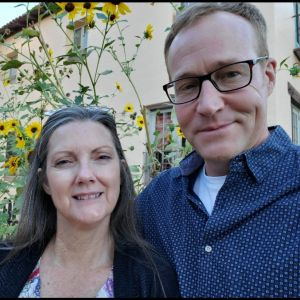

#### Priateľ, ktorý bol kedysi adventistom (4)

_Andrew McChesney_

Po tom, čo ju upokojujúci hlas zastavil pred spáchaním samovraždy, Diana sa v myšlienkach vrátila k Bohu. V tú nedeľu vzala svoje tri deti do malého kostola v Santa Fe v Novom Mexiku. Keď si sadli do lavice, hudobníci začali hrať. Ale hudba, ktorú počula z pódia, sa jej nepáčila. Pripomínala jej zlé obdobie jej života. Preto aj s deťmi z kostola odišli.

Zdalo sa, že Diane sa darí stále horšie. Do jej bytu sa vlámali zlodeji a vzali to málo, čo mala. Otehotnela s partnerom, ktorý bol násilnícky. Jeho jediné riešenie znelo: „Zaplatím ti potrat.“ Jedného večera, keď deti už spali, sedela potme v obývačke plná hanby a nenávisti voči sebe. V hneve kričala k Bohu: „To je to, čo si pre mňa pripravil?“ Hnev sa zmenil na vzlykanie, keď si spomenula na roky plné zápasov. „Pane Ježišu,“ prosila, „potrebujem ťa.“ Okamžite pocítila silný príval energie. Miestnosť bola zahalená do tmy, ale jej sa zdalo, že ju naplnilo svetlo. Bolo to, akoby ju objal Boh z neba. Celú jej bytosť naplnil ohromujúci pocit radosti, pokoja a lásky. Krátko na to upadla do hlbokého, pokojného spánku. Ráno sa tento intenzívny pocit vytratil, ale Diana cítila, že niečo sa zmenilo.

O niekoľko mesiacov neskôr sa stretla s jedným zvláštnym a výnimočným človekom. Loren Fish bol štvrtou generáciou adventistov siedmeho dňa. Jeho otec bol kazateľom a zakladal zbory. Počas štúdia v prvom ročníku na vysokej škole Loren odišiel od Boha, začal piť a nakoniec nechal štúdium. S Dianou sa stretol v tanečnom klube v Santa Fe v Novom Mexiku a požiadal ju, aby ho odviezla domov.

Diane sa zdal cudzinec nepríjemný, ale odviezla ho. Loren ju nechcel nechať len tak. Zistil, kde pracuje a prišiel za ňou do práce. Diana nemala záujem nadviazať ďalší vzťah. Ešte neprerušila vzťah s mužom, s ktorým žila. Navyše Loren bol o štyri a pol roka mladší a zdal sa jej naivný a nezrelý. V skutočnosti nechcela, aby vedel, aký je stroskotanec, a nechcela prežiť ďalšie zranenie. Preto ho odmietla. Loren odišiel zo Santa Fe a usadil sa neďaleko Chicaga. 

Jednej noci Loren zavolal Diane práve po tom, čo jej násilnícky partner zničil pneumatiky na aute a zaútočil na ňu. Diana bola šťastná, že počuje Lorena, a spomenula si, ako sa pri ňom cítila bezpečne. „Môžeš ma prísť navštíviť, kedykoľvek budeš chcieť,“ povedala mu. Loren prišiel ešte v ten víkend a už nikdy neodišiel.

_Tento misijný príbeh rozpráva o tom, ako Boh zázračne pôsobil v živote Diany Fish, manažérky na škole Holbrook Seventh-day Adventist Indian School. Tejto škole boli venované dary trinástej soboty v roku 2021. Ďakujeme vám za podporu šírenia evanjelia prostredníctvom darov trinástej soboty v tomto štvrťroku. Zbierka sa uskutoční 28. júna._

_Pokračovanie nabudúce._

