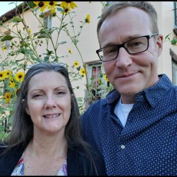

#### Láska a manželstvo (5)

_Andrew McChesney_

Keď Diana a Loren zistili, že čakajú dieťa, rozhodli sa, že sa vezmú. Naplánovali si, že sobáš sa bude konať v Santa Fe v Novom Mexiku. Diana však odložila svadbu, pretože nechcela, aby dieťa bolo dôvodom pre sobáš.

Po narodení dieťaťa sa manželia presťahovali do Salt Lake City v štáte Utah, kde žili Dianini rodičia. Už mali dosť života v Santa Fe.

Hoci Diana a Loren nežili ako kresťania, Loren chcel, aby sa svadobný obrad uskutočnil v nejakom kostole. Vybral si adventistický zbor a skontaktoval sa s jeho kazateľom. Požiadal svojho otca, ktorý bol tiež adventistickým kazateľom a býval neďaleko Chicaga, aby vykonal obrad. Pre oboch kazateľov to bola určitá dilema, pretože Diana nebola členkou cirkvi a manželia nežili kresťanským životom.

Po dlhých modlitbách však povedali, že sú presvedčení, že sa majú „rozhodnúť pre lásku.“ Lorenov otec im poskytol predmanželské poradenstvo po telefóne.

V deň svadby bola Diana prekvapená, keď videla, koľko členov cirkvi prišlo na ich svadbu. ´Kto chodí na svadbu cudzích ľudí?´ rozmýšľala. Jej prekvapenie ešte vzrástlo, keď im členovia zboru priniesli dary.

Pri vybaľovaní darov Diana narazila na malú knižku s názvom Happiness Digest (Príručka šťastia). Myslela si, že je to kniha od troch vytrvalých žien, ktoré ju navštevovali v Colorade. Ale keď ju začala doma čítať, nemohla prestať.

Keď sa Loren vrátil domov z práce, celá nadšená mu povedala: „Toto je pravda!“ On na to zareagoval slovami: „Ach, veď to je kniha Cesta ku Kristovi, ktorú napísala Ellen Whiteová.“ Myšlienka, že Ellen Whiteová je akási prorokyňa, Dianu zmiatla. V jej srdci však vzklíčila túžba navštíviť adventistický zbor a dozvedieť sa viac o tom, čo čítala.

Keď sa Diana objavila v zbore, členovia nepovedali ani slovo. Prijali ju takú, aká bola. Dokonca sa postarali o deti, aby mohla počúvať. Keď počula staršieho zboru hovoriť o štúdiu Biblie, prišla za ním a povedala mu: „Aj ja chcem študovať Bibliu.“ Loren ju prerušil: „Môžem ti povedať všetko, čo budeš chcieť vedieť.“ Bolo mu trápne, že on s ňou nečítal Bibliu. „Nie, ja chce študovať Bibliu sama,“ povedala.

Starší zboru Lorell Herold a jeho manželka Carol ich navštevovali doma každý týždeň počas 28 týždňov. Počas štúdia sa Dianin vzhľad začal meniť. Nikto s ňou o tom nehovoril. Nikto o tom nekázal. Jednoducho stratila záujem o svetské veci, keď cítila, že členovia cirkvi ju milujú a keď sa dozvedela o Božej láske, ktorá sa prejavila v živote, smrti a vzkriesení Ježiša Krista.

Jej nadšenie študovať Bibliu Lorena prekvapilo. Rozmýšľal, čo zanedbal v mladosti, a aj sám začal študovať Bibliu. Obidvaja sa rozhodli, že budú spolu pokrstení.

_Tento misijný príbeh rozpráva o tom, ako Boh zázračne pôsobil v živote Diany Fish, manažérky na škole Holbrook Seventh-day Adventist Indian School. Tejto škole boli venované dary trinástej soboty v roku 2021. Ďakujeme vám za podporu šírenia evanjelia prostredníctvom darov trinástej soboty v tomto štvrťroku. Zbierka sa uskutoční 28. júna._

_Pokračovanie nabudúce._

 
