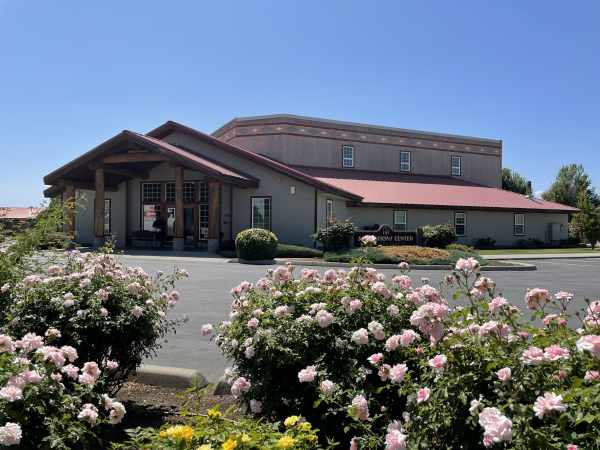

#### Premenená myseľ

_Andrew McChesney_

Mitch, drsný člen gangu, sa zaplietol do bitky s viacerými ďalšími domorodcami v americkom štáte Washington. Utrpel vážne poranenie hlavy a lekári mu povedali, že už nikdy nebude schopný pracovať.

Potom ho jeho mladší brat Stephan pozval do adventistického zboru All Nations Center v meste Wapato v štáte Washington. Stephan tam každú sobotu chodil spolu s ich mamou a sestrou.

Mitch tam nechcel ísť, a v sobotu chodil do zboru neochotne. Potom však prichádzal znova a znova. Ponoril sa do štúdia Biblie, poháňaný nádejou, že by mohla uzdraviť jeho myseľ. Držal sa zasľúbenia z Rimanom 12,2, ktoré hovorí: „Nepripodobňujte sa tomuto svetu, ale premeňte sa obnovením mysle, aby ste vedeli rozoznať, čo je Božia vôľa: čo je dobré, Bohu milé a dokonalé“. Prijal aj slová z Filipanom 4,8: „Napokon, bratia, čokoľvek je pravdivé, čokoľvek počestné, čokoľvek spravodlivé, čokoľvek čisté, čokoľvek ľúbezné, čokoľvek má dobrú povesť – ak je nejaká čnosť a ak je nejaká chvála – nad tým premýšľajte.“

Vedúci zboru Jeff Weijohn ho povzbudzoval slovami: „Božie slovo sľubuje, že ti zmení myseľ, ak ho budeš študovať.“

Mitch začal vidieť naplnenie biblických zasľúbení. Lekári, ktorí mu tvrdili, že už nikdy nebude pracovať, boli prekvapení, keď si našiel prácu a dokázal si ju aj udržať. Po biblických štúdiách odovzdal Mitch svoje srdce Ježišovi a pripojil sa k Cirkvi adventistov siedmeho dňa. Neskôr sa stal biblickým pracovníkom a začal učiť Bibliu aj iných. Spolu s manželkou otvorili svoj dom pre mladých ľudí, ktorí potrebovali miesto na bývanie. Každý bol vítaný, pokiaľ rešpektoval domové pravidlá. Jedno z nich znelo: každý ide v sobotu do zboru. Aj životy ich hostí sa začali meniť.

Raz v sobotu jeden mladý človek s radosťou povedal Jeffovi: „Vieš čo? Keď si nám hovoril o Biblii, vôbec sme ťa nechceli počúvať. Ale teraz ju chceme študovať.“ Jeff povedal, že zmena v Mitchovom živote bola revolučná. „Keď prijal Boha do svojho života, ľudia ho už nespoznávali,“ povedal. „Z človeka, ktorý bol tvrdý a mal poškodený mozog, sa stal služobník evanjelia. Dotkol sa mnohých mladých ľudí.Boh pracuje cez nás napriek nám samotným.“

 
