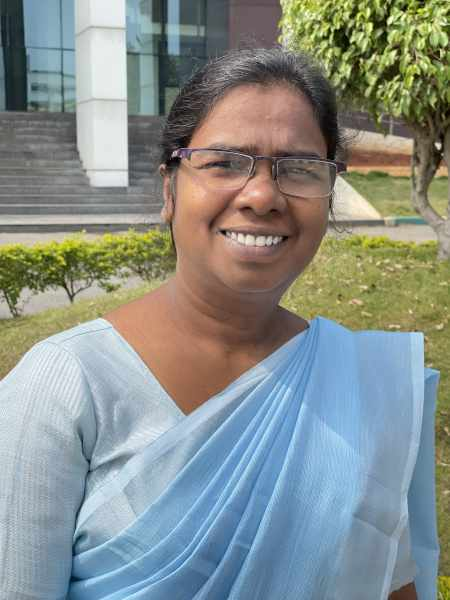

#### Zvláštny a tichý svet

_Andrew McChesney_

Nikto v meste, kde žila Kokila, sa ešte nikdy neobrátil na kresťanstvo a obyvatelia mesta sa poriadne nahnevali, keď sa jej otec a ďalšie štyri rodiny rozhodli zachovávať sobotu ako deň odpočinku. Kokila mala deväť rokov a jej život sa navždy zmenil.

Jej mama zomrela, keď bola ešte bábätko, a tak žila s otcom, štyrmi staršími sestrami a starším bratom v južnej Ázii. Otec bol chudobný roľník. Keď začal svätiť sobotu, zakázali mu pracovať na poli. On aj ďalší, ktorí prijali sobotu, si už nesmeli kupovať potraviny v miestnych obchodoch. Okrem toho, predstavitelia mesta oznámili, že ktokoľvek, kto sa bude rozprávať so svätiteľmi soboty, bude musieť zaplatiť vysokú pokutu.V dôsledku toho sa susedia odmietli rozprávať s Kokilou a jej rodinou a ani ona sa nerozprávala  so svojimi susedmi. Nikto nechcel platiť pokutu. Kokila mala predtým veľa priateľov a zrazu všetkých stratila. Bol to pre dievča zvláštny a tichý svet.

Keď sa jej otec odmietol vzdať svojej viery, susedia sa stali násilnými. Rozhnevaní vtrhli do ich domu, pobrali nábytok, oblečenie, riad a všetko vyhodili na ulicu. Otca a brata zbili. Jeden sused sa však v tomto temnom období ukázal byť jasným svetlom. Ani on nebol kresťanom, ale nepatril ani k hlavnej náboženskej skupine v meste. Pomohol Kokilinej rodine kúpiť ryžu. Rozprával sa s Kokilou a ochotne zaplatil pokutu za porušenie pravidiel.

Sedem rokov prežívala Kokila v hrozných podmienkach. Tri z piatich rodín, ktoré prijali sobotu spolu s jej otcom, zmenili názor a opustili cirkev. Verné zostali len dve z piatich rodín, vrátane Kokilinej rodiny. Kokila sa nikdy nesťažovala, ale veľa plakala. Otec videl jej slzy a rozhodol sa poslať ju do adventistickej internátnej školy. Pre dievča to bolo ako kúsok neba na zemi. „Učitelia boli veľmi láskaví a milí,“ spomínala Kokila, ktorá má dnes 39 rokov a pracuje ako sekretárka na internátnej škole – E. D. Thomas Memorial Higher Secondary School v indickom meste Thanjavur. „Učitelia sa so mnou rozprávali! Deti sa so mnou rozprávali! Bolo to také pekné mať opäť priateľov.“

