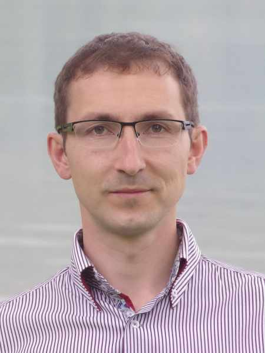

#### Špeciálna misia: Nemocnica

_Andrew McChesney_

Dmitrij Bagal, ruský misionár žijúci v Nemecku, zistil, že nemocnica sa stala nečakaným misijným poľom počas liečby rakoviny, z ktorej napokon boli len tri nezhubné nádory. Počas pobytu v Mníchove stretával ľudí zo všetkých vrstiev spoločnosti – sekulárnych, z postkresťanského prostredia i z iných svetových náboženstiev – ako zápasia s ťažkými otázkami o Bohu.

Jedného pacienta liečili šiestimi cyklami chemoterapie a bol operovaný v mníchovskej nemocnici. Ale keď sa mu rakovina vrátila už po šestich týždňoch,  lekár už nevidel zmysel pokračovať v ďalšej liečbe. Muž už nedokázal jasne myslieť, sotva spoznával svoju manželku, ktorej jediné prianie bolo byť pri ňom až do jeho smrti na jednotke paliatívnej starostlivosti. V jednom vhodnom okamihu jej Dmitrij podal brožúrku o Bohu a utrpení a pomodlil sa s nimi. Modlitba dojala ženu k slzám.

Neskôr, v ten deň, jej Dmitrij daroval aj výtlačky kníh „Veľký spor vekov“ a „Túžba vekov“, pričom dodal, že tieto knihy priniesli útechu jemu aj mnohým ďalším. Žena  knihy chcela, ale nie zadarmo. Dala mu 14 Eur, všetky drobné, ktoré mala v peňaženke. Dmitrij verí, že sa tí dvaja ešte stretnú,  ak nie na tejto Zemi, tak na novej Zemi.

Dmitrij sa v nemocnici stretol aj s mladým mužom z Iránu, ktorý trpel neznámou chorobou. Štúdium v Británii prerušil a priletel do Nemecka, no lekári nevedeli stanoviť diagnózu. Nemohol chodiť, a tak ho Dmitrij každý deň vozil na vozíku po nemocničnom areáli. Aj keď nebol vychovaný ako kresťan, dovolil Dmitrijovi, aby sa za neho modlil k Ježišovi. Ako sa Dmitrij deň čo deň modlil, mladík sa začal zotavovať. Čoskoro sa postavil a s pomocou začal aj chodiť. Hovorili spolu po nemecky, no keďže mladík študoval v Británii, Dmitrij mu daroval anglický výtlačok knihy „Veľký spor vekov“. Aj niekoľko mesiacov po tom sa za neho Dmitrij stále modlil a pripomínal si slová Ellen G. Whiteovej: „Pamätajte však, že neviete ani nemôžete zmerať výsledok verného úsilia.“ (Colporteur Ministry, s. 114).

Počas dvoch týždňov v nemocnici rozdal Dmitrij 20 výtlačkov knihy Veľký spor vekov a aj ďalšie knihy, rozdal mnoho vizitiek s QR kódmi na stiahnutie knihy a doplnil asi 10 nemocničných verejných knižníc duchovnou literatúrou.

„Zasialo sa mnoho semien a modlím sa, aby priniesli ovocie,“ povedal. „Pracujeme pod Božím vedením a výsledky nechávame na Neho.“

