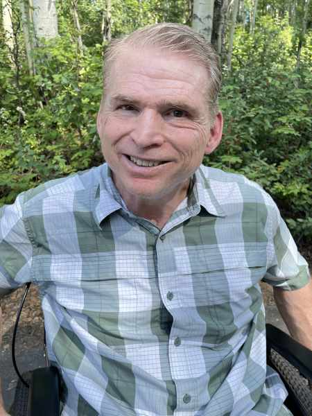

#### Všetko pracuje spolu pre dobro

_Andrew McChesney_

Carl Casey, pilot vrtuľníka a učiteľ prírodných vied na Aljaške, mal mŕtvicu vo veku 51 rokov. Nevedel pochopiť prečo. Už dávno predtým, než sa stal adventistom siedmeho dňa, prestal jesť nečisté mäso, pretože v Biblii videl, že to je zakázané, a našiel aj vedecké dôkazy, ktoré to potvrdzovali. Mŕtvica zmenila Carlov život vo Fairbanks. Nemohol chodiť ani pracovať. 

Potom si prečítal v liste Rimanom 8,28: „„Vieme, že všetko napomáha k dobrému tým, ktorí milujú Boha, tým, ktorí sú povolaní podľa jeho účelu.“ Tento verš poznal už dávno, ale teraz nadobudol nový význam. Uvedomil si, že text nehovorí „všetko je dobré tým, ktorí milujú Boha“, ale že všetko napomáha k dobrému tým, ktorí milujú Boha.

Carl prestal klásť otázku „prečo?“ a namiesto toho prosil Boha, aby jeho mŕtvicu použil na záchranu duší na Aljaške. Chcel vedieť, že podobne ako Jozef bude môcť povedať: „Vy ste zamýšľali zlo proti mne, ale Boh to zamýšľal pre dobro, aby zachoval mnoho ľudí nažive.“ (Gn 50,20)

Začal hľadať príležitosti svedčiť na Aljaške – náročnom misijnom poli s komplikovanou históriou, dlhými studenými zimami a obmedzenými cestami a infraštruktúrou na rozľahlom území. Na celú populáciu 733 000 tam žije iba okolo 3 000 adventistov.

Carl si rýchlo uvedomil, že jeho vozík mu dáva výhodu. Bolo ťažké ho prehliadnuť, a tak získaval pozornosť ľudí. S úsmevom rozprával o svojej láske k Bohu. Ľudia boli prekvapení: „Si na vozíku a staráš sa o Boha?“ pýtali sa. „No iste!“ odpovedal Carl a potom chválil veľkú Božiu lásku. Delil sa o verše ako Rimanom 3,23 – všetci zhrešili a chýbajú Božej sláve – a Jn 3,16 – tí, čo veria v Ježiša, majú večný život. Povzbudzoval ľudí, aby každý deň čítali Bibliu a utužovali vzťah s Bohom, veriac, že keď vznikne osobný vzťah, všetko ostatné príde na svoje miesto vrátane doktrín ako sobota a učenie o levitskej diéte.    Carl otvorene priznáva, že zdravá strava nezabránila jeho mŕtvici. „Mŕtvica nebola spôsobená nezdravou stravou, ale jednoducho dôsledkom života v hriešnom svete,“ povedal. „Mám šťastie, že som nažive. Väčšina ľudí po takej mŕtvici zomrie.“

Napriek tomu stále odporúča a sám dodržiava levitskú diétu ako cestu k dlhšiemu a zdravšiemu životu.

Takmer desať rokov po mŕtvici môže povedať, že životy sa zmenili práve vďaka nej.

„Uvidím ľudí v nebi, pretože som mal túto mŕtvicu,“ povedal Carl. „Budú tam ľudia, ktorí tam inak neboli. Takže všetko naozaj pracuje spolu pre dobro tým, ktorí milujú Boha.“

