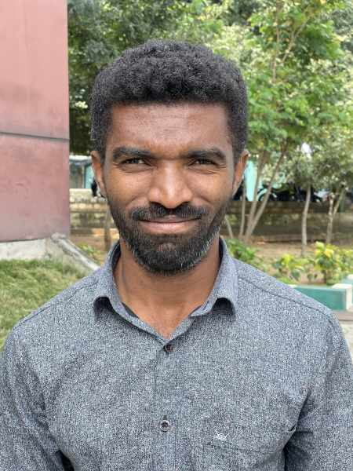

#### Poznať vševedúceho Boha

_Andrew McChesney_

Iqbal nič nevedel o Ježišovi, keď precestoval viac než 600 míľ zo svojho domova, aby sa učil angličtinu na internátnej strednej škole adventistov siedmeho dňa v južnej Ázii. Vyrastal v nekresťanskej rodine a jeho rodičia ho vo veku 20 rokov poslali, aby sa pripojil k svojej sestre, ktorá tam študovala a darilo sa jej v angličtine. Iqbal sa zúčastňoval na ranných a večerných bohoslužbách školy a chodil aj na sobotné služby. V jeho srdci sa začalo prebúdzať túžobné záujmy poznať Ježiša. Čítal Bibliu, hľadajúc informácie o Ježišovi. Jeho oči sa upreli na Jeremiáša 1,5: „Predtým, než som ťa utvoril v matkinom lone, poznal som ťa; predtým, než si vyšla z lona, zasvätil som ťa.“ Pomyslel si: Chcem poznať Ježiša osobne, lebo On poznal mňa osobne ešte predtým, ako ma utvoril v matkinom lone. Týždne sa zmenili na mesiace a Iqbal sa o Ježišovi dozvedal stále viac. Pomyslel si: Mohlo by byť, že Ježiš ma priviedol viac než 600 míľ od domova nielen kvôli angličtine, ale aj preto, aby som sa dozvedel o Jeho láske? Začal prežívať Ježišovu lásku vo svojom živote a dva a pol roka po príchode na školu sa rozhodol odovzdať svoje srdce Ježišovi a byť pokrstený. 

Po ukončení školy získal Iqbal bakalársky titul v odbore počítačové aplikácie na Lowry Adventist College v Bengaluru v Indii a stal sa členom jej personálu, kde sa venuje aktivitám duchovnej služby na kampuse. Ježiš je jeho životom. „Teraz som šťastný, že žijem s Ježišom,“ povedal. „Deň za dňom ma Ježiš vedie a stará sa o mňa. Kedykoľvek čelím problémom, Ježiš Kristus je mojím útočiskom a vyvádza ma z problémov.“ Iqbal bol ohromený vševedúcou povahou Ježiša, myšlienkou, že Ježiš nielen poznal jeho predtým, než ho utvoril v matkinom lone, ale že pozná aj jeho potreby skôr, než si ich sám uvedomí. „Ďakujem Ježišovi, že sa stará o moje potreby dávno predtým, než si ich uvedomujem,“ povedal. „Skôr než sa opýtam, On vie, čo mi má dať a cez koho mi to má dať. Preto Mu dôverujem a každý deň Ho mám viac rád.“

