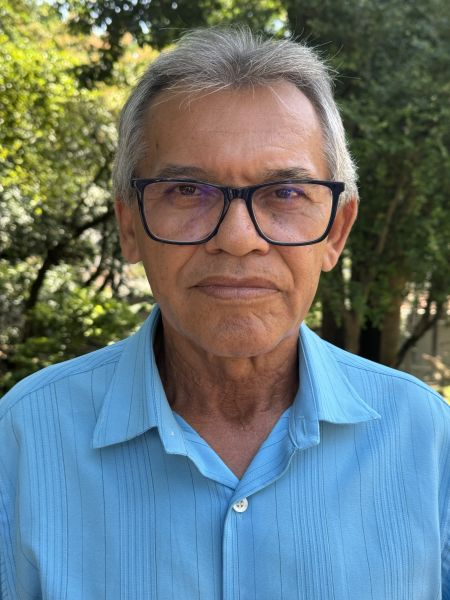

#### „Nebojte sa. Boh vám pomôže.“

Keď Inácio Manoel zaklopal na dvere jednej ženy v Brazílii, aby jej ponúkol knihy adventistov siedmeho dňa, žena na neho vyliala svoju nenávisť. „Nenávidím kresťanov!“ kričala.

Inácio bol prekvapený. Bol to jeho prvý dom v jeho prvý deň práce ako literárneho evanjelistu, ktorý ponúka knihy a biblické štúdium.

On a jeho priateľ išli do ďalšieho domu. Z dvora zúrivo štekal veľký pes. Jeho priateľ zamrmlal niečo o tom, že v prvom dome bola nahnevaná žena a v druhom nahnevaný pes.

„Neboj sa,“ povedal Inácio. „Boh je s nami.“

Z domu vyšla žena a odviedla psa preč. Potom pozvala Inácia a jeho priateľa, aby vošli dnu. Trojica mala úprimný rozhovor a žena rozprávala o svojich ťažkostiach, odkedy jej manžela poslali do väzenia. Nasledujúcu sobotu prišla žena do kostola aj so svojimi tromi malými deťmi. Inácio bol užasnutý. Povedal Bohu, že chce po zvyšok svojho života viesť ľudí k Nemu.

Najväčšie prekvapenie však Inácia čakalo v treťom dome, ktorý on a jeho priateľ navštívili v prvý deň práce. Edileuza, žena, ktorá tam bývala, súhlasila so štúdiom Biblie v sobotu popoludní. Keď týždeň čo týždeň čítali, dospeli k biblickej pravde o siedmom dni, sobote. Edileuza pracovala ako manikérka a domáca pomocnica a nevidela žiadnu možnosť, ako by mohla v sobotu odpočívať.

„V tento deň v týždni zarobím najviac peňazí,“ povedala. „Čo môžem robiť?“

„Neboj sa,“ povedal Inácio. „Boh ti pomôže. Má pre teba niečo lepšie.“

Na ďalšom biblickom štúdiu Edileuza povedala, že na ulici stretla cudzinca, ktorý sa jej spýtal, či nepozná dobrú pomocníčku do domácnosti. Táto práca nevyžadovala žiadnu prácu počas soboty, od západu slnka v piatok do západu slnka v sobotu.

Edileuza žiarila, keď sa podelila o tento príbeh s Ináciom. „Teraz mám trikrát vyšší plat ako som mala ako manikérka a domáca pomocníčka,“ povedala.

Edileuza bola pokrstená. Neskôr nasledoval jej príklad aj zvyšok rodiny.

Inácio, dnes 68-ročný, už 36 rokov vedie každý rok ku krstu štyroch až jedenásť ľudí. Kamkoľvek ide, nosí so sebou biblické lekcie. Jeho večerná modlitba znie: „Pane, daj mi do cesty niekoho, s kým môžem zdieľať Tvoju lásku.“

„Môžem žiť bez čohokoľvek na svete, ale nie bez štúdia Biblie,“ povedal.

