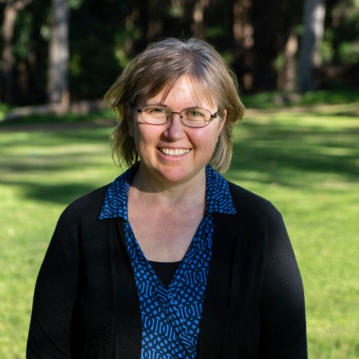

#### Investovanie do trinástej soboty

_Vania Chew_

Austrálčanka sa znovu pozrela na misijné projekty trinástej soboty, keď jej cirkev povzbudzovala členov, aby v poslednú sobotu každého štvrťroka darovali viac než len to, čo mali vo vrecku.

Marilene Stevenson si spomenula na časy, keď členovia cirkvi piekli koláče, pestovali zeleninu a predávali to, aby získali peniaze na investičné projekty sobotnej školy. Premýšľala, či by mohla urobiť niečo podobné a darovať peniaze do zbierky trinástej soboty, známej aj ako Štvrťročné misijné projekty.

Marilene nemala čas ani chuť piecť koláče a pestovať zeleninu. Začala však používať sprej na hrdlo, ktorý považovala za užitočný, a odporúčala ho aj ostatným. Keď oňho prejavili záujem aj iní ľudia, Marilene dostala nápad kúpiť sprej vo veľkoobchode a predávať ho ďalej. Akýkoľvek zisk by išiel priamo na dary trinástej soboty.

Táto prvá investícia do spreja na hrdlo podnietila Marilene hľadať ďalšie spôsoby, ako získavať peniaze na misiu.

„V skutočnosti to začalo tým, že som kupovala veci, ktoré som chcela ja,“ povedala. „Ukázalo sa však, že veci, ktoré rada kupujem ja, chcú aj iní ľudia, len nemajú čas ísť si ich kúpiť!“

Vďaka spolupráci s miestnymi farmami a továrňami mohla Marilene nakupovať zdravé produkty za veľkoobchodné ceny a predávať ich rodine a priateľom lacnejšie, ako v maloobchode. V priebehu rokov predávala exotické ovocie, čerstvé tofu a špeciálne vegánske produkty. Taktiež vytvárala kvetinové aranžmány a predávala ich pri zvláštnych príležitostiach, napríklad na Deň matiek.

„Dáva mi to obrovskú radosť,“ povedala. „Pomáham ľuďom, ktorým predávam, a zároveň zbieram peniaze na dobrú vec.“

Odkedy začala investovať, Marilene vyzbierala každý štvrťrok 300 až 600 austrálskych dolárov (200 až 400 USD) na misijné projekty trinástej soboty.

Povzbudzuje všetkých členov cirkvi, aby štedro prispievali na projekty trinástej soboty, aj keď si to vyžaduje určitú investíciu, aby mohli darovať o niečo viac.

„Dúfam, že to bude inšpirovať aj ostatných k niečomu viac, než len symbolickému daru, ako som to robila ja,“ povedala. „Boh ma naozaj požehnal tým, že som na vlastnej skúsenosti pocítila Jeho veľkú vernosť. Ako by som sa o to nemohla chcieť podeliť?“

_Tento štvrťrok sú misijné projekty trinástej soboty realizované v Juho-pacifickej divízii, ktorej územie zahŕňa aj domovinu Marilene, Austráliu. Ďakujeme, že plánujete štedrý dar na 28. marca._

